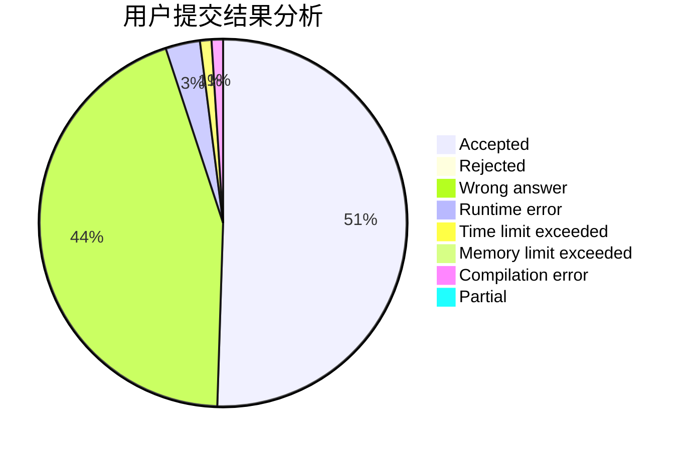
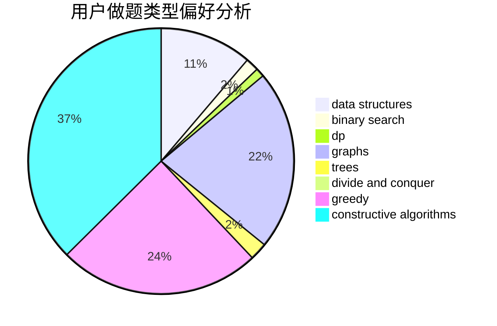
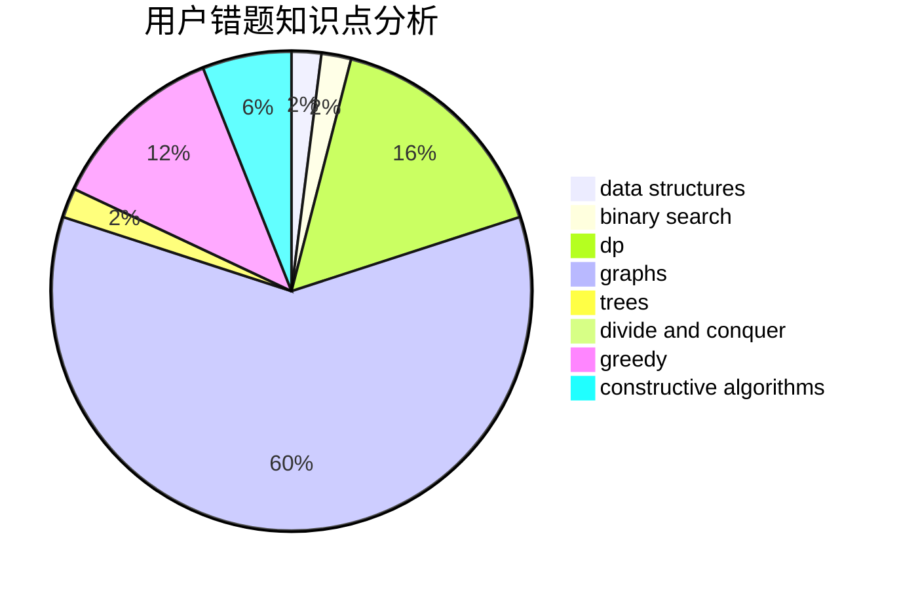

# Random_Rating

<!-- tabs:start -->

#### **用户提交结果分析**

#### **用户做题类型偏好分析**

#### **用户错题知识点分析**

<!-- tabs:end -->
# 推荐题目
[1217E](https://codeforces.com/contest/1217/problem/E)		data structures,
                        greedy,
                        implementation,
                        math		  
[1471E](https://codeforces.com/contest/1471/problem/E)		dsu,graphs,sortings,trees		  
[1070F](https://codeforces.com/contest/1070/problem/F)		greedy		  
[201C](https://codeforces.com/contest/201/problem/C)		dp		  
[651B](https://codeforces.com/contest/651/problem/B)		greedy,
                        sortings		  
[506D](https://codeforces.com/contest/506/problem/D)		brute force,
                        dfs and similar,
                        dsu,
                        graphs		  
[1042E](https://codeforces.com/contest/1042/problem/E)		dp,
                        math,
                        probabilities		  
[245A](https://codeforces.com/contest/245/problem/A)		implementation		  
[1113B](https://codeforces.com/contest/1113/problem/B)		greedy,
                        number theory		  
[441C](https://codeforces.com/contest/441/problem/C)		constructive algorithms,
                        dfs and similar,
                        implementation		  
