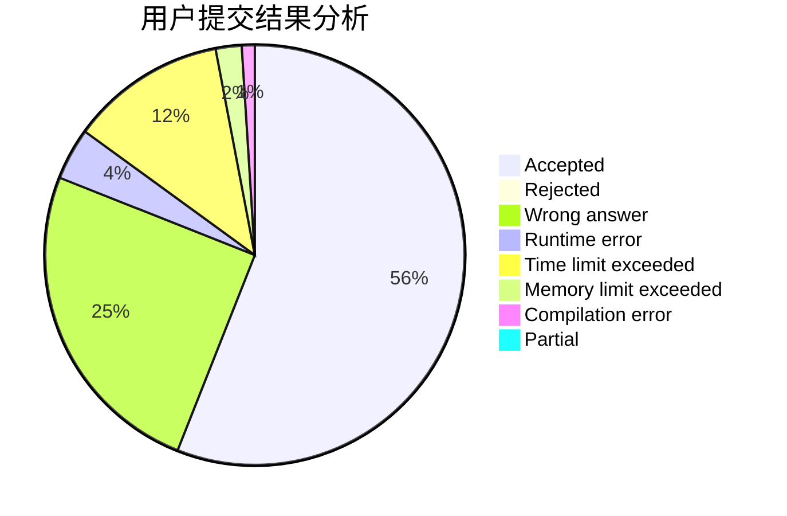
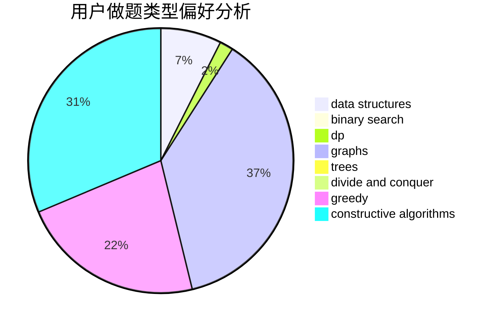

# Ravenclaw_OIer

<!-- tabs:start -->

#### **用户提交结果分析**

#### **用户做题类型偏好分析**

#### **用户错题知识点分析**

<!-- tabs:end -->
# 推荐题目
[1504E](https://codeforces.com/contest/1504/problem/E)		dsu,graphs,sortings,trees		  
[1292E](https://codeforces.com/contest/1292/problem/E)		constructive algorithms,
                        greedy,
                        interactive,
                        math		  
[20A](https://codeforces.com/contest/20/problem/A)		implementation		  
[1081D](https://codeforces.com/contest/1081/problem/D)		dsu,
                        graphs,
                        shortest paths,
                        sortings		  
[906A](https://codeforces.com/contest/906/problem/A)		implementation,
                        strings		  
[922D](https://codeforces.com/contest/922/problem/D)		greedy,
                        sortings		  
[121D](https://codeforces.com/contest/121/problem/D)		binary search,
                        implementation,
                        two pointers		  
[1042F](https://codeforces.com/contest/1042/problem/F)		data structures,
                        dfs and similar,
                        dsu,
                        graphs,
                        greedy,
                        sortings,
                        trees		  
[1067C](https://codeforces.com/contest/1067/problem/C)		constructive algorithms		  
[116A](https://codeforces.com/contest/116/problem/A)		implementation		  
