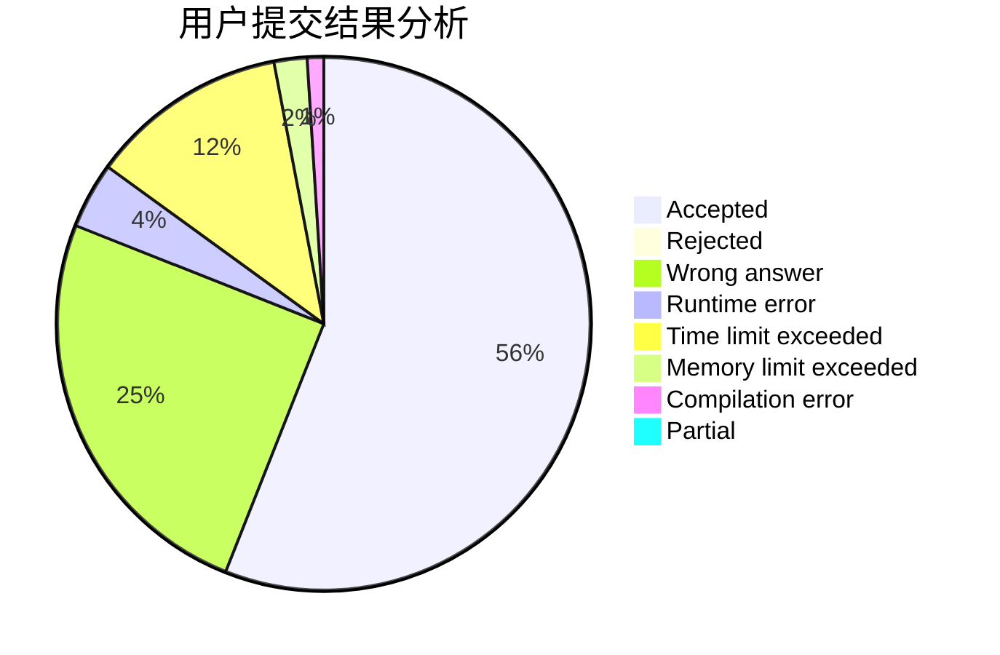
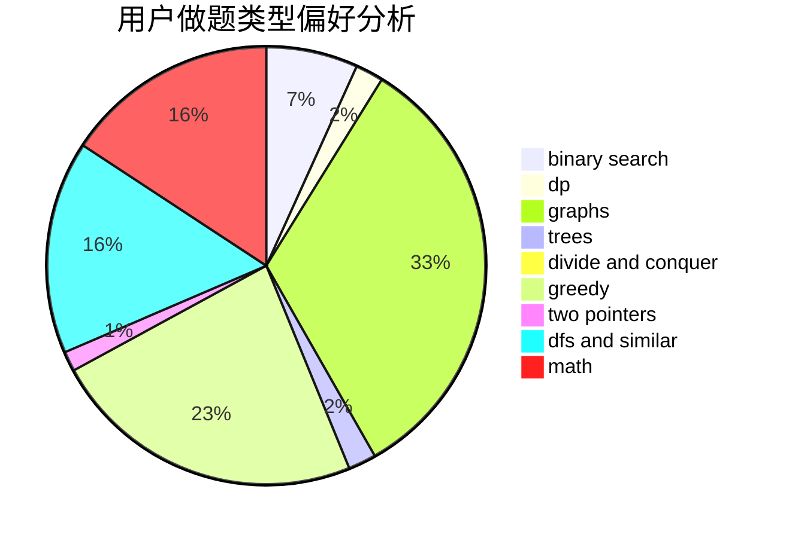

# Ravenclaw_OIer

<!-- tabs:start -->

#### **用户提交结果分析**

#### **用户做题类型偏好分析**

<!-- tabs:end -->
# 推荐题目
[1504E](https://codeforces.com/contest/1504/problem/E)
[1292E](https://codeforces.com/contest/1292/problem/E)
[20A](https://codeforces.com/contest/20/problem/A)
[1081D](https://codeforces.com/contest/1081/problem/D)
[906A](https://codeforces.com/contest/906/problem/A)
[922D](https://codeforces.com/contest/922/problem/D)
[121D](https://codeforces.com/contest/121/problem/D)
[1042F](https://codeforces.com/contest/1042/problem/F)
[1067C](https://codeforces.com/contest/1067/problem/C)
[116A](https://codeforces.com/contest/116/problem/A)
