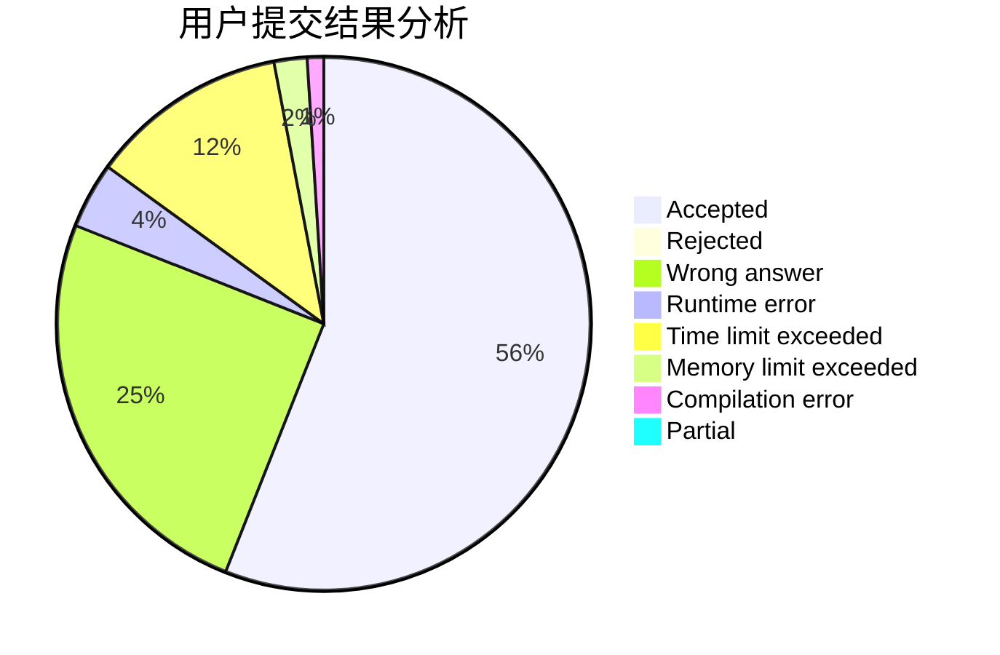
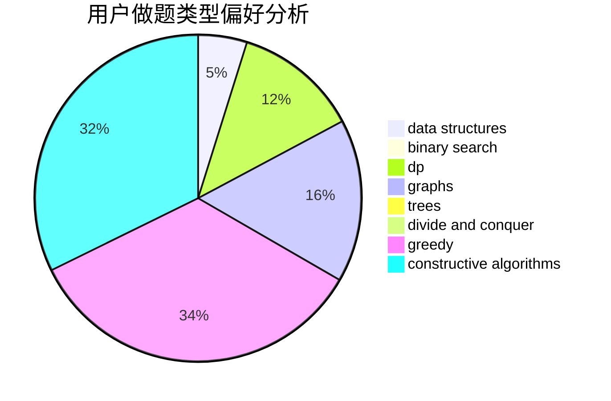
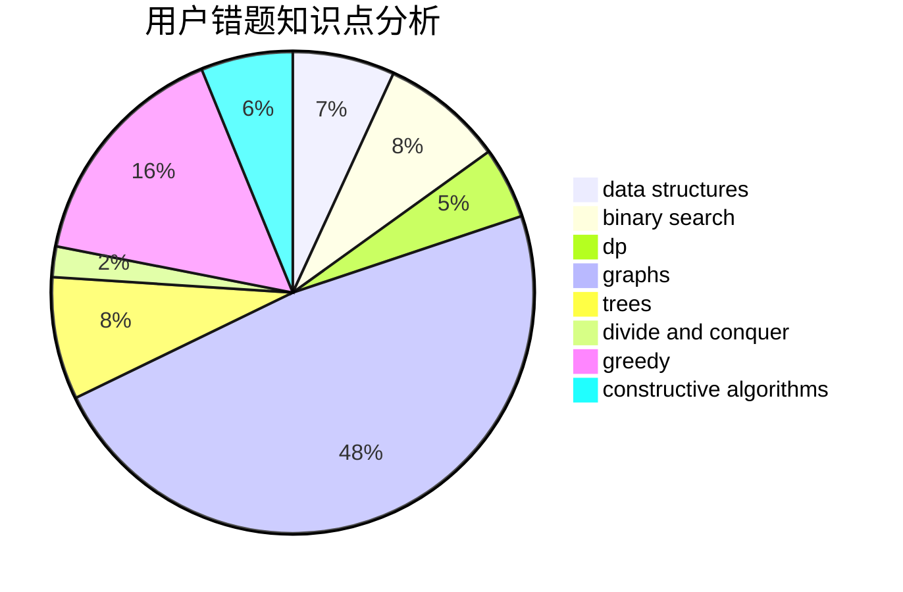

# Ravenclaw_OIer

<!-- tabs:start -->

#### **用户提交结果分析**

#### **用户做题类型偏好分析**

#### **用户错题知识点分析**

<!-- tabs:end -->
# 推荐题目
[1495E](https://codeforces.com/contest/1495/problem/E)		brute force,
                        data structures,
                        greedy,
                        implementation		  
[1285D](https://codeforces.com/contest/1285/problem/D)		bitmasks,
                        brute force,
                        dfs and similar,
                        divide and conquer,
                        dp,
                        greedy,
                        strings,
                        trees		  
[183D](https://codeforces.com/contest/183/problem/D)		dp,
                        greedy,
                        probabilities		  
[1081A](https://codeforces.com/contest/1081/problem/A)		constructive algorithms,
                        math		  
[886F](https://codeforces.com/contest/886/problem/F)		geometry		  
[908C](https://codeforces.com/contest/908/problem/C)		brute force,
                        geometry,
                        implementation,
                        math		  
[1214C](https://codeforces.com/contest/1214/problem/C)		data structures,
                        greedy		  
[1042C](https://codeforces.com/contest/1042/problem/C)		constructive algorithms,
                        greedy,
                        math		  
[1066F](https://codeforces.com/contest/1066/problem/F)		dp		  
[1166E](https://codeforces.com/contest/1166/problem/E)		bitmasks,
                        brute force,
                        constructive algorithms,
                        math,
                        number theory		  
