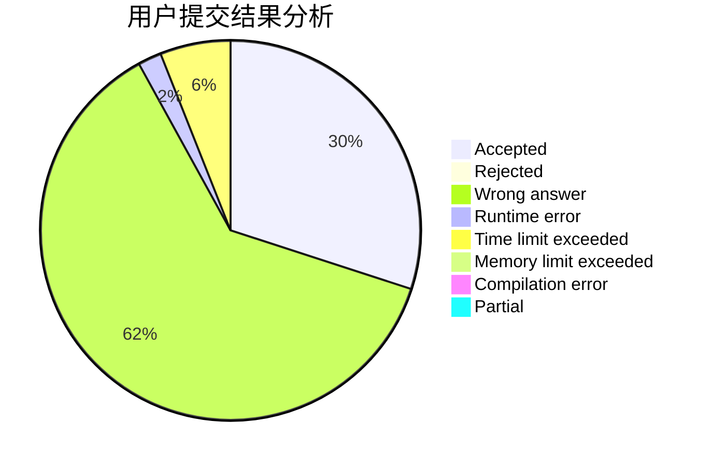
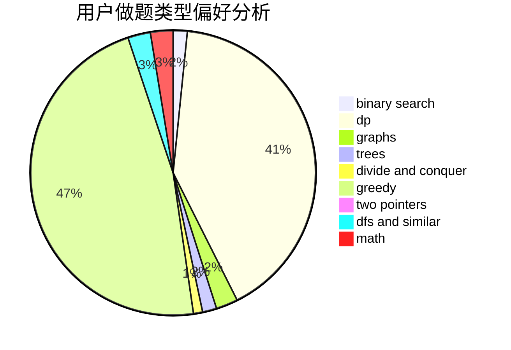

# RayLuo

<!-- tabs:start -->

#### **用户提交结果分析**

#### **用户做题类型偏好分析**

<!-- tabs:end -->
# 推荐题目
[870A](https://codeforces.com/contest/870/problem/A)
[388B](https://codeforces.com/contest/388/problem/B)
[453B](https://codeforces.com/contest/453/problem/B)
[1205E](https://codeforces.com/contest/1205/problem/E)
[1059A](https://codeforces.com/contest/1059/problem/A)
[749A](https://codeforces.com/contest/749/problem/A)
[791B](https://codeforces.com/contest/791/problem/B)
[1179D](https://codeforces.com/contest/1179/problem/D)
[815A](https://codeforces.com/contest/815/problem/A)
[387D](https://codeforces.com/contest/387/problem/D)
