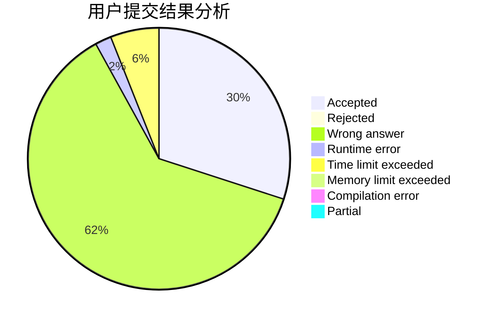
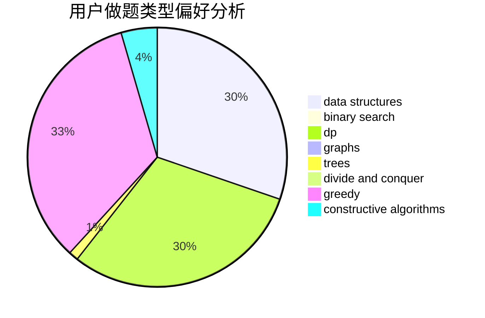
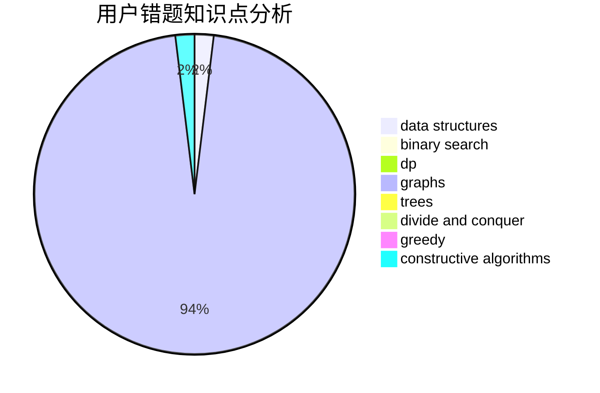

# RayLuo

<!-- tabs:start -->

#### **用户提交结果分析**

#### **用户做题类型偏好分析**

#### **用户错题知识点分析**

<!-- tabs:end -->
# 推荐题目
[870A](https://codeforces.com/contest/870/problem/A)		brute force,
                        implementation		  
[388B](https://codeforces.com/contest/388/problem/B)		bitmasks,
                        constructive algorithms,
                        graphs,
                        implementation,
                        math		  
[453B](https://codeforces.com/contest/453/problem/B)		bitmasks,
                        brute force,
                        dp		  
[1205E](https://codeforces.com/contest/1205/problem/E)		combinatorics,
                        strings		  
[1059A](https://codeforces.com/contest/1059/problem/A)		implementation		  
[749A](https://codeforces.com/contest/749/problem/A)		greedy,
                        implementation,
                        math,
                        number theory		  
[791B](https://codeforces.com/contest/791/problem/B)		dsu,graphs,sortings,trees		  
[1179D](https://codeforces.com/contest/1179/problem/D)		data structures,
                        dp,
                        trees		  
[815A](https://codeforces.com/contest/815/problem/A)		brute force,
                        greedy,
                        implementation		  
[387D](https://codeforces.com/contest/387/problem/D)		graph matchings		  
