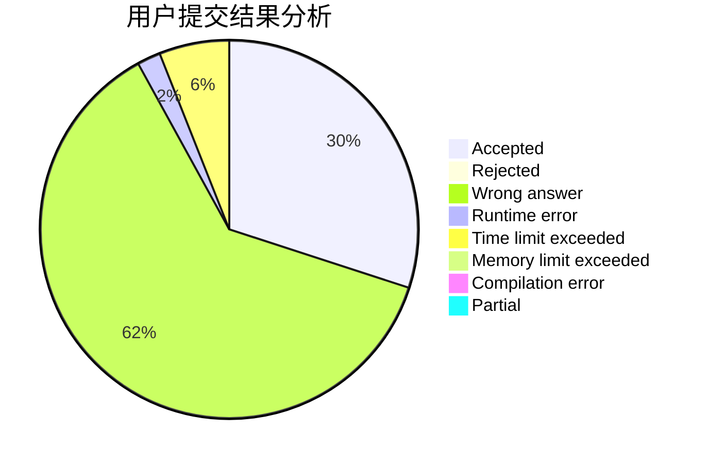
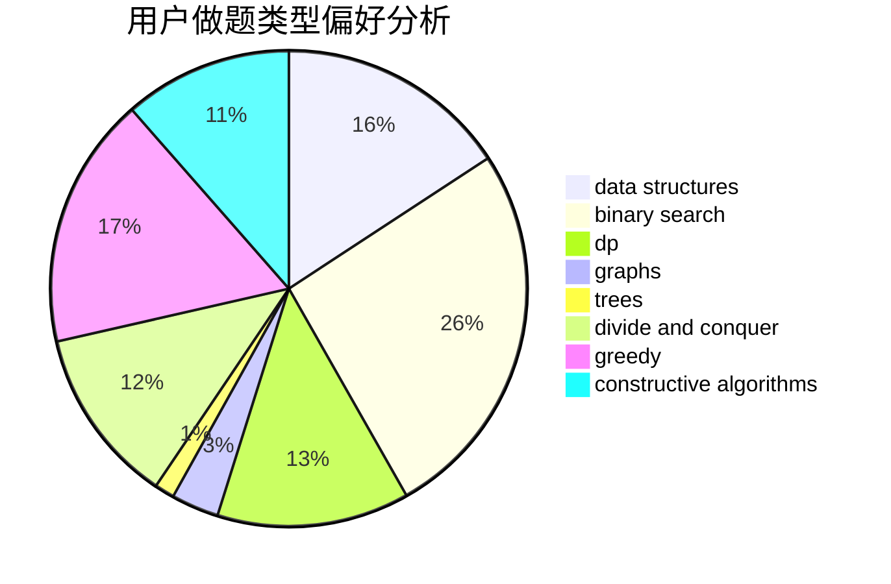
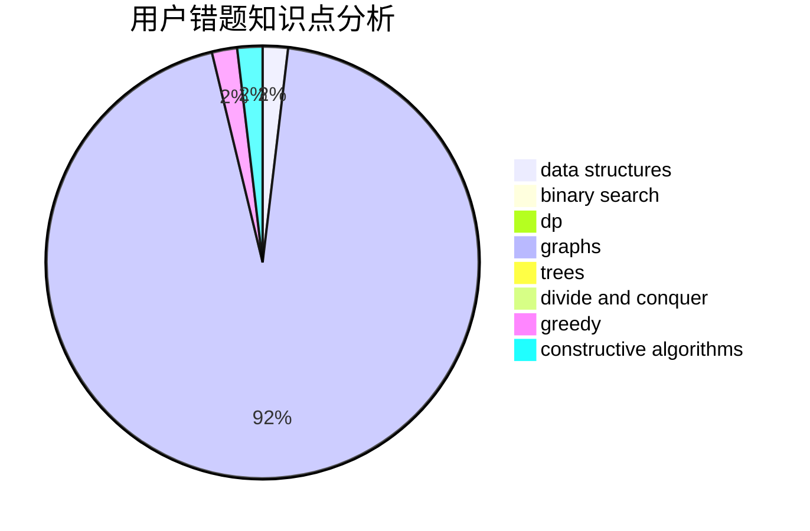

# RayLuo

<!-- tabs:start -->

#### **用户提交结果分析**

#### **用户做题类型偏好分析**

#### **用户错题知识点分析**

<!-- tabs:end -->
# 推荐题目
[851D](https://codeforces.com/contest/851/problem/D)		dsu,graphs,sortings,trees		  
[360A](https://codeforces.com/contest/360/problem/A)		greedy,
                        implementation		  
[431D](https://codeforces.com/contest/431/problem/D)		binary search,
                        bitmasks,
                        combinatorics,
                        dp,
                        math		  
[1201A](https://codeforces.com/contest/1201/problem/A)		implementation,
                        strings		  
[1058C](https://codeforces.com/contest/1058/problem/C)		dsu,graphs,sortings,trees		  
[730J](https://codeforces.com/contest/730/problem/J)		dp		  
[771C](https://codeforces.com/contest/771/problem/C)		dfs and similar,
                        dp,
                        trees		  
[1176C](https://codeforces.com/contest/1176/problem/C)		dp,
                        greedy,
                        implementation		  
[7E](https://codeforces.com/contest/7/problem/E)		dp,
                        expression parsing,
                        implementation		  
[35A](https://codeforces.com/contest/35/problem/A)		implementation		  
