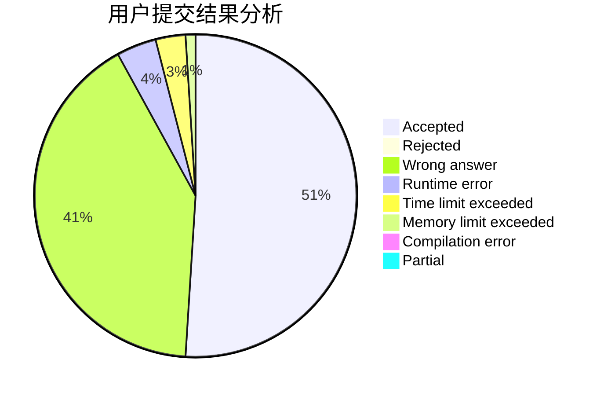
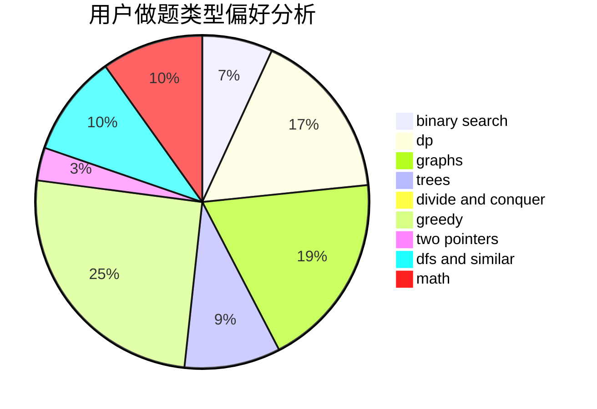

# Rea1

<!-- tabs:start -->

#### **用户提交结果分析**

#### **用户做题类型偏好分析**

<!-- tabs:end -->
# 推荐题目
[893D](https://codeforces.com/contest/893/problem/D)
[109A](https://codeforces.com/contest/109/problem/A)
[509C](https://codeforces.com/contest/509/problem/C)
[353D](https://codeforces.com/contest/353/problem/D)
[1102E](https://codeforces.com/contest/1102/problem/E)
[98C](https://codeforces.com/contest/98/problem/C)
[318A](https://codeforces.com/contest/318/problem/A)
[908A](https://codeforces.com/contest/908/problem/A)
[474B](https://codeforces.com/contest/474/problem/B)
[235E](https://codeforces.com/contest/235/problem/E)
