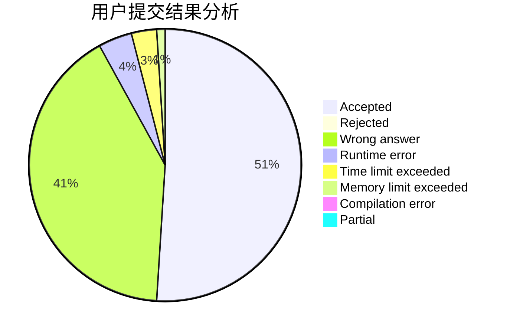
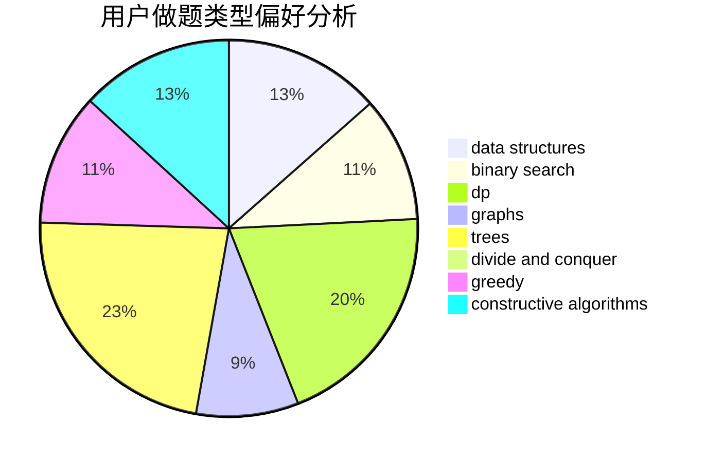
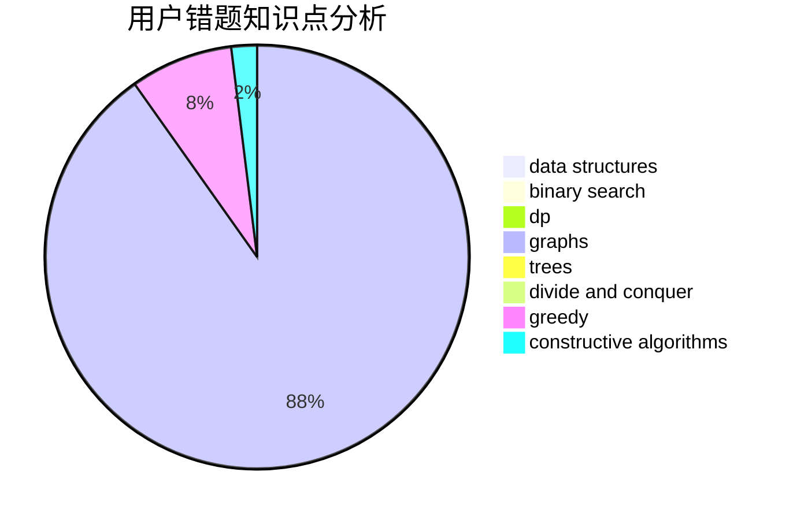

# Rea1

<!-- tabs:start -->

#### **用户提交结果分析**

#### **用户做题类型偏好分析**

#### **用户错题知识点分析**

<!-- tabs:end -->
# 推荐题目
[893D](https://codeforces.com/contest/893/problem/D)		data structures,
                        dp,
                        greedy,
                        implementation		  
[109A](https://codeforces.com/contest/109/problem/A)		brute force,
                        implementation		  
[509C](https://codeforces.com/contest/509/problem/C)		dp,
                        greedy,
                        implementation		  
[353D](https://codeforces.com/contest/353/problem/D)		constructive algorithms,
                        dp		  
[1102E](https://codeforces.com/contest/1102/problem/E)		combinatorics,
                        sortings		  
[98C](https://codeforces.com/contest/98/problem/C)		geometry,
                        ternary search		  
[318A](https://codeforces.com/contest/318/problem/A)		math		  
[908A](https://codeforces.com/contest/908/problem/A)		brute force,
                        implementation		  
[474B](https://codeforces.com/contest/474/problem/B)		binary search,
                        implementation		  
[235E](https://codeforces.com/contest/235/problem/E)		combinatorics,
                        dp,
                        implementation,
                        math,
                        number theory		  
