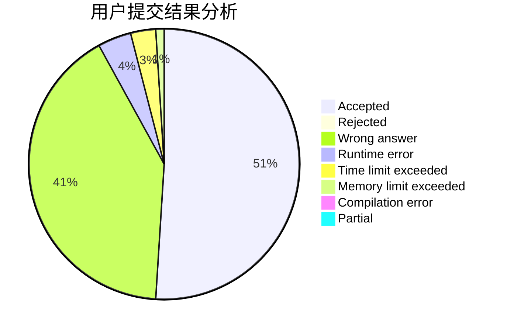
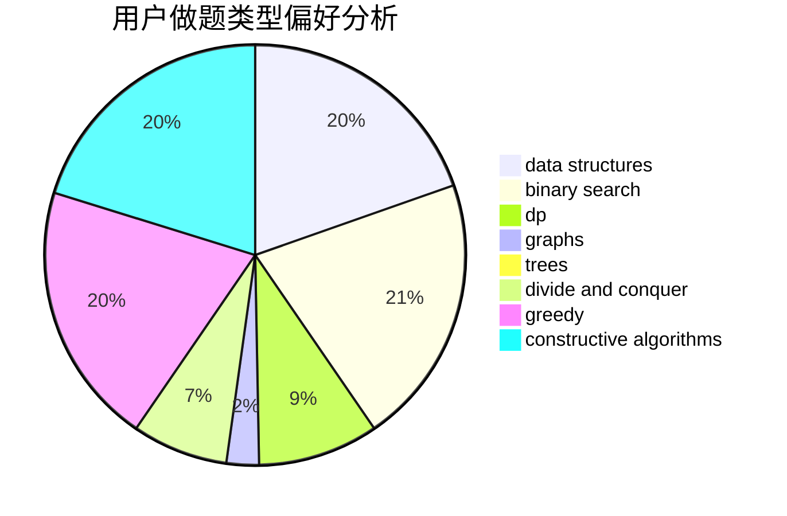
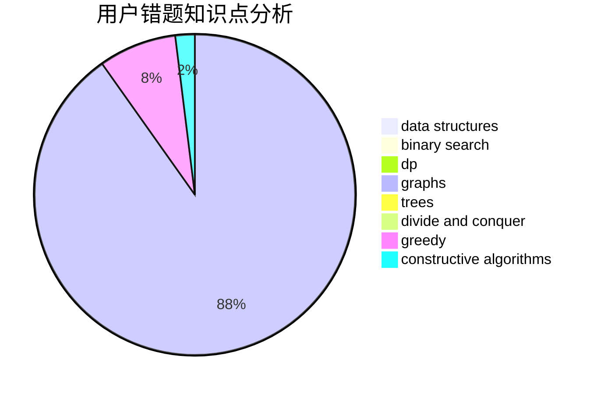

# Rea1

<!-- tabs:start -->

#### **用户提交结果分析**

#### **用户做题类型偏好分析**

#### **用户错题知识点分析**

<!-- tabs:end -->
# 推荐题目
[872B](https://codeforces.com/contest/872/problem/B)		dsu,graphs,sortings,trees		  
[1099D](https://codeforces.com/contest/1099/problem/D)		dsu,graphs,sortings,trees		  
[489B](https://codeforces.com/contest/489/problem/B)		dfs and similar,
                        dp,
                        graph matchings,
                        greedy,
                        sortings,
                        two pointers		  
[321E](https://codeforces.com/contest/321/problem/E)		data structures,
                        divide and conquer,
                        dp		  
[1102B](https://codeforces.com/contest/1102/problem/B)		greedy,
                        sortings		  
[975D](https://codeforces.com/contest/975/problem/D)		geometry,
                        math		  
[2B](https://codeforces.com/contest/2/problem/B)		dp,
                        math		  
[888C](https://codeforces.com/contest/888/problem/C)		binary search,
                        implementation,
                        two pointers		  
[452B](https://codeforces.com/contest/452/problem/B)		brute force,
                        constructive algorithms,
                        geometry,
                        trees		  
[216C](https://codeforces.com/contest/216/problem/C)		greedy		  
