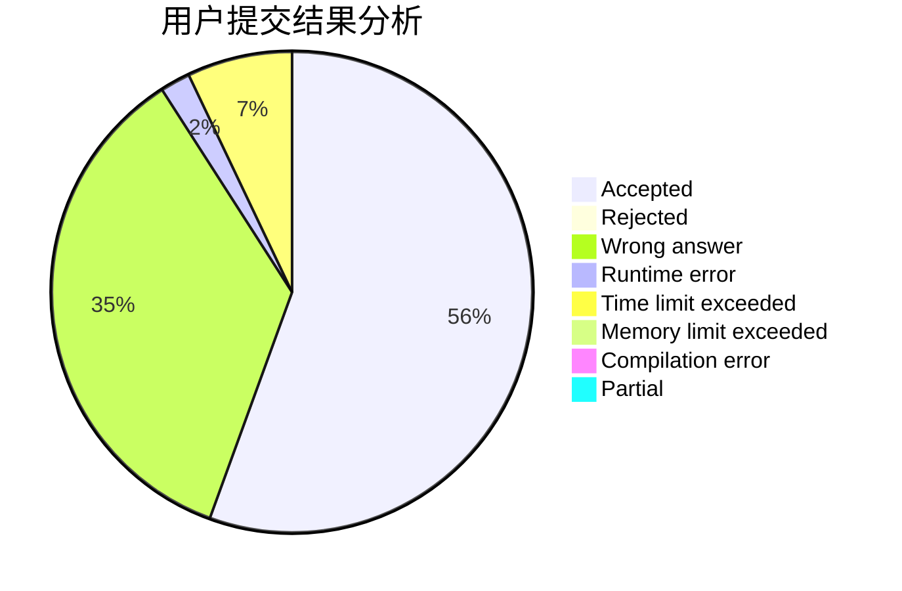
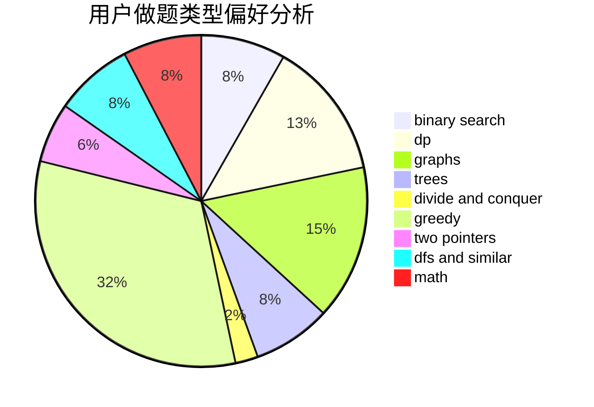

# RealArtist

<!-- tabs:start -->

#### **用户提交结果分析**

#### **用户做题类型偏好分析**

<!-- tabs:end -->
# 推荐题目
[1501A](https://codeforces.com/contest/1501/problem/A)
[286A](https://codeforces.com/contest/286/problem/A)
[1028G](https://codeforces.com/contest/1028/problem/G)
[962A](https://codeforces.com/contest/962/problem/A)
[919D](https://codeforces.com/contest/919/problem/D)
[1384A](https://codeforces.com/contest/1384/problem/A)
[1461F](https://codeforces.com/contest/1461/problem/F)
[801D](https://codeforces.com/contest/801/problem/D)
[1459A](https://codeforces.com/contest/1459/problem/A)
[462A](https://codeforces.com/contest/462/problem/A)
