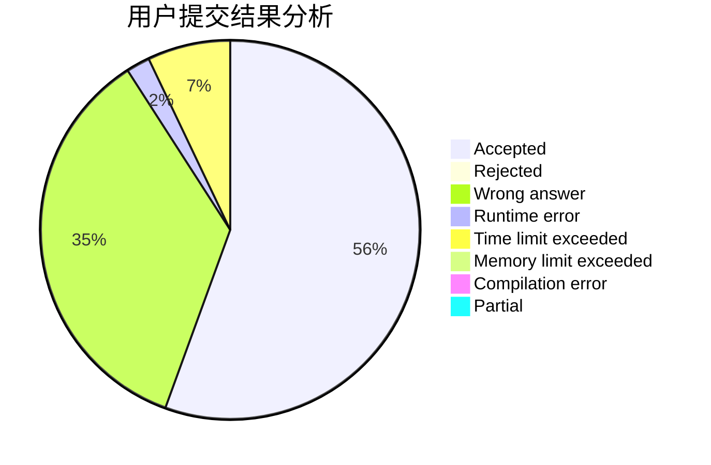
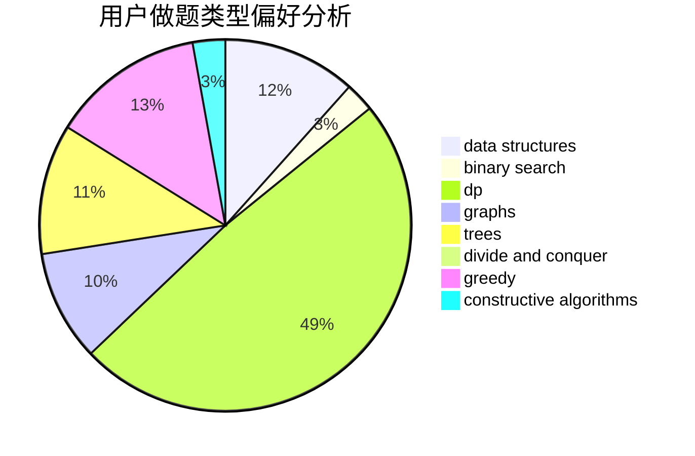
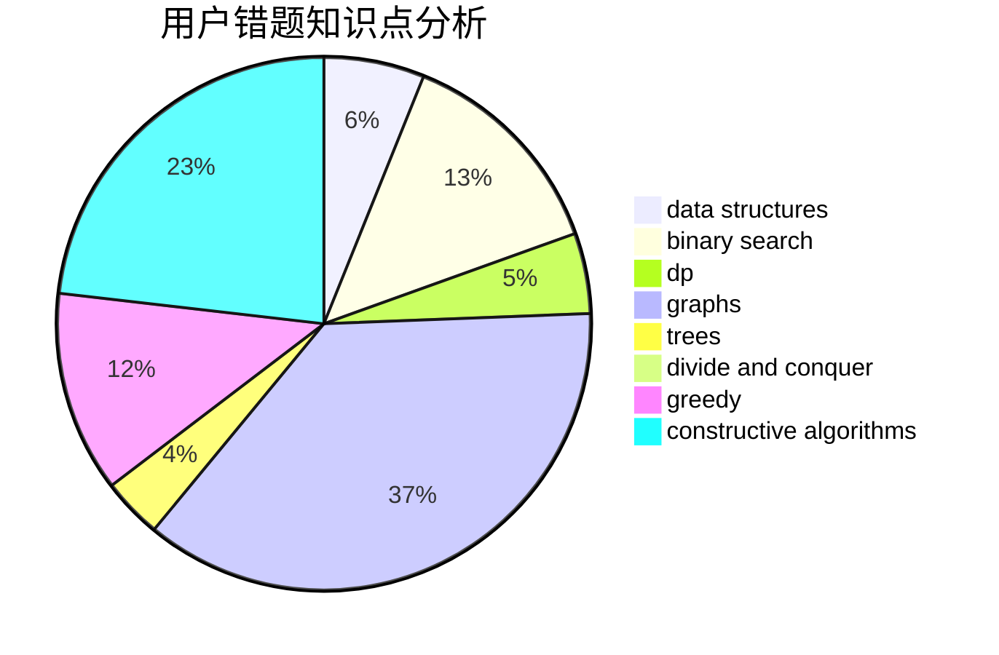

# RealArtist

<!-- tabs:start -->

#### **用户提交结果分析**

#### **用户做题类型偏好分析**

#### **用户错题知识点分析**

<!-- tabs:end -->
# 推荐题目
[1493A](https://codeforces.com/contest/1493/problem/A)		constructive algorithms,
                        greedy		  
[269E](https://codeforces.com/contest/269/problem/E)		nan		  
[1028C](https://codeforces.com/contest/1028/problem/C)		geometry,
                        implementation,
                        sortings		  
[940D](https://codeforces.com/contest/940/problem/D)		binary search,
                        implementation		  
[903D](https://codeforces.com/contest/903/problem/D)		data structures,
                        math		  
[1375C](https://codeforces.com/contest/1375/problem/C)		constructive algorithms,
                        data structures,
                        greedy		  
[1452C](https://codeforces.com/contest/1452/problem/C)		greedy		  
[784D](https://codeforces.com/contest/784/problem/D)		*special problem,
                        implementation		  
[1450D](https://codeforces.com/contest/1450/problem/D)		binary search,
                        data structures,
                        greedy,
                        implementation,
                        two pointers		  
[441C](https://codeforces.com/contest/441/problem/C)		constructive algorithms,
                        dfs and similar,
                        implementation		  
