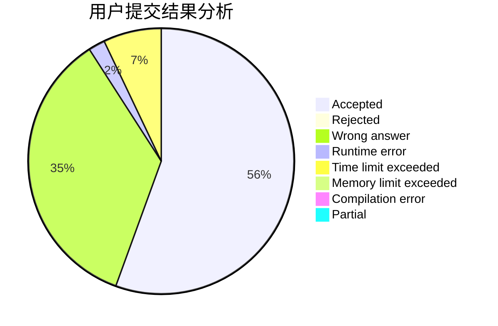
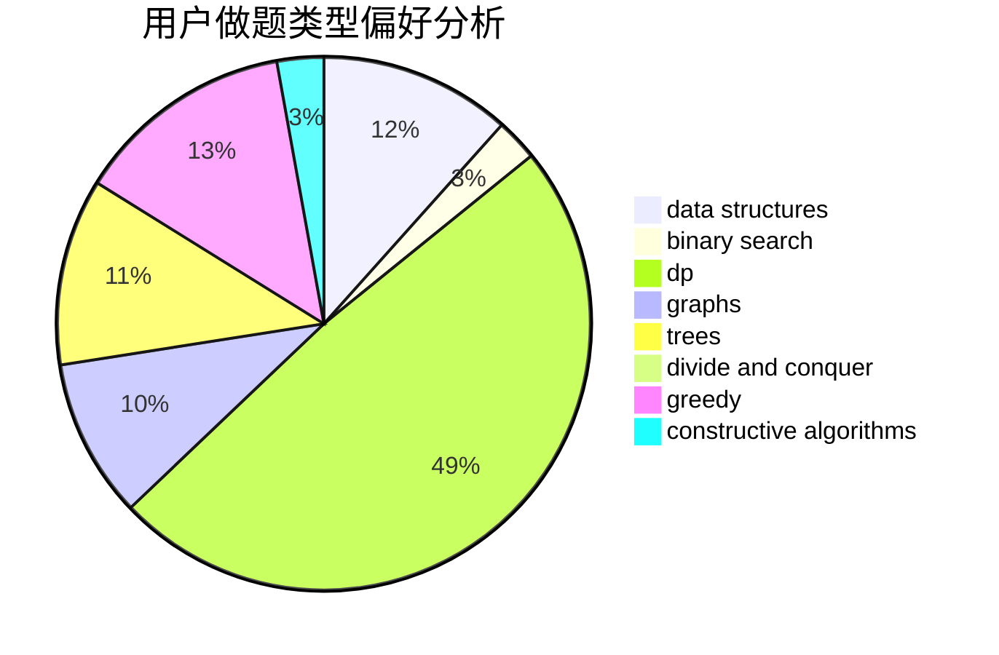
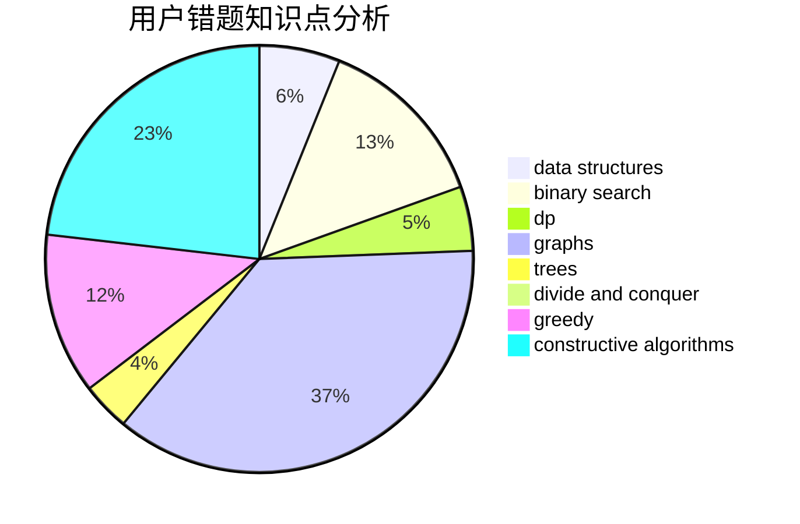

# RealArtist
<!-- tabs:start -->
#### **用户提交结果分析**

#### **用户做题类型偏好分析**

#### **用户错题知识点分析**

<!-- tabs:end -->
# 推荐题目
[Anti-knapsack](http://codeforces.com/problemset/problem/1493/A)		constructive algorithms,
                        greedy		  
[Balanced Removals (Harder)](http://codeforces.com/problemset/problem/1237/C2)		binary search,
                        constructive algorithms,
                        divide and conquer,
                        greedy,
                        implementation,
                        sortings		  
[Rectangles](http://codeforces.com/problemset/problem/1028/C)		geometry,
                        implementation,
                        sortings		  
[Two Merged Sequences](http://codeforces.com/problemset/problem/1144/G)		dp,
                        greedy		  
[Kuro and GCD and XOR and SUM](http://codeforces.com/problemset/problem/979/D)		binary search,
                        bitmasks,
                        brute force,
                        data structures,
                        dp,
                        dsu,
                        greedy,
                        math,
                        number theory,
                        strings,
                        trees		  
[Alena And The Heater](http://codeforces.com/problemset/problem/940/D)		binary search,
                        implementation		  
[Divisibility](http://codeforces.com/problemset/problem/597/A)		math		  
[Prime Number](http://codeforces.com/problemset/problem/359/C)		math,
                        number theory		  
[Bear and Company](http://codeforces.com/problemset/problem/771/D)		dp		  
[String Theory](http://codeforces.com/problemset/problem/269/E)		nan		  
<!-- tabs:start -->
#### **data structures**
[Anti-knapsack](http://codeforces.com/problemset/problem/979/D)		binary search,
                        bitmasks,
                        brute force,
                        data structures,
                        dp,
                        dsu,
                        greedy,
                        math,
                        number theory,
                        strings,
                        trees		  
[Balanced Removals (Harder)](http://codeforces.com/problemset/problem/796/C)		constructive algorithms,
                        data structures,
                        dp,
                        trees		  
[Rectangles](http://codeforces.com/problemset/problem/903/D)		data structures,
                        math		  
[Two Merged Sequences](http://codeforces.com/problemset/problem/1375/C)		constructive algorithms,
                        data structures,
                        greedy		  
[Kuro and GCD and XOR and SUM](http://codeforces.com/problemset/problem/1450/D)		binary search,
                        data structures,
                        greedy,
                        implementation,
                        two pointers		  
[Alena And The Heater](http://codeforces.com/problemset/problem/1492/C)		binary search,
                        data structures,
                        dp,
                        greedy,
                        two pointers		  
[Divisibility](http://codeforces.com/problemset/problem/1490/G)		binary search,
                        data structures,
                        math		  
[Prime Number](http://codeforces.com/problemset/problem/1479/D)		binary search,
                        bitmasks,
                        brute force,
                        data structures,
                        probabilities,
                        trees		  
[Bear and Company](http://codeforces.com/problemset/problem/1497/A)		brute force,
                        data structures,
                        greedy,
                        sortings		  
[String Theory](http://codeforces.com/problemset/problem/1491/C)		brute force,
                        data structures,
                        dp,
                        greedy,
                        implementation		  
#### **binary search**
[Anti-knapsack](http://codeforces.com/problemset/problem/1237/C2)		binary search,
                        constructive algorithms,
                        divide and conquer,
                        greedy,
                        implementation,
                        sortings		  
[Balanced Removals (Harder)](http://codeforces.com/problemset/problem/979/D)		binary search,
                        bitmasks,
                        brute force,
                        data structures,
                        dp,
                        dsu,
                        greedy,
                        math,
                        number theory,
                        strings,
                        trees		  
[Rectangles](http://codeforces.com/problemset/problem/940/D)		binary search,
                        implementation		  
[Two Merged Sequences](http://codeforces.com/problemset/problem/1450/D)		binary search,
                        data structures,
                        greedy,
                        implementation,
                        two pointers		  
[Kuro and GCD and XOR and SUM](http://codeforces.com/problemset/problem/1359/C)		binary search,
                        math		  
[Alena And The Heater](http://codeforces.com/problemset/problem/1492/C)		binary search,
                        data structures,
                        dp,
                        greedy,
                        two pointers		  
[Divisibility](http://codeforces.com/problemset/problem/1463/D)		binary search,
                        constructive algorithms,
                        greedy,
                        two pointers		  
[Prime Number](http://codeforces.com/problemset/problem/1490/G)		binary search,
                        data structures,
                        math		  
[Bear and Company](http://codeforces.com/problemset/problem/1479/D)		binary search,
                        bitmasks,
                        brute force,
                        data structures,
                        probabilities,
                        trees		  
[String Theory](http://codeforces.com/problemset/problem/1436/E)		binary search,
                        data structures,
                        two pointers		  
#### **dp**
[Anti-knapsack](http://codeforces.com/problemset/problem/1144/G)		dp,
                        greedy		  
[Balanced Removals (Harder)](http://codeforces.com/problemset/problem/979/D)		binary search,
                        bitmasks,
                        brute force,
                        data structures,
                        dp,
                        dsu,
                        greedy,
                        math,
                        number theory,
                        strings,
                        trees		  
[Rectangles](http://codeforces.com/problemset/problem/771/D)		dp		  
[Two Merged Sequences](http://codeforces.com/problemset/problem/796/C)		constructive algorithms,
                        data structures,
                        dp,
                        trees		  
[Kuro and GCD and XOR and SUM](http://codeforces.com/problemset/problem/44/E)		dp		  
[Alena And The Heater](http://codeforces.com/problemset/problem/467/D)		dfs and similar,
                        dp,
                        graphs,
                        hashing,
                        strings		  
[Divisibility](http://codeforces.com/problemset/problem/300/D)		dp,
                        fft		  
[Prime Number](http://codeforces.com/problemset/problem/294/B)		dp,
                        greedy		  
[Bear and Company](http://codeforces.com/problemset/problem/354/C)		brute force,
                        dp,
                        number theory		  
[String Theory](http://codeforces.com/problemset/problem/1433/F)		dp		  
#### **graph**
[Anti-knapsack](http://codeforces.com/problemset/problem/467/D)		dfs and similar,
                        dp,
                        graphs,
                        hashing,
                        strings		  
[Balanced Removals (Harder)](http://codeforces.com/problemset/problem/627/F)		dfs and similar,
                        dsu,
                        graphs,
                        trees		  
[Rectangles](http://codeforces.com/problemset/problem/1381/C)		constructive algorithms,
                        graph matchings,
                        greedy,
                        implementation,
                        sortings,
                        two pointers		  
[Two Merged Sequences](http://codeforces.com/problemset/problem/453/C)		constructive algorithms,
                        dfs and similar,
                        graphs		  
[Kuro and GCD and XOR and SUM](http://codeforces.com/problemset/problem/1487/C)		brute force,
                        constructive algorithms,
                        dfs and similar,
                        graphs,
                        greedy,
                        implementation,
                        math		  
[Alena And The Heater](http://codeforces.com/problemset/problem/1437/C)		dp,
                        flows,
                        graph matchings,
                        greedy,
                        math,
                        sortings		  
[Divisibility](http://codeforces.com/problemset/problem/1470/D)		constructive algorithms,
                        dfs and similar,
                        graph matchings,
                        graphs,
                        greedy		  
[Prime Number](http://codeforces.com/problemset/problem/1476/C)		dp,
                        graphs,
                        greedy		  
[Bear and Company](http://codeforces.com/problemset/problem/1304/D)		constructive algorithms,
                        graphs,
                        greedy,
                        two pointers		  
[String Theory](http://codeforces.com/problemset/problem/1475/C)		combinatorics,
                        graphs,
                        math		  
#### **trees**
[Anti-knapsack](http://codeforces.com/problemset/problem/979/D)		binary search,
                        bitmasks,
                        brute force,
                        data structures,
                        dp,
                        dsu,
                        greedy,
                        math,
                        number theory,
                        strings,
                        trees		  
[Balanced Removals (Harder)](http://codeforces.com/problemset/problem/796/C)		constructive algorithms,
                        data structures,
                        dp,
                        trees		  
[Rectangles](http://codeforces.com/problemset/problem/627/F)		dfs and similar,
                        dsu,
                        graphs,
                        trees		  
[Two Merged Sequences](http://codeforces.com/problemset/problem/724/F)		combinatorics,
                        dp,
                        trees		  
[Kuro and GCD and XOR and SUM](http://codeforces.com/problemset/problem/1479/D)		binary search,
                        bitmasks,
                        brute force,
                        data structures,
                        probabilities,
                        trees		  
[Alena And The Heater](http://codeforces.com/problemset/problem/1511/C)		brute force,
                        data structures,
                        implementation,
                        trees		  
[Divisibility](http://codeforces.com/problemset/problem/1499/F)		combinatorics,
                        dfs and similar,
                        dp,
                        trees		  
[Prime Number](http://codeforces.com/problemset/problem/1491/E)		brute force,
                        dfs and similar,
                        divide and conquer,
                        number theory,
                        trees		  
[Bear and Company](http://codeforces.com/problemset/problem/1466/D)		data structures,
                        greedy,
                        sortings,
                        trees		  
[String Theory](http://codeforces.com/problemset/problem/1495/D)		combinatorics,
                        dfs and similar,
                        graphs,
                        math,
                        shortest paths,
                        trees		  
#### **divide and conquer**
[Anti-knapsack](http://codeforces.com/problemset/problem/1237/C2)		binary search,
                        constructive algorithms,
                        divide and conquer,
                        greedy,
                        implementation,
                        sortings		  
[Balanced Removals (Harder)](http://codeforces.com/problemset/problem/1461/D)		binary search,
                        brute force,
                        data structures,
                        divide and conquer,
                        implementation,
                        sortings		  
[Rectangles](http://codeforces.com/problemset/problem/1466/G)		combinatorics,
                        divide and conquer,
                        hashing,
                        math,
                        string suffix structures,
                        strings		  
[Two Merged Sequences](http://codeforces.com/problemset/problem/1490/D)		dfs and similar,
                        divide and conquer,
                        implementation		  
[Kuro and GCD and XOR and SUM](https://codeforces.com/contest/1483/problem/C)		data structures,
                        divide and conquer,
                        dp		  
[Alena And The Heater](http://codeforces.com/problemset/problem/1491/E)		brute force,
                        dfs and similar,
                        divide and conquer,
                        number theory,
                        trees		  
[Divisibility](http://codeforces.com/problemset/problem/1303/G)		data structures,
                        divide and conquer,
                        geometry,
                        trees		  
[Prime Number](http://codeforces.com/problemset/problem/1494/D)		constructive algorithms,
                        data structures,
                        dfs and similar,
                        divide and conquer,
                        dsu,
                        greedy,
                        sortings,
                        trees		  
[Bear and Company](http://codeforces.com/problemset/problem/1482/E)		data structures,
                        divide and conquer,
                        dp		  
[String Theory](http://codeforces.com/problemset/problem/566/C)		dfs and similar,
                        divide and conquer,
                        trees		  
#### **greedy**
[Anti-knapsack](http://codeforces.com/problemset/problem/1493/A)		constructive algorithms,
                        greedy		  
[Balanced Removals (Harder)](http://codeforces.com/problemset/problem/1237/C2)		binary search,
                        constructive algorithms,
                        divide and conquer,
                        greedy,
                        implementation,
                        sortings		  
[Rectangles](http://codeforces.com/problemset/problem/1144/G)		dp,
                        greedy		  
[Two Merged Sequences](http://codeforces.com/problemset/problem/979/D)		binary search,
                        bitmasks,
                        brute force,
                        data structures,
                        dp,
                        dsu,
                        greedy,
                        math,
                        number theory,
                        strings,
                        trees		  
[Kuro and GCD and XOR and SUM](http://codeforces.com/problemset/problem/1294/E)		greedy,
                        implementation,
                        math		  
[Alena And The Heater](http://codeforces.com/problemset/problem/16/B)		greedy,
                        implementation,
                        sortings		  
[Divisibility](http://codeforces.com/problemset/problem/294/B)		dp,
                        greedy		  
[Prime Number](http://codeforces.com/problemset/problem/1186/D)		constructive algorithms,
                        greedy,
                        math		  
[Bear and Company](http://codeforces.com/problemset/problem/1375/C)		constructive algorithms,
                        data structures,
                        greedy		  
[String Theory](http://codeforces.com/problemset/problem/1452/C)		greedy		  
#### **constructive algorithms**
[Anti-knapsack](http://codeforces.com/problemset/problem/1493/A)		constructive algorithms,
                        greedy		  
[Balanced Removals (Harder)](http://codeforces.com/problemset/problem/1237/C2)		binary search,
                        constructive algorithms,
                        divide and conquer,
                        greedy,
                        implementation,
                        sortings		  
[Rectangles](http://codeforces.com/problemset/problem/796/C)		constructive algorithms,
                        data structures,
                        dp,
                        trees		  
[Two Merged Sequences](http://codeforces.com/problemset/problem/441/C)		constructive algorithms,
                        dfs and similar,
                        implementation		  
[Kuro and GCD and XOR and SUM](http://codeforces.com/problemset/problem/85/A)		constructive algorithms,
                        implementation		  
[Alena And The Heater](http://codeforces.com/problemset/problem/1186/D)		constructive algorithms,
                        greedy,
                        math		  
[Divisibility](http://codeforces.com/problemset/problem/1375/C)		constructive algorithms,
                        data structures,
                        greedy		  
[Prime Number](http://codeforces.com/problemset/problem/1381/C)		constructive algorithms,
                        graph matchings,
                        greedy,
                        implementation,
                        sortings,
                        two pointers		  
[Bear and Company](http://codeforces.com/problemset/problem/453/C)		constructive algorithms,
                        dfs and similar,
                        graphs		  
[String Theory](http://codeforces.com/problemset/problem/1493/A)		constructive algorithms,
                        greedy		  
#### **sortings**
[Anti-knapsack](http://codeforces.com/problemset/problem/1237/C2)		binary search,
                        constructive algorithms,
                        divide and conquer,
                        greedy,
                        implementation,
                        sortings		  
[Balanced Removals (Harder)](http://codeforces.com/problemset/problem/1028/C)		geometry,
                        implementation,
                        sortings		  
[Rectangles](http://codeforces.com/problemset/problem/16/B)		greedy,
                        implementation,
                        sortings		  
[Two Merged Sequences](http://codeforces.com/problemset/problem/1381/C)		constructive algorithms,
                        graph matchings,
                        greedy,
                        implementation,
                        sortings,
                        two pointers		  
[Kuro and GCD and XOR and SUM](http://codeforces.com/problemset/problem/1445/A)		greedy,
                        sortings		  
[Alena And The Heater](https://codeforces.com/contest/1496/problem/C)		geometry,
                        greedy,
                        math,
                        sortings		  
[Divisibility](http://codeforces.com/problemset/problem/1495/A)		geometry,
                        greedy,
                        math,
                        sortings		  
[Prime Number](http://codeforces.com/problemset/problem/1497/A)		brute force,
                        data structures,
                        greedy,
                        sortings		  
[Bear and Company](http://codeforces.com/problemset/problem/1427/A)		math,
                        sortings		  
[String Theory](http://codeforces.com/problemset/problem/1461/D)		binary search,
                        brute force,
                        data structures,
                        divide and conquer,
                        implementation,
                        sortings		  
<!-- tabs:end -->
