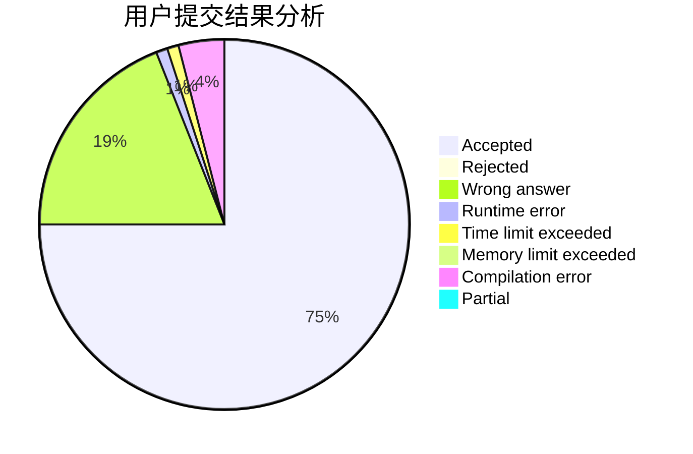
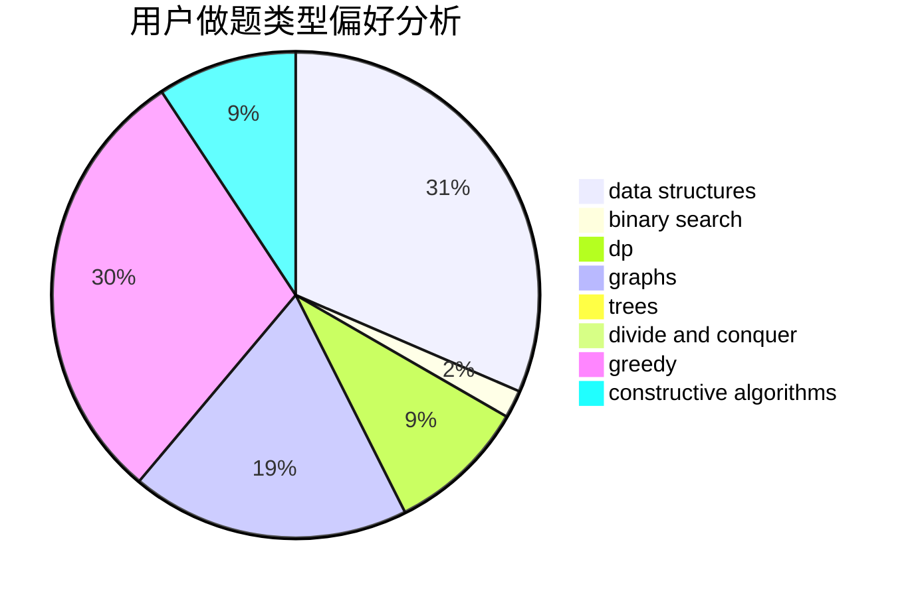

# Red_Flower

<!-- tabs:start -->

#### **用户提交结果分析**

#### **用户做题类型偏好分析**

#### **用户错题知识点分析**

<!-- tabs:end -->
# 推荐题目
[1397D](https://codeforces.com/contest/1397/problem/D)		dsu,graphs,sortings,trees		  
[1200E](https://codeforces.com/contest/1200/problem/E)		brute force,
                        hashing,
                        implementation,
                        string suffix structures,
                        strings		  
[115B](https://codeforces.com/contest/115/problem/B)		greedy,
                        sortings		  
[431E](https://codeforces.com/contest/431/problem/E)		binary search,
                        data structures,
                        ternary search		  
[993E](https://codeforces.com/contest/993/problem/E)		chinese remainder theorem,
                        fft,
                        math		  
[1293A](https://codeforces.com/contest/1293/problem/A)		binary search,
                        brute force,
                        implementation		  
[93A](https://codeforces.com/contest/93/problem/A)		implementation		  
[689E](https://codeforces.com/contest/689/problem/E)		combinatorics,
                        data structures,
                        dp,
                        geometry,
                        implementation		  
[251C](https://codeforces.com/contest/251/problem/C)		dp,
                        greedy,
                        number theory		  
[1303C](https://codeforces.com/contest/1303/problem/C)		dfs and similar,
                        greedy,
                        implementation		  
