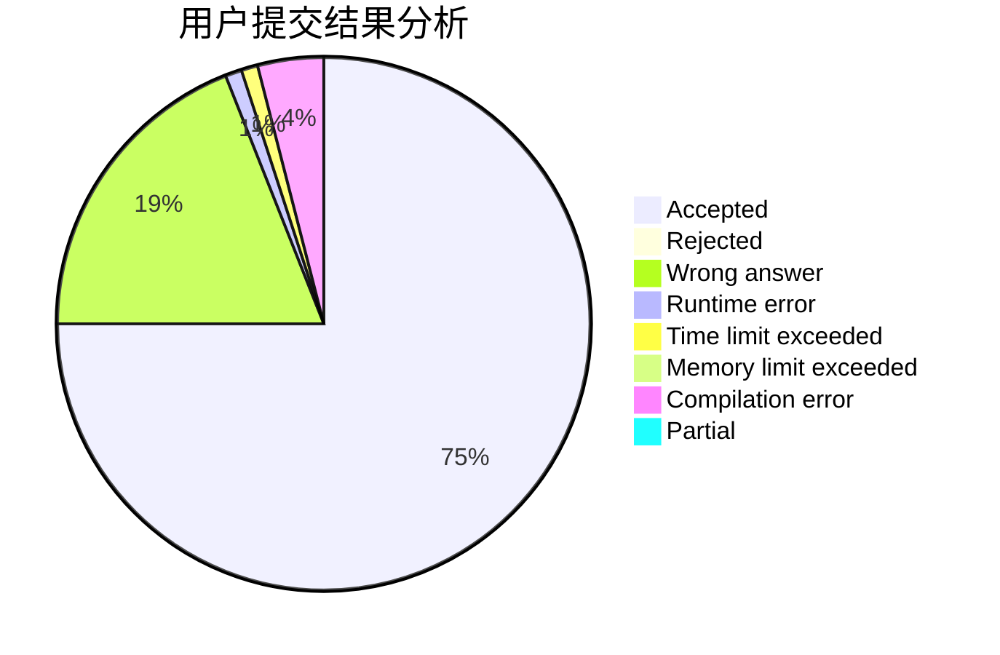
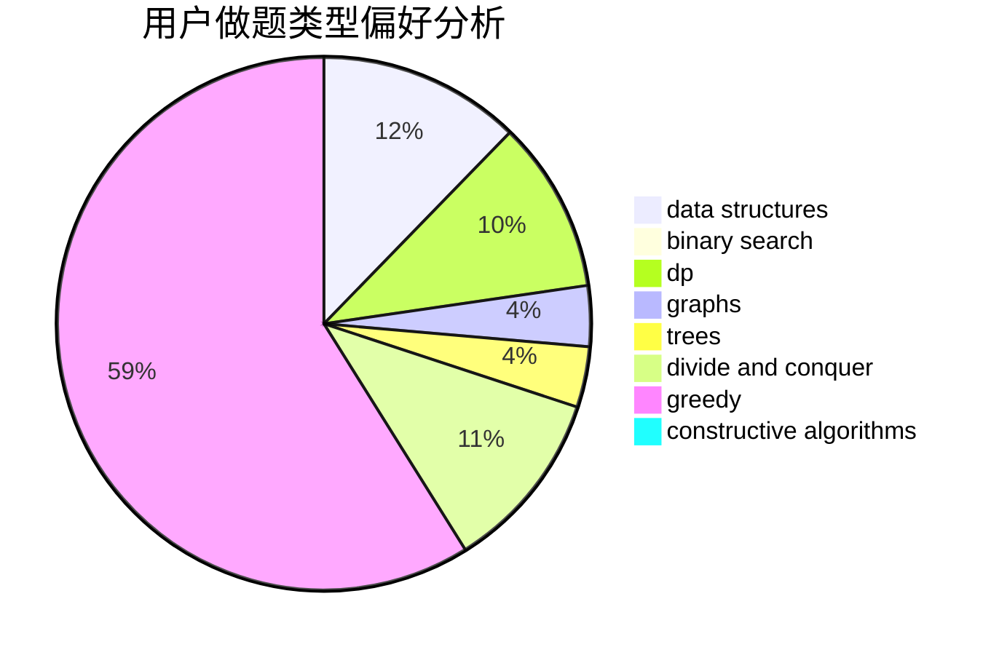

# Red_Flower

<!-- tabs:start -->

#### **用户提交结果分析**

#### **用户做题类型偏好分析**

#### **用户错题知识点分析**

<!-- tabs:end -->
# 推荐题目
[1388A](https://codeforces.com/contest/1388/problem/A)		brute force,
                        greedy,
                        math,
                        number theory		  
[1197C](https://codeforces.com/contest/1197/problem/C)		greedy,
                        sortings		  
[1157F](https://codeforces.com/contest/1157/problem/F)		constructive algorithms,
                        dp,
                        greedy,
                        two pointers		  
[403E](https://codeforces.com/contest/403/problem/E)		data structures,
                        implementation,
                        trees		  
[979E](https://codeforces.com/contest/979/problem/E)		dp		  
[1285F](https://codeforces.com/contest/1285/problem/F)		binary search,
                        combinatorics,
                        number theory		  
[919F](https://codeforces.com/contest/919/problem/F)		games,
                        graphs,
                        shortest paths		  
[667E](https://codeforces.com/contest/667/problem/E)		dsu,graphs,sortings,trees		  
[230B](https://codeforces.com/contest/230/problem/B)		binary search,
                        implementation,
                        math,
                        number theory		  
[1296A](https://codeforces.com/contest/1296/problem/A)		math		  
