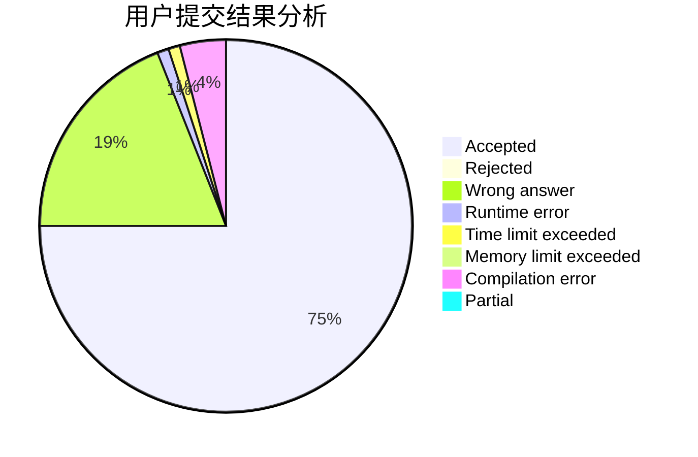
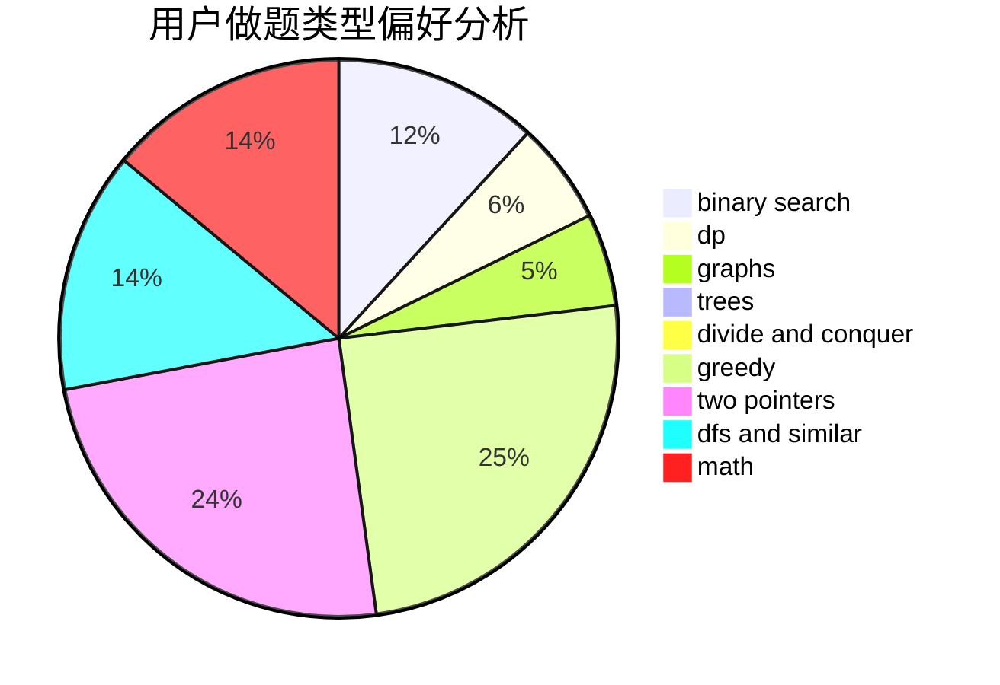

# Red_Flower

<!-- tabs:start -->

#### **用户提交结果分析**

#### **用户做题类型偏好分析**

<!-- tabs:end -->
# 推荐题目
[1397D](https://codeforces.com/contest/1397/problem/D)
[1200E](https://codeforces.com/contest/1200/problem/E)
[115B](https://codeforces.com/contest/115/problem/B)
[431E](https://codeforces.com/contest/431/problem/E)
[993E](https://codeforces.com/contest/993/problem/E)
[1293A](https://codeforces.com/contest/1293/problem/A)
[93A](https://codeforces.com/contest/93/problem/A)
[689E](https://codeforces.com/contest/689/problem/E)
[251C](https://codeforces.com/contest/251/problem/C)
[1303C](https://codeforces.com/contest/1303/problem/C)
