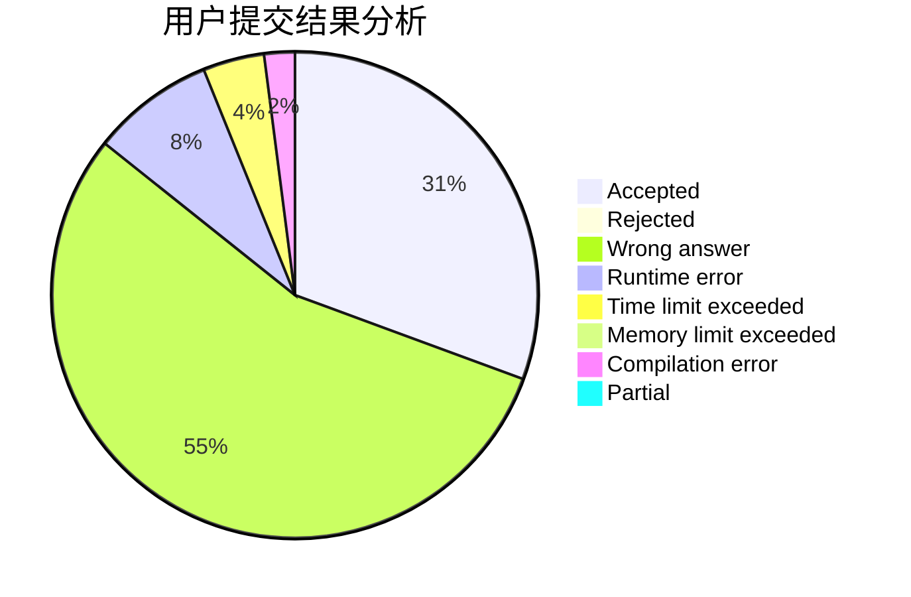
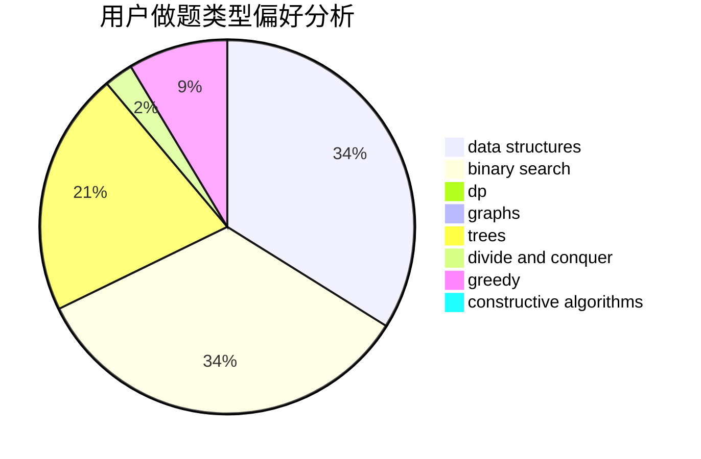
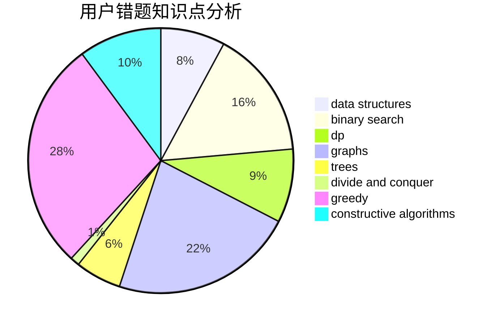

# Reisen_Inaba

<!-- tabs:start -->

#### **用户提交结果分析**

#### **用户做题类型偏好分析**

#### **用户错题知识点分析**

<!-- tabs:end -->
# 推荐题目
[266D](https://codeforces.com/contest/266/problem/D)		graphs,
                        math,
                        shortest paths		  
[1214G](https://codeforces.com/contest/1214/problem/G)		bitmasks,
                        data structures		  
[313D](https://codeforces.com/contest/313/problem/D)		dp		  
[975E](https://codeforces.com/contest/975/problem/E)		geometry		  
[799A](https://codeforces.com/contest/799/problem/A)		brute force,
                        implementation		  
[550D](https://codeforces.com/contest/550/problem/D)		constructive algorithms,
                        graphs,
                        implementation		  
[1016C](https://codeforces.com/contest/1016/problem/C)		dp,
                        implementation		  
[1367F1](https://codeforces.com/contest/1367F/problem/1)		dp,
                        greedy,
                        two pointers		  
[676D](https://codeforces.com/contest/676/problem/D)		graphs,
                        implementation,
                        shortest paths		  
[554A](https://codeforces.com/contest/554/problem/A)		brute force,
                        math,
                        strings		  
