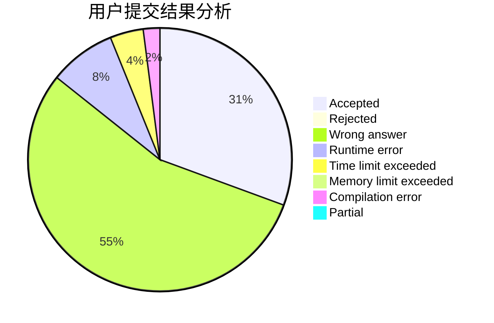
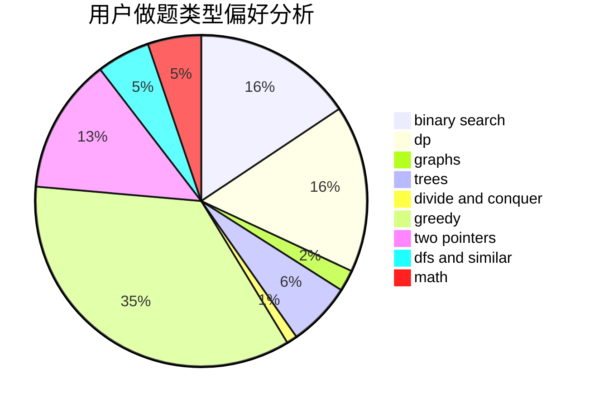

# Reisen_Inaba

<!-- tabs:start -->

#### **用户提交结果分析**

#### **用户做题类型偏好分析**

<!-- tabs:end -->
# 推荐题目
[282C](https://codeforces.com/contest/282/problem/C)
[1220C](https://codeforces.com/contest/1220/problem/C)
[337D](https://codeforces.com/contest/337/problem/D)
[98D](https://codeforces.com/contest/98/problem/D)
[813B](https://codeforces.com/contest/813/problem/B)
[575H](https://codeforces.com/contest/575/problem/H)
[1016F](https://codeforces.com/contest/1016/problem/F)
[1374C](https://codeforces.com/contest/1374/problem/C)
[700D](https://codeforces.com/contest/700/problem/D)
[57A](https://codeforces.com/contest/57/problem/A)
