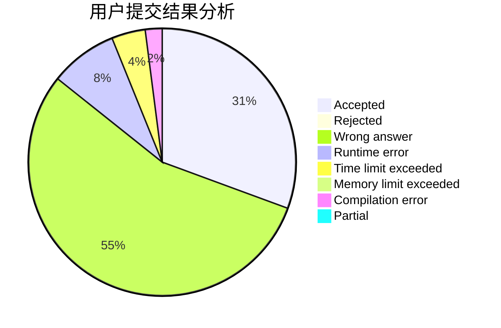
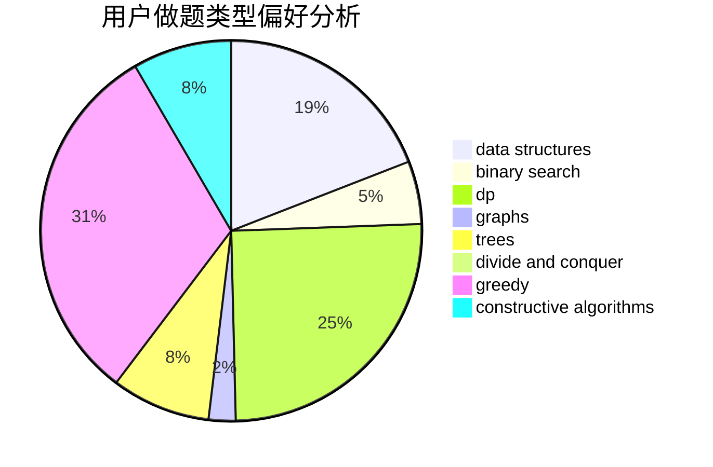
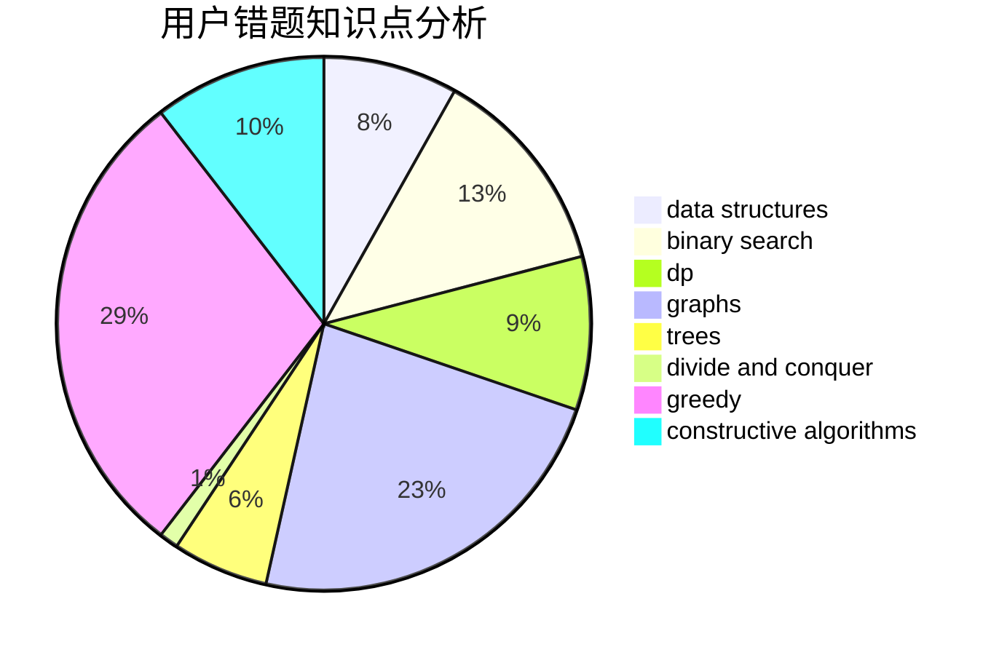

# Reisen_Inaba

<!-- tabs:start -->

#### **用户提交结果分析**

#### **用户做题类型偏好分析**

#### **用户错题知识点分析**

<!-- tabs:end -->
# 推荐题目
[282C](https://codeforces.com/contest/282/problem/C)		constructive algorithms,
                        implementation,
                        math		  
[1220C](https://codeforces.com/contest/1220/problem/C)		games,
                        greedy,
                        strings		  
[337D](https://codeforces.com/contest/337/problem/D)		dfs and similar,
                        divide and conquer,
                        dp,
                        trees		  
[98D](https://codeforces.com/contest/98/problem/D)		constructive algorithms		  
[813B](https://codeforces.com/contest/813/problem/B)		brute force,
                        math		  
[575H](https://codeforces.com/contest/575/problem/H)		combinatorics,
                        number theory		  
[1016F](https://codeforces.com/contest/1016/problem/F)		dfs and similar,
                        dp,
                        trees		  
[1374C](https://codeforces.com/contest/1374/problem/C)		greedy,
                        strings		  
[700D](https://codeforces.com/contest/700/problem/D)		data structures,
                        greedy		  
[57A](https://codeforces.com/contest/57/problem/A)		dfs and similar,
                        greedy,
                        implementation		  
