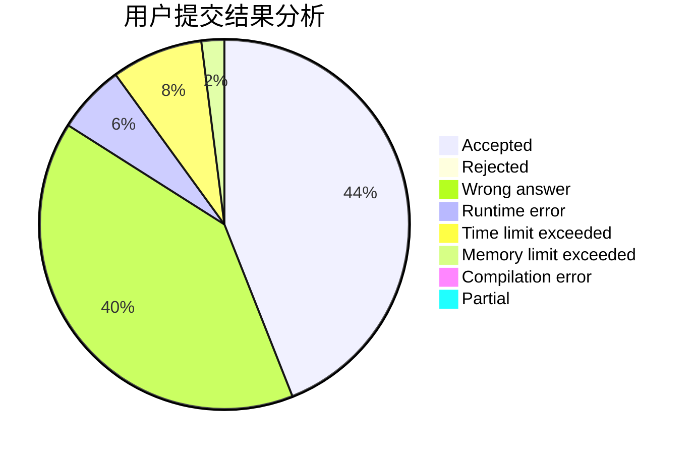
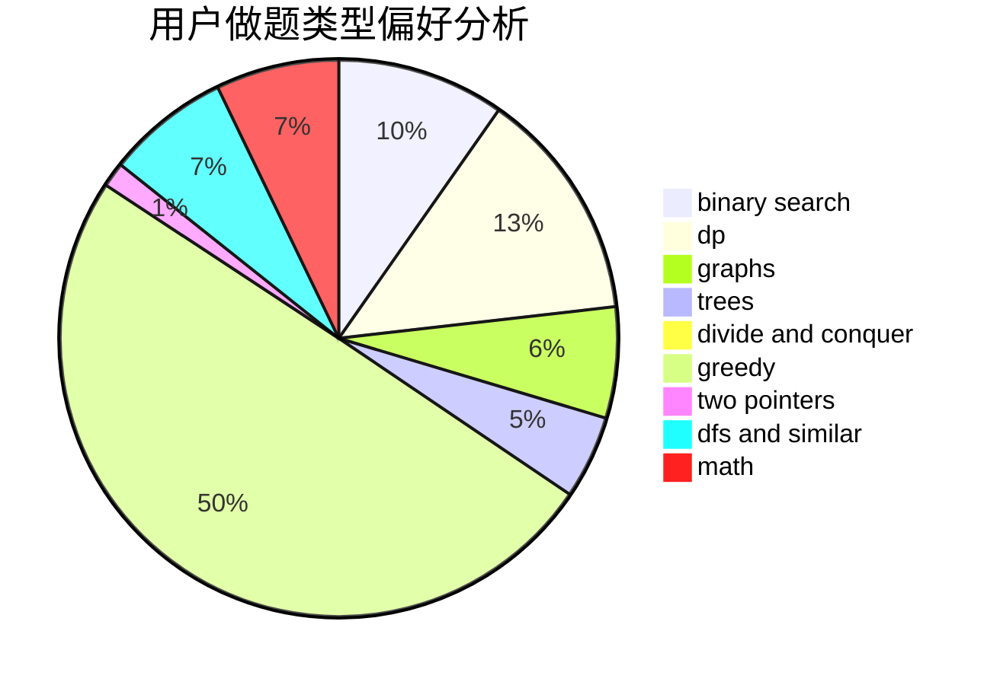

# Reliauk

<!-- tabs:start -->

#### **用户提交结果分析**

#### **用户做题类型偏好分析**

<!-- tabs:end -->
# 推荐题目
[1474E](https://codeforces.com/contest/1474/problem/E)
[1245F](https://codeforces.com/contest/1245/problem/F)
[955A](https://codeforces.com/contest/955/problem/A)
[277D](https://codeforces.com/contest/277/problem/D)
[86C](https://codeforces.com/contest/86/problem/C)
[1266A](https://codeforces.com/contest/1266/problem/A)
[1081A](https://codeforces.com/contest/1081/problem/A)
[453D](https://codeforces.com/contest/453/problem/D)
[580D](https://codeforces.com/contest/580/problem/D)
[613A](https://codeforces.com/contest/613/problem/A)
