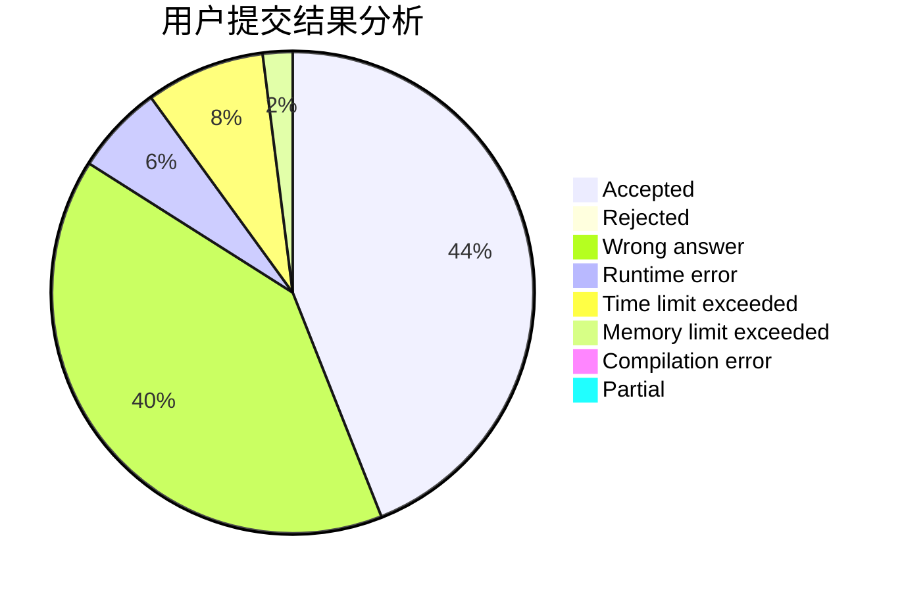
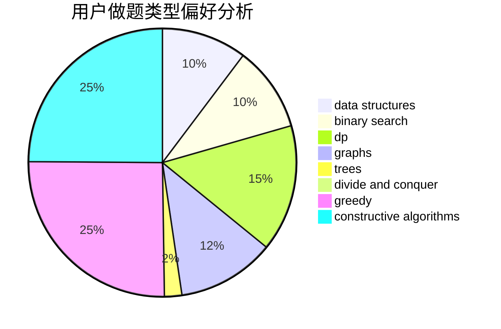

# Reliauk

<!-- tabs:start -->

#### **用户提交结果分析**

#### **用户做题类型偏好分析**

#### **用户错题知识点分析**

<!-- tabs:end -->
# 推荐题目
[1467C](https://codeforces.com/contest/1467/problem/C)		constructive algorithms,
                        greedy		  
[1240C](https://codeforces.com/contest/1240/problem/C)		dsu,graphs,sortings,trees		  
[933A](https://codeforces.com/contest/933/problem/A)		dp		  
[25D](https://codeforces.com/contest/25/problem/D)		dsu,
                        graphs,
                        trees		  
[851B](https://codeforces.com/contest/851/problem/B)		geometry,
                        math		  
[1260A](https://codeforces.com/contest/1260/problem/A)		math		  
[1080D](https://codeforces.com/contest/1080/problem/D)		constructive algorithms,
                        implementation,
                        math		  
[432D](https://codeforces.com/contest/432/problem/D)		dp,
                        string suffix structures,
                        strings,
                        two pointers		  
[557C](https://codeforces.com/contest/557/problem/C)		brute force,
                        data structures,
                        dp,
                        greedy,
                        math,
                        sortings		  
[596A](https://codeforces.com/contest/596/problem/A)		geometry,
                        implementation		  
