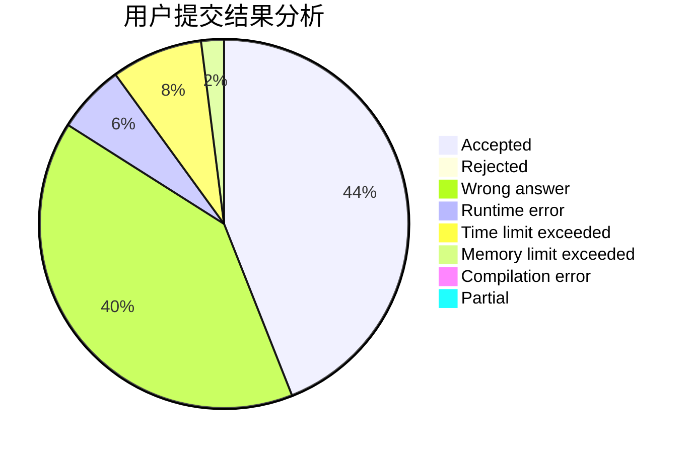
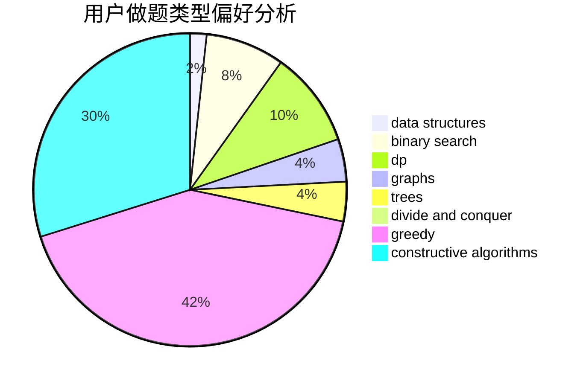

# Reliauk

<!-- tabs:start -->

#### **用户提交结果分析**

#### **用户做题类型偏好分析**

#### **用户错题知识点分析**

<!-- tabs:end -->
# 推荐题目
[1474E](https://codeforces.com/contest/1474/problem/E)		constructive algorithms,
                        greedy		  
[1245F](https://codeforces.com/contest/1245/problem/F)		bitmasks,
                        brute force,
                        combinatorics,
                        dp		  
[955A](https://codeforces.com/contest/955/problem/A)		greedy,
                        math		  
[277D](https://codeforces.com/contest/277/problem/D)		dp,
                        probabilities		  
[86C](https://codeforces.com/contest/86/problem/C)		dp,
                        string suffix structures,
                        trees		  
[1266A](https://codeforces.com/contest/1266/problem/A)		chinese remainder theorem,
                        math		  
[1081A](https://codeforces.com/contest/1081/problem/A)		constructive algorithms,
                        math		  
[453D](https://codeforces.com/contest/453/problem/D)		dp,
                        matrices		  
[580D](https://codeforces.com/contest/580/problem/D)		bitmasks,
                        dp		  
[613A](https://codeforces.com/contest/613/problem/A)		binary search,
                        geometry,
                        ternary search		  
