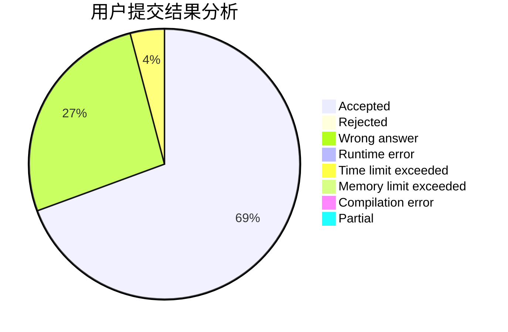
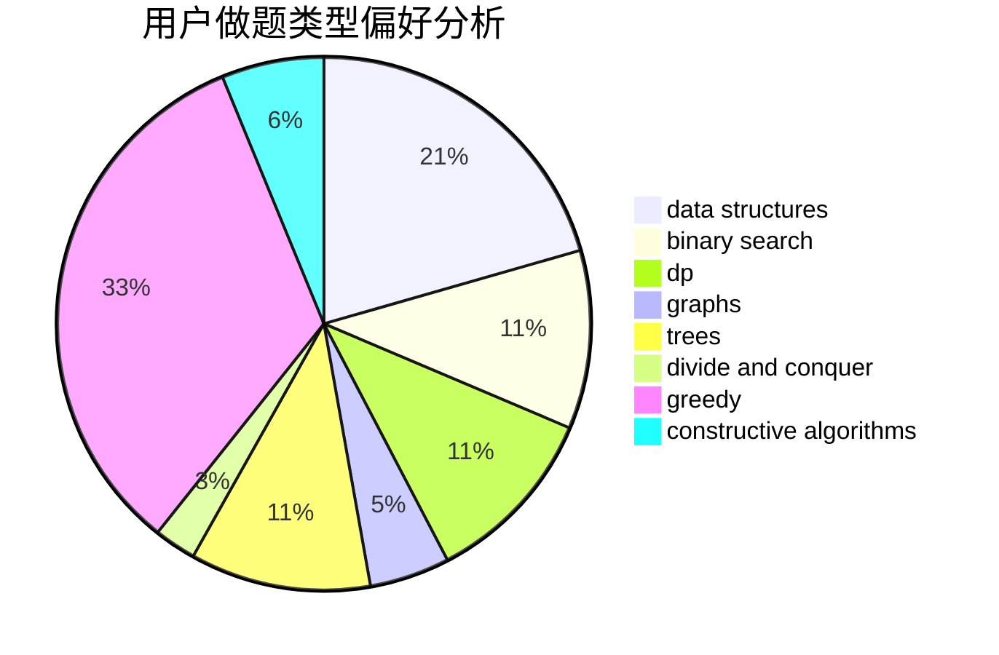
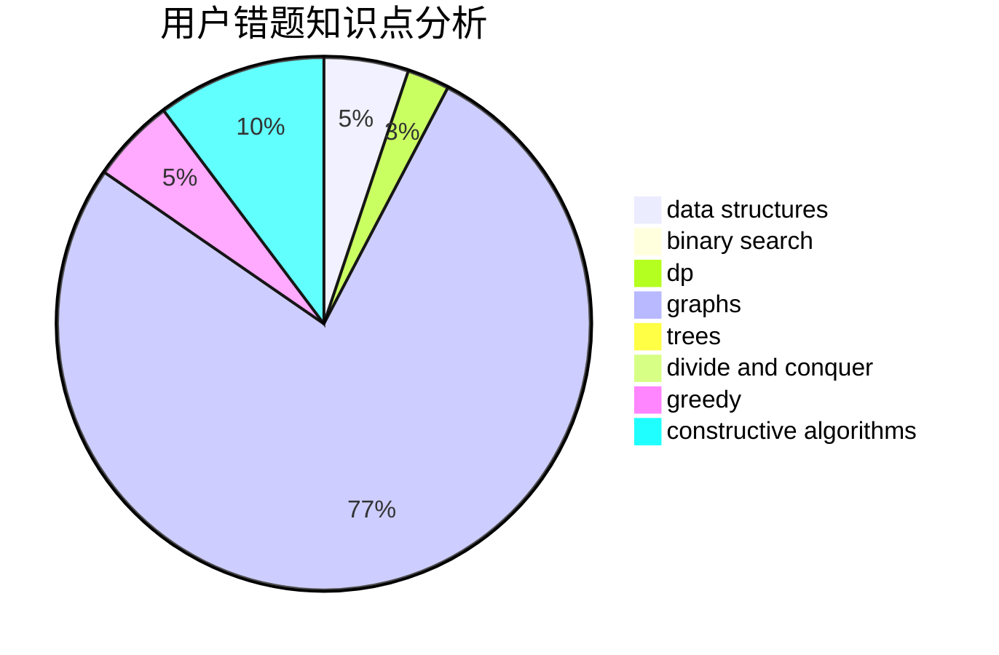

# RevolutionXIII

<!-- tabs:start -->

#### **用户提交结果分析**

#### **用户做题类型偏好分析**

#### **用户错题知识点分析**

<!-- tabs:end -->
# 推荐题目
[1254D](https://codeforces.com/contest/1254/problem/D)		data structures,
                        probabilities,
                        trees		  
[858F](https://codeforces.com/contest/858/problem/F)		constructive algorithms,
                        dfs and similar,
                        graphs		  
[299B](https://codeforces.com/contest/299/problem/B)		brute force,
                        implementation		  
[1033D](https://codeforces.com/contest/1033/problem/D)		interactive,
                        math,
                        number theory		  
[306B](https://codeforces.com/contest/306/problem/B)		data structures,
                        greedy,
                        sortings		  
[1080B](https://codeforces.com/contest/1080/problem/B)		math		  
[702B](https://codeforces.com/contest/702/problem/B)		brute force,
                        data structures,
                        implementation,
                        math		  
[538A](https://codeforces.com/contest/538/problem/A)		brute force,
                        implementation		  
[434A](https://codeforces.com/contest/434/problem/A)		dsu,graphs,sortings,trees		  
[670D1](https://codeforces.com/contest/670D/problem/1)		binary search,
                        brute force,
                        implementation		  
