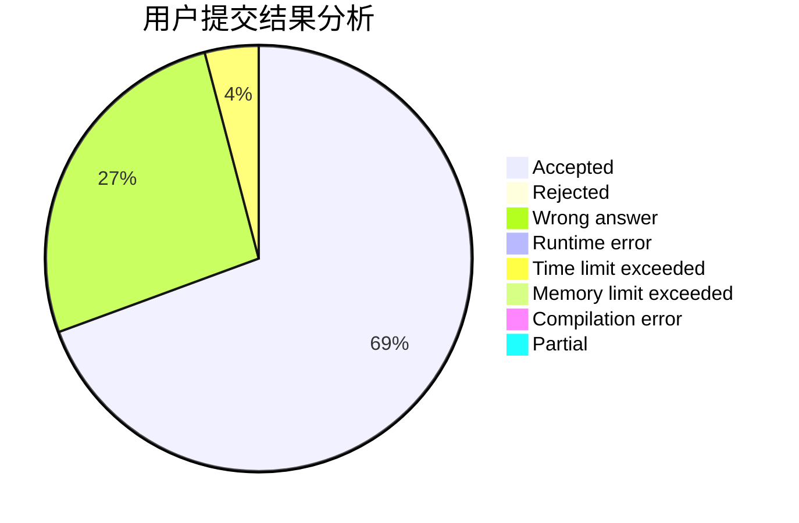
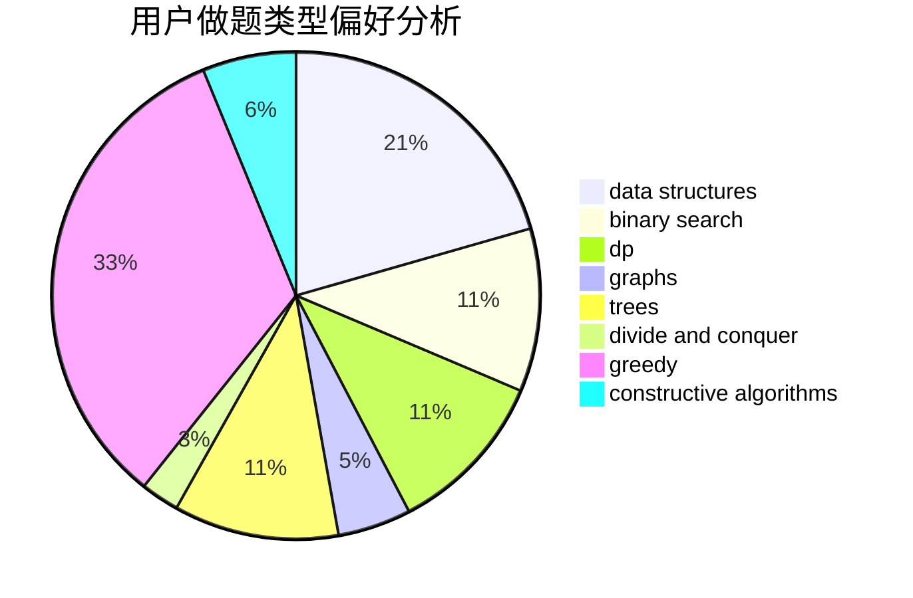
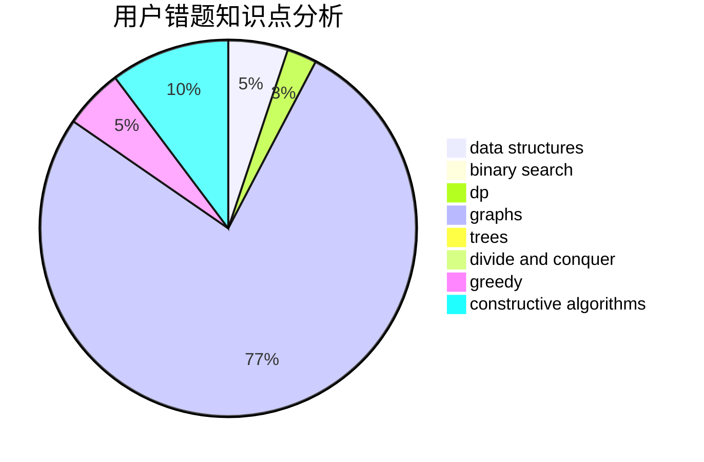

# RevolutionXIII
<!-- tabs:start -->
#### **用户提交结果分析**

#### **用户做题类型偏好分析**

#### **用户错题知识点分析**

<!-- tabs:end -->
# 推荐题目
[Pairs of Pairs](http://codeforces.com/problemset/problem/1391/E)		constructive algorithms,
                        dfs and similar,
                        graphs,
                        greedy,
                        trees		  
[Walking Between Houses](http://codeforces.com/problemset/problem/1015/D)		constructive algorithms,
                        greedy		  
[Max Median](http://codeforces.com/problemset/problem/1486/D)		binary search,
                        data structures,
                        dp		  
[Copy or Prefix Sum](http://codeforces.com/problemset/problem/1485/F)		combinatorics,
                        data structures,
                        dp,
                        sortings		  
[Tree Queries](http://codeforces.com/problemset/problem/1254/D)		data structures,
                        probabilities,
                        trees		  
[Margarite and the best present](http://codeforces.com/problemset/problem/1080/B)		math		  
[Orac and Models](http://codeforces.com/problemset/problem/1350/B)		dp,
                        math,
                        number theory		  
[Running Competition](http://codeforces.com/problemset/problem/1398/G)		bitmasks,
                        fft,
                        math,
                        number theory		  
[Ping-Pong](http://codeforces.com/problemset/problem/319/E)		data structures		  
[XOR Equation](https://codeforces.com/contest/634/problem/B)		dp,
                        math		  
<!-- tabs:start -->
#### **data structures**
[Pairs of Pairs](http://codeforces.com/problemset/problem/1486/D)		binary search,
                        data structures,
                        dp		  
[Walking Between Houses](http://codeforces.com/problemset/problem/1485/F)		combinatorics,
                        data structures,
                        dp,
                        sortings		  
[Max Median](http://codeforces.com/problemset/problem/1254/D)		data structures,
                        probabilities,
                        trees		  
[Copy or Prefix Sum](http://codeforces.com/problemset/problem/319/E)		data structures		  
[Tree Queries](http://codeforces.com/problemset/problem/306/B)		data structures,
                        greedy,
                        sortings		  
[Margarite and the best present](http://codeforces.com/problemset/problem/1388/E)		data structures,
                        geometry,
                        sortings		  
[Orac and Models](http://codeforces.com/problemset/problem/144/D)		data structures,
                        dfs and similar,
                        graphs,
                        shortest paths		  
[Running Competition](http://codeforces.com/problemset/problem/407/E)		data structures		  
[Ping-Pong](http://codeforces.com/problemset/problem/368/B)		data structures,
                        dp		  
[XOR Equation](http://codeforces.com/problemset/problem/702/B)		brute force,
                        data structures,
                        implementation,
                        math		  
#### **binary search**
[Pairs of Pairs](http://codeforces.com/problemset/problem/1486/D)		binary search,
                        data structures,
                        dp		  
[Walking Between Houses](http://codeforces.com/problemset/problem/670/D1)		binary search,
                        brute force,
                        implementation		  
[Max Median](http://codeforces.com/problemset/problem/75/C)		binary search,
                        number theory		  
[Copy or Prefix Sum](https://codeforces.com/contest/1247/problem/E)		binary search,
                        dp		  
[Tree Queries](http://codeforces.com/problemset/problem/1486/E)		binary search,
                        brute force,
                        constructive algorithms,
                        dp,
                        flows,
                        graphs,
                        shortest paths		  
[Margarite and the best present](http://codeforces.com/problemset/problem/1492/C)		binary search,
                        data structures,
                        dp,
                        greedy,
                        two pointers		  
[Orac and Models](http://codeforces.com/problemset/problem/1463/D)		binary search,
                        constructive algorithms,
                        greedy,
                        two pointers		  
[Running Competition](http://codeforces.com/problemset/problem/1490/G)		binary search,
                        data structures,
                        math		  
[Ping-Pong](http://codeforces.com/problemset/problem/1479/D)		binary search,
                        bitmasks,
                        brute force,
                        data structures,
                        probabilities,
                        trees		  
[XOR Equation](http://codeforces.com/problemset/problem/1436/E)		binary search,
                        data structures,
                        two pointers		  
#### **dp**
[Pairs of Pairs](http://codeforces.com/problemset/problem/1486/D)		binary search,
                        data structures,
                        dp		  
[Walking Between Houses](http://codeforces.com/problemset/problem/1485/F)		combinatorics,
                        data structures,
                        dp,
                        sortings		  
[Max Median](http://codeforces.com/problemset/problem/1350/B)		dp,
                        math,
                        number theory		  
[Copy or Prefix Sum](https://codeforces.com/contest/634/problem/B)		dp,
                        math		  
[Tree Queries](https://codeforces.com/contest/1261/problem/D1)		dp		  
[Margarite and the best present](http://codeforces.com/problemset/problem/546/D)		constructive algorithms,
                        dp,
                        math,
                        number theory		  
[Orac and Models](http://codeforces.com/problemset/problem/809/C)		combinatorics,
                        divide and conquer,
                        dp		  
[Running Competition](http://codeforces.com/problemset/problem/368/B)		data structures,
                        dp		  
[Ping-Pong](https://codeforces.com/contest/1247/problem/E)		binary search,
                        dp		  
[XOR Equation](http://codeforces.com/problemset/problem/1486/E)		binary search,
                        brute force,
                        constructive algorithms,
                        dp,
                        flows,
                        graphs,
                        shortest paths		  
#### **graph**
[Pairs of Pairs](http://codeforces.com/problemset/problem/1391/E)		constructive algorithms,
                        dfs and similar,
                        graphs,
                        greedy,
                        trees		  
[Walking Between Houses](http://codeforces.com/problemset/problem/858/F)		constructive algorithms,
                        dfs and similar,
                        graphs		  
[Max Median](http://codeforces.com/problemset/problem/144/D)		data structures,
                        dfs and similar,
                        graphs,
                        shortest paths		  
[Copy or Prefix Sum](http://codeforces.com/problemset/problem/1033/A)		dfs and similar,
                        graphs,
                        implementation		  
[Tree Queries](http://codeforces.com/problemset/problem/1093/D)		dfs and similar,
                        graphs		  
[Margarite and the best present](https://codeforces.com/contest/403/problem/C)		graphs,
                        math		  
[Orac and Models](http://codeforces.com/problemset/problem/1486/E)		binary search,
                        brute force,
                        constructive algorithms,
                        dp,
                        flows,
                        graphs,
                        shortest paths		  
[Running Competition](http://codeforces.com/problemset/problem/1487/C)		brute force,
                        constructive algorithms,
                        dfs and similar,
                        graphs,
                        greedy,
                        implementation,
                        math		  
[Ping-Pong](http://codeforces.com/problemset/problem/1437/C)		dp,
                        flows,
                        graph matchings,
                        greedy,
                        math,
                        sortings		  
[XOR Equation](http://codeforces.com/problemset/problem/1470/D)		constructive algorithms,
                        dfs and similar,
                        graph matchings,
                        graphs,
                        greedy		  
#### **trees**
[Pairs of Pairs](http://codeforces.com/problemset/problem/1391/E)		constructive algorithms,
                        dfs and similar,
                        graphs,
                        greedy,
                        trees		  
[Walking Between Houses](http://codeforces.com/problemset/problem/1254/D)		data structures,
                        probabilities,
                        trees		  
[Max Median](http://codeforces.com/problemset/problem/566/E)		bitmasks,
                        constructive algorithms,
                        trees		  
[Copy or Prefix Sum](http://codeforces.com/problemset/problem/1479/D)		binary search,
                        bitmasks,
                        brute force,
                        data structures,
                        probabilities,
                        trees		  
[Tree Queries](http://codeforces.com/problemset/problem/1511/C)		brute force,
                        data structures,
                        implementation,
                        trees		  
[Margarite and the best present](http://codeforces.com/problemset/problem/1499/F)		combinatorics,
                        dfs and similar,
                        dp,
                        trees		  
[Orac and Models](http://codeforces.com/problemset/problem/1491/E)		brute force,
                        dfs and similar,
                        divide and conquer,
                        number theory,
                        trees		  
[Running Competition](http://codeforces.com/problemset/problem/1466/D)		data structures,
                        greedy,
                        sortings,
                        trees		  
[Ping-Pong](http://codeforces.com/problemset/problem/1495/D)		combinatorics,
                        dfs and similar,
                        graphs,
                        math,
                        shortest paths,
                        trees		  
[XOR Equation](http://codeforces.com/problemset/problem/1303/G)		data structures,
                        divide and conquer,
                        geometry,
                        trees		  
#### **divide and conquer**
[Pairs of Pairs](http://codeforces.com/problemset/problem/809/C)		combinatorics,
                        divide and conquer,
                        dp		  
[Walking Between Houses](http://codeforces.com/problemset/problem/1461/D)		binary search,
                        brute force,
                        data structures,
                        divide and conquer,
                        implementation,
                        sortings		  
[Max Median](http://codeforces.com/problemset/problem/1466/G)		combinatorics,
                        divide and conquer,
                        hashing,
                        math,
                        string suffix structures,
                        strings		  
[Copy or Prefix Sum](http://codeforces.com/problemset/problem/1490/D)		dfs and similar,
                        divide and conquer,
                        implementation		  
[Tree Queries](https://codeforces.com/contest/1483/problem/C)		data structures,
                        divide and conquer,
                        dp		  
[Margarite and the best present](http://codeforces.com/problemset/problem/1491/E)		brute force,
                        dfs and similar,
                        divide and conquer,
                        number theory,
                        trees		  
[Orac and Models](http://codeforces.com/problemset/problem/1303/G)		data structures,
                        divide and conquer,
                        geometry,
                        trees		  
[Running Competition](http://codeforces.com/problemset/problem/1494/D)		constructive algorithms,
                        data structures,
                        dfs and similar,
                        divide and conquer,
                        dsu,
                        greedy,
                        sortings,
                        trees		  
[Ping-Pong](http://codeforces.com/problemset/problem/1482/E)		data structures,
                        divide and conquer,
                        dp		  
[XOR Equation](http://codeforces.com/problemset/problem/566/C)		dfs and similar,
                        divide and conquer,
                        trees		  
#### **greedy**
[Pairs of Pairs](http://codeforces.com/problemset/problem/1391/E)		constructive algorithms,
                        dfs and similar,
                        graphs,
                        greedy,
                        trees		  
[Walking Between Houses](http://codeforces.com/problemset/problem/1015/D)		constructive algorithms,
                        greedy		  
[Max Median](http://codeforces.com/problemset/problem/306/B)		data structures,
                        greedy,
                        sortings		  
[Copy or Prefix Sum](http://codeforces.com/problemset/problem/743/A)		constructive algorithms,
                        greedy,
                        implementation		  
[Tree Queries](http://codeforces.com/problemset/problem/297/B)		constructive algorithms,
                        greedy		  
[Margarite and the best present](http://codeforces.com/problemset/problem/909/A)		brute force,
                        greedy,
                        sortings		  
[Orac and Models](http://codeforces.com/problemset/problem/1117/B)		greedy,
                        math,
                        sortings		  
[Running Competition](http://codeforces.com/problemset/problem/719/B)		greedy		  
[Ping-Pong](http://codeforces.com/problemset/problem/1236/D)		brute force,
                        data structures,
                        greedy,
                        implementation		  
[XOR Equation](http://codeforces.com/problemset/problem/1511/E)		combinatorics,
                        dp,
                        greedy,
                        math		  
#### **constructive algorithms**
[Pairs of Pairs](http://codeforces.com/problemset/problem/1391/E)		constructive algorithms,
                        dfs and similar,
                        graphs,
                        greedy,
                        trees		  
[Walking Between Houses](http://codeforces.com/problemset/problem/1015/D)		constructive algorithms,
                        greedy		  
[Max Median](http://codeforces.com/problemset/problem/858/F)		constructive algorithms,
                        dfs and similar,
                        graphs		  
[Copy or Prefix Sum](http://codeforces.com/problemset/problem/743/A)		constructive algorithms,
                        greedy,
                        implementation		  
[Tree Queries](http://codeforces.com/problemset/problem/297/B)		constructive algorithms,
                        greedy		  
[Margarite and the best present](http://codeforces.com/problemset/problem/546/D)		constructive algorithms,
                        dp,
                        math,
                        number theory		  
[Orac and Models](http://codeforces.com/problemset/problem/566/E)		bitmasks,
                        constructive algorithms,
                        trees		  
[Running Competition](http://codeforces.com/problemset/problem/1486/E)		binary search,
                        brute force,
                        constructive algorithms,
                        dp,
                        flows,
                        graphs,
                        shortest paths		  
[Ping-Pong](https://codeforces.com/contest/764/problem/D)		constructive algorithms,
                        geometry		  
[XOR Equation](http://codeforces.com/problemset/problem/1493/A)		constructive algorithms,
                        greedy		  
#### **sortings**
[Pairs of Pairs](http://codeforces.com/problemset/problem/1485/F)		combinatorics,
                        data structures,
                        dp,
                        sortings		  
[Walking Between Houses](http://codeforces.com/problemset/problem/306/B)		data structures,
                        greedy,
                        sortings		  
[Max Median](http://codeforces.com/problemset/problem/1388/E)		data structures,
                        geometry,
                        sortings		  
[Copy or Prefix Sum](http://codeforces.com/problemset/problem/845/A)		implementation,
                        sortings		  
[Tree Queries](https://codeforces.com/contest/434/problem/A)		implementation,
                        math,
                        sortings		  
[Margarite and the best present](http://codeforces.com/problemset/problem/909/A)		brute force,
                        greedy,
                        sortings		  
[Orac and Models](http://codeforces.com/problemset/problem/1117/B)		greedy,
                        math,
                        sortings		  
[Running Competition](https://codeforces.com/contest/1496/problem/C)		geometry,
                        greedy,
                        math,
                        sortings		  
[Ping-Pong](http://codeforces.com/problemset/problem/1495/A)		geometry,
                        greedy,
                        math,
                        sortings		  
[XOR Equation](http://codeforces.com/problemset/problem/1497/A)		brute force,
                        data structures,
                        greedy,
                        sortings		  
<!-- tabs:end -->
