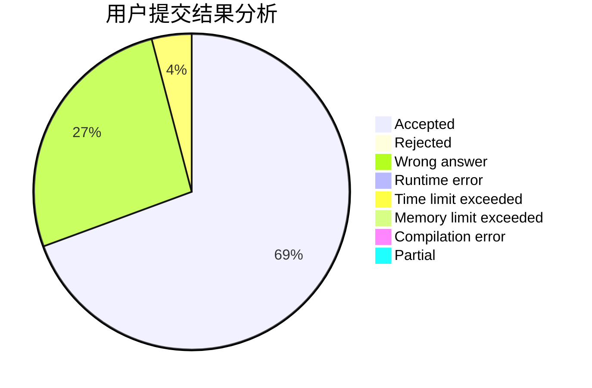
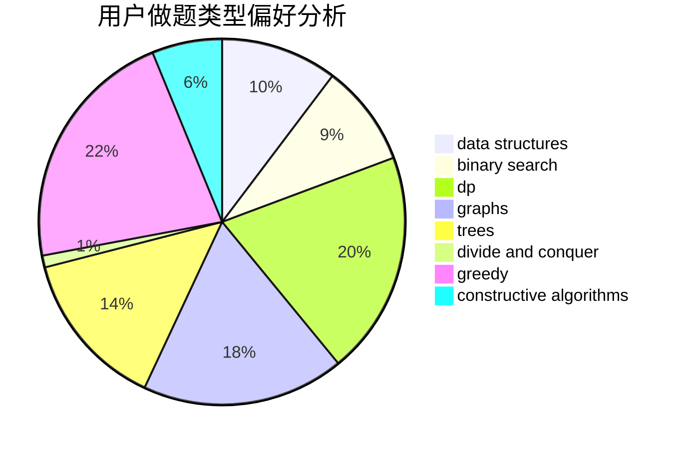
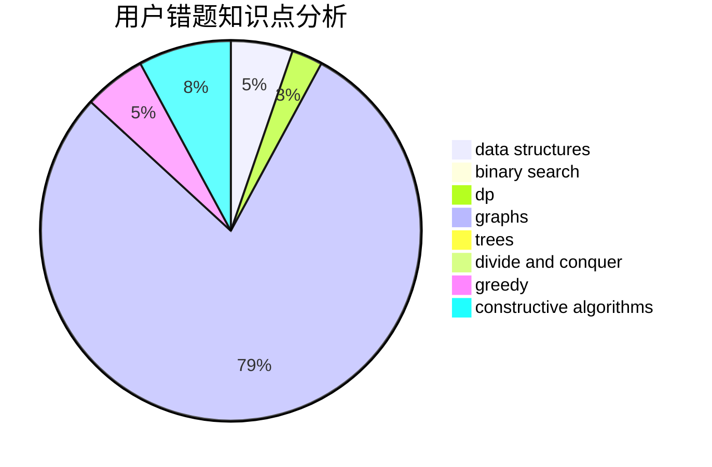

# RevolutionXIII

<!-- tabs:start -->

#### **用户提交结果分析**

#### **用户做题类型偏好分析**

#### **用户错题知识点分析**

<!-- tabs:end -->
# 推荐题目
[12621](https://codeforces.com/contest/1262/problem/1)		dsu,graphs,sortings,trees		  
[876C](https://codeforces.com/contest/876/problem/C)		dsu,graphs,sortings,trees		  
[3161](https://codeforces.com/contest/316/problem/1)		dsu,graphs,sortings,trees		  
[1033G](https://codeforces.com/contest/1033/problem/G)		games		  
[327D](https://codeforces.com/contest/327/problem/D)		constructive algorithms,
                        dfs and similar,
                        graphs		  
[1080E](https://codeforces.com/contest/1080/problem/E)		strings		  
[721A](https://codeforces.com/contest/721/problem/A)		implementation		  
[559B](https://codeforces.com/contest/559/problem/B)		divide and conquer,
                        hashing,
                        sortings,
                        strings		  
[454A](https://codeforces.com/contest/454/problem/A)		implementation		  
[696B](https://codeforces.com/contest/696/problem/B)		dfs and similar,
                        math,
                        probabilities,
                        trees		  
