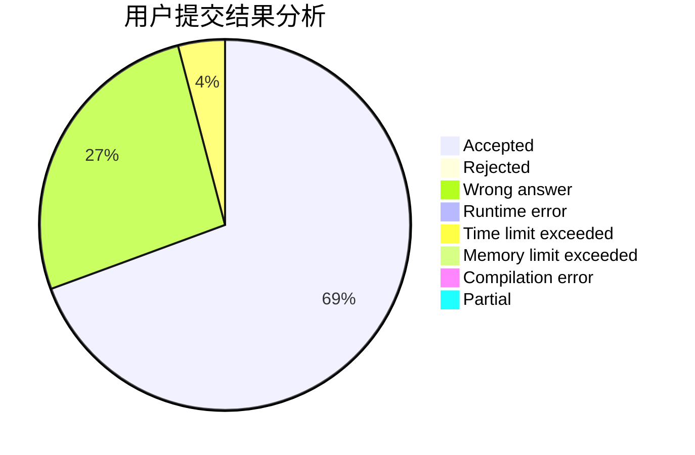
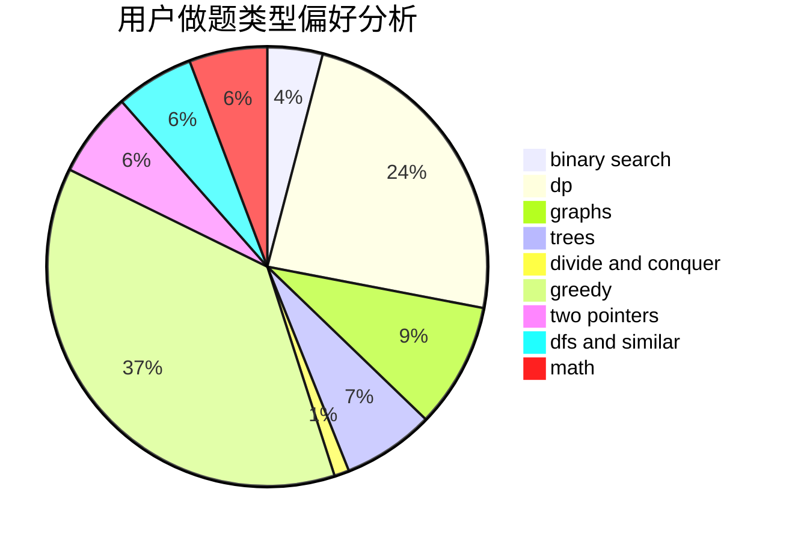

# RevolutionXIII

<!-- tabs:start -->

#### **用户提交结果分析**

#### **用户做题类型偏好分析**

<!-- tabs:end -->
# 推荐题目
[12621](https://codeforces.com/contest/1262/problem/1)
[876C](https://codeforces.com/contest/876/problem/C)
[3161](https://codeforces.com/contest/316/problem/1)
[1033G](https://codeforces.com/contest/1033/problem/G)
[327D](https://codeforces.com/contest/327/problem/D)
[1080E](https://codeforces.com/contest/1080/problem/E)
[721A](https://codeforces.com/contest/721/problem/A)
[559B](https://codeforces.com/contest/559/problem/B)
[454A](https://codeforces.com/contest/454/problem/A)
[696B](https://codeforces.com/contest/696/problem/B)
