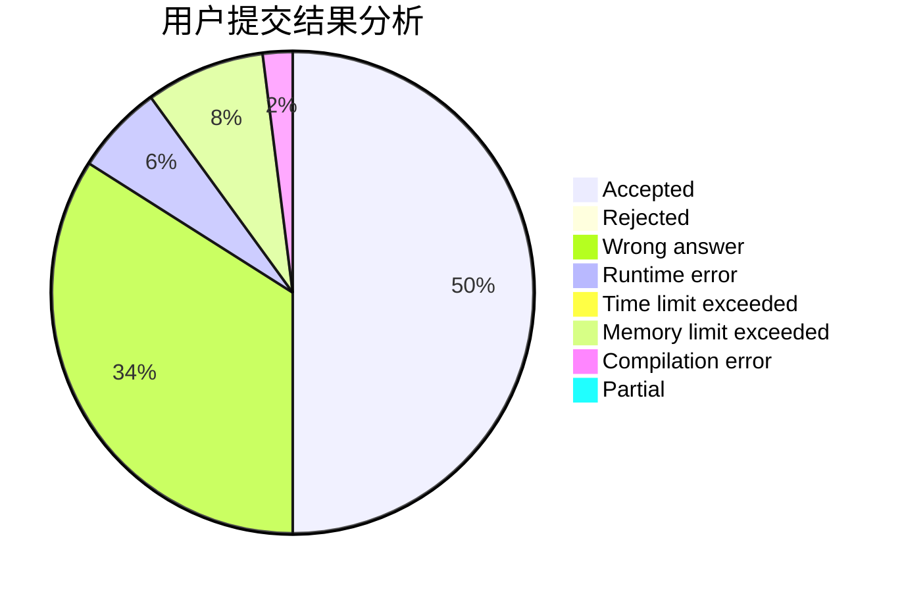
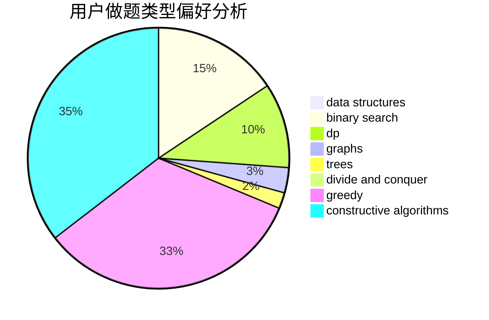
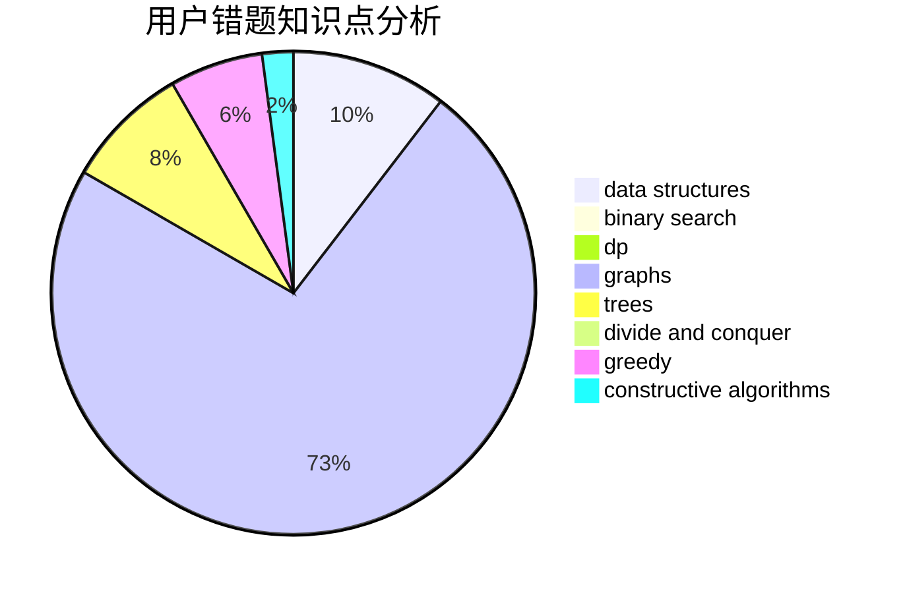

# Rheinmetall

<!-- tabs:start -->

#### **用户提交结果分析**

#### **用户做题类型偏好分析**

#### **用户错题知识点分析**

<!-- tabs:end -->
# 推荐题目
[1375C](https://codeforces.com/contest/1375/problem/C)		constructive algorithms,
                        data structures,
                        greedy		  
[699A](https://codeforces.com/contest/699/problem/A)		implementation		  
[727F](https://codeforces.com/contest/727/problem/F)		binary search,
                        dp,
                        greedy		  
[1276F](https://codeforces.com/contest/1276/problem/F)		string suffix structures		  
[650E](https://codeforces.com/contest/650/problem/E)		data structures,
                        dfs and similar,
                        dsu,
                        greedy,
                        trees		  
[1040B](https://codeforces.com/contest/1040/problem/B)		dp,
                        greedy,
                        math		  
[746B](https://codeforces.com/contest/746/problem/B)		implementation,
                        strings		  
[494E](https://codeforces.com/contest/494/problem/E)		data structures,
                        games		  
[976E](https://codeforces.com/contest/976/problem/E)		greedy,
                        sortings		  
[1369F](https://codeforces.com/contest/1369/problem/F)		dfs and similar,
                        dp,
                        games		  
