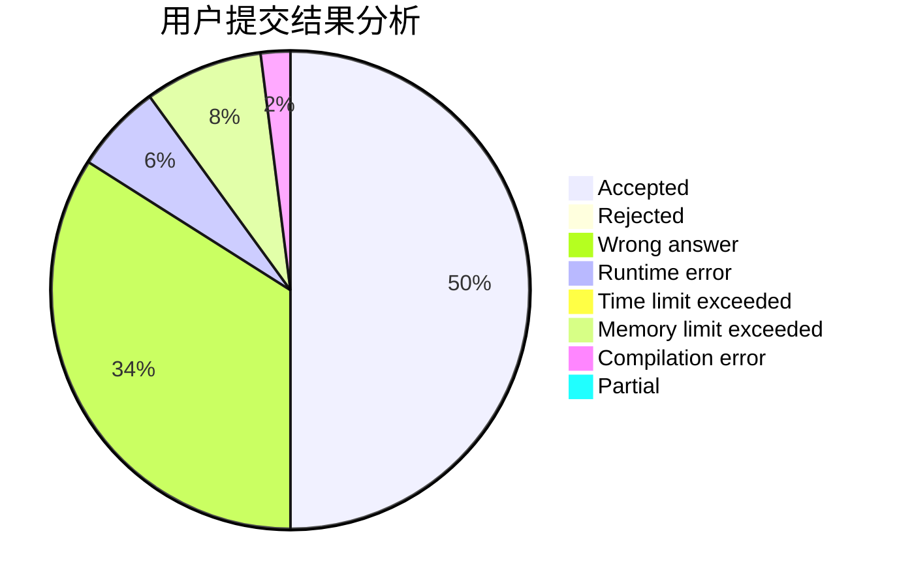
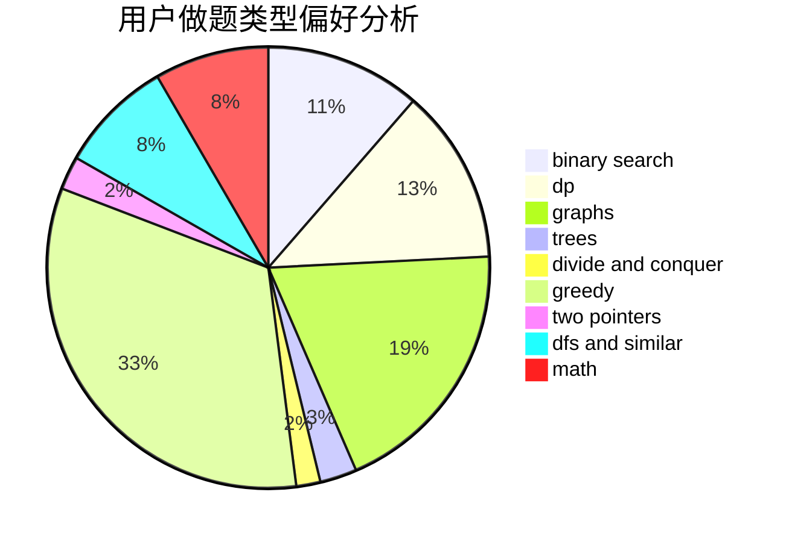

# Rheinmetall

<!-- tabs:start -->

#### **用户提交结果分析**

#### **用户做题类型偏好分析**

<!-- tabs:end -->
# 推荐题目
[1375C](https://codeforces.com/contest/1375/problem/C)
[699A](https://codeforces.com/contest/699/problem/A)
[727F](https://codeforces.com/contest/727/problem/F)
[1276F](https://codeforces.com/contest/1276/problem/F)
[650E](https://codeforces.com/contest/650/problem/E)
[1040B](https://codeforces.com/contest/1040/problem/B)
[746B](https://codeforces.com/contest/746/problem/B)
[494E](https://codeforces.com/contest/494/problem/E)
[976E](https://codeforces.com/contest/976/problem/E)
[1369F](https://codeforces.com/contest/1369/problem/F)
