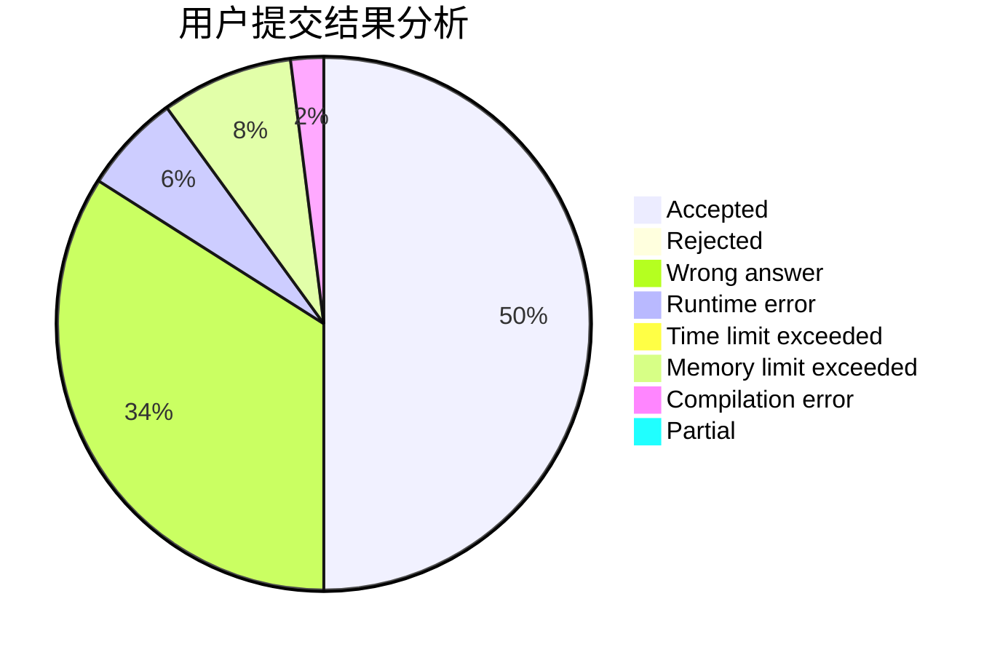
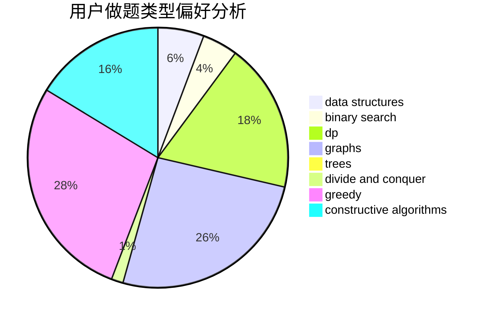
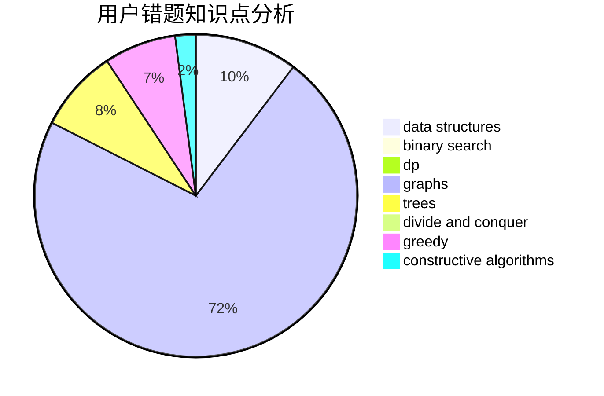

# Rheinmetall
<!-- tabs:start -->
#### **用户提交结果分析**

#### **用户做题类型偏好分析**

#### **用户错题知识点分析**

<!-- tabs:end -->
# 推荐题目
[Biathlon](http://codeforces.com/problemset/problem/84/C)		binary search,
                        implementation		  
[Decorate Apple Tree](http://codeforces.com/problemset/problem/1056/D)		constructive algorithms,
                        dfs and similar,
                        dp,
                        graphs,
                        greedy,
                        sortings,
                        trees		  
[Unshuffling a Deck](http://codeforces.com/problemset/problem/1427/D)		constructive algorithms,
                        implementation		  
[Death Stars (medium)](http://codeforces.com/problemset/problem/958/A2)		hashing,
                        strings		  
[Problems for Round](http://codeforces.com/problemset/problem/673/B)		greedy,
                        implementation		  
[XOR Equation](https://codeforces.com/contest/634/problem/B)		dp,
                        math		  
[Time to Raid Cowavans](http://codeforces.com/problemset/problem/103/D)		brute force,
                        data structures,
                        sortings		  
[Berland Elections](http://codeforces.com/problemset/problem/847/F)		greedy,
                        sortings		  
[AND, OR and square sum](http://codeforces.com/problemset/problem/1368/D)		bitmasks,
                        greedy,
                        math		  
[Domino](http://codeforces.com/problemset/problem/97/A)		brute force,
                        implementation		  
<!-- tabs:start -->
#### **data structures**
[Biathlon](http://codeforces.com/problemset/problem/103/D)		brute force,
                        data structures,
                        sortings		  
[Decorate Apple Tree](http://codeforces.com/problemset/problem/1304/E)		data structures,
                        dfs and similar,
                        shortest paths,
                        trees		  
[Unshuffling a Deck](http://codeforces.com/problemset/problem/915/E)		data structures,
                        implementation,
                        sortings		  
[Death Stars (medium)](http://codeforces.com/problemset/problem/838/B)		data structures,
                        dfs and similar,
                        trees		  
[Problems for Round](http://codeforces.com/problemset/problem/573/E)		data structures,
                        greedy		  
[XOR Equation](http://codeforces.com/problemset/problem/603/E)		data structures,
                        divide and conquer,
                        dsu,
                        math,
                        trees		  
[Time to Raid Cowavans](http://codeforces.com/problemset/problem/1492/C)		binary search,
                        data structures,
                        dp,
                        greedy,
                        two pointers		  
[Berland Elections](http://codeforces.com/problemset/problem/1490/G)		binary search,
                        data structures,
                        math		  
[AND, OR and square sum](http://codeforces.com/problemset/problem/1479/D)		binary search,
                        bitmasks,
                        brute force,
                        data structures,
                        probabilities,
                        trees		  
[Domino](http://codeforces.com/problemset/problem/1497/A)		brute force,
                        data structures,
                        greedy,
                        sortings		  
#### **binary search**
[Biathlon](http://codeforces.com/problemset/problem/84/C)		binary search,
                        implementation		  
[Decorate Apple Tree](https://codeforces.com/contest/1247/problem/E)		binary search,
                        dp		  
[Unshuffling a Deck](http://codeforces.com/problemset/problem/1438/E)		binary search,
                        bitmasks,
                        brute force,
                        constructive algorithms,
                        divide and conquer,
                        two pointers		  
[Death Stars (medium)](https://codeforces.com/contest/1262/problem/E)		binary search,
                        graphs,
                        graphs,
                        shortest paths		  
[Problems for Round](http://codeforces.com/problemset/problem/1153/E)		binary search,
                        brute force,
                        interactive		  
[XOR Equation](http://codeforces.com/problemset/problem/1492/C)		binary search,
                        data structures,
                        dp,
                        greedy,
                        two pointers		  
[Time to Raid Cowavans](http://codeforces.com/problemset/problem/1463/D)		binary search,
                        constructive algorithms,
                        greedy,
                        two pointers		  
[Berland Elections](http://codeforces.com/problemset/problem/1490/G)		binary search,
                        data structures,
                        math		  
[AND, OR and square sum](http://codeforces.com/problemset/problem/1479/D)		binary search,
                        bitmasks,
                        brute force,
                        data structures,
                        probabilities,
                        trees		  
[Domino](http://codeforces.com/problemset/problem/1436/E)		binary search,
                        data structures,
                        two pointers		  
#### **dp**
[Biathlon](http://codeforces.com/problemset/problem/1056/D)		constructive algorithms,
                        dfs and similar,
                        dp,
                        graphs,
                        greedy,
                        sortings,
                        trees		  
[Decorate Apple Tree](https://codeforces.com/contest/634/problem/B)		dp,
                        math		  
[Unshuffling a Deck](https://codeforces.com/contest/1384/problem/E)		bitmasks,
                        dp,
                        graphs,
                        trees		  
[Death Stars (medium)](http://codeforces.com/problemset/problem/1065/D)		dfs and similar,
                        dp,
                        shortest paths		  
[Problems for Round](https://codeforces.com/contest/791/problem/D)		dfs and similar,
                        dp,
                        trees		  
[XOR Equation](http://codeforces.com/problemset/problem/1307/C)		brute force,
                        dp,
                        math,
                        strings		  
[Time to Raid Cowavans](http://codeforces.com/problemset/problem/101/D)		dp,
                        greedy,
                        probabilities,
                        sortings,
                        trees		  
[Berland Elections](http://codeforces.com/problemset/problem/729/B)		dp,
                        implementation		  
[AND, OR and square sum](https://codeforces.com/contest/1314/problem/B)		dp,
                        implementation		  
[Domino](http://codeforces.com/problemset/problem/78/C)		dp,
                        games,
                        number theory		  
#### **graph**
[Biathlon](http://codeforces.com/problemset/problem/1056/D)		constructive algorithms,
                        dfs and similar,
                        dp,
                        graphs,
                        greedy,
                        sortings,
                        trees		  
[Decorate Apple Tree](https://codeforces.com/contest/1384/problem/E)		bitmasks,
                        dp,
                        graphs,
                        trees		  
[Unshuffling a Deck](http://codeforces.com/problemset/problem/842/C)		dfs and similar,
                        graphs,
                        math,
                        number theory,
                        trees		  
[Death Stars (medium)](http://codeforces.com/problemset/problem/367/C)		graphs,
                        greedy,
                        sortings		  
[Problems for Round](http://codeforces.com/problemset/problem/682/C)		dfs and similar,
                        dp,
                        graphs,
                        trees		  
[XOR Equation](http://codeforces.com/problemset/problem/1333/D)		brute force,
                        constructive algorithms,
                        games,
                        graphs,
                        greedy,
                        implementation,
                        sortings		  
[Time to Raid Cowavans](https://codeforces.com/contest/1262/problem/E)		binary search,
                        graphs,
                        graphs,
                        shortest paths		  
[Berland Elections](http://codeforces.com/problemset/problem/627/F)		dfs and similar,
                        dsu,
                        graphs,
                        trees		  
[AND, OR and square sum](http://codeforces.com/problemset/problem/1487/C)		brute force,
                        constructive algorithms,
                        dfs and similar,
                        graphs,
                        greedy,
                        implementation,
                        math		  
[Domino](http://codeforces.com/problemset/problem/1437/C)		dp,
                        flows,
                        graph matchings,
                        greedy,
                        math,
                        sortings		  
#### **trees**
[Biathlon](http://codeforces.com/problemset/problem/1056/D)		constructive algorithms,
                        dfs and similar,
                        dp,
                        graphs,
                        greedy,
                        sortings,
                        trees		  
[Decorate Apple Tree](https://codeforces.com/contest/1384/problem/E)		bitmasks,
                        dp,
                        graphs,
                        trees		  
[Unshuffling a Deck](http://codeforces.com/problemset/problem/715/C)		dfs and similar,
                        divide and conquer,
                        dsu,
                        trees		  
[Death Stars (medium)](http://codeforces.com/problemset/problem/842/C)		dfs and similar,
                        graphs,
                        math,
                        number theory,
                        trees		  
[Problems for Round](https://codeforces.com/contest/791/problem/D)		dfs and similar,
                        dp,
                        trees		  
[XOR Equation](http://codeforces.com/problemset/problem/101/D)		dp,
                        greedy,
                        probabilities,
                        sortings,
                        trees		  
[Time to Raid Cowavans](http://codeforces.com/problemset/problem/1304/E)		data structures,
                        dfs and similar,
                        shortest paths,
                        trees		  
[Berland Elections](http://codeforces.com/problemset/problem/838/B)		data structures,
                        dfs and similar,
                        trees		  
[AND, OR and square sum](http://codeforces.com/problemset/problem/682/C)		dfs and similar,
                        dp,
                        graphs,
                        trees		  
[Domino](http://codeforces.com/problemset/problem/627/F)		dfs and similar,
                        dsu,
                        graphs,
                        trees		  
#### **divide and conquer**
[Biathlon](http://codeforces.com/problemset/problem/715/C)		dfs and similar,
                        divide and conquer,
                        dsu,
                        trees		  
[Decorate Apple Tree](http://codeforces.com/problemset/problem/662/C)		bitmasks,
                        brute force,
                        divide and conquer,
                        dp,
                        fft,
                        math		  
[Unshuffling a Deck](http://codeforces.com/problemset/problem/1438/E)		binary search,
                        bitmasks,
                        brute force,
                        constructive algorithms,
                        divide and conquer,
                        two pointers		  
[Death Stars (medium)](http://codeforces.com/problemset/problem/603/E)		data structures,
                        divide and conquer,
                        dsu,
                        math,
                        trees		  
[Problems for Round](http://codeforces.com/problemset/problem/1461/D)		binary search,
                        brute force,
                        data structures,
                        divide and conquer,
                        implementation,
                        sortings		  
[XOR Equation](http://codeforces.com/problemset/problem/1466/G)		combinatorics,
                        divide and conquer,
                        hashing,
                        math,
                        string suffix structures,
                        strings		  
[Time to Raid Cowavans](http://codeforces.com/problemset/problem/1490/D)		dfs and similar,
                        divide and conquer,
                        implementation		  
[Berland Elections](https://codeforces.com/contest/1483/problem/C)		data structures,
                        divide and conquer,
                        dp		  
[AND, OR and square sum](http://codeforces.com/problemset/problem/1491/E)		brute force,
                        dfs and similar,
                        divide and conquer,
                        number theory,
                        trees		  
[Domino](http://codeforces.com/problemset/problem/1303/G)		data structures,
                        divide and conquer,
                        geometry,
                        trees		  
#### **greedy**
[Biathlon](http://codeforces.com/problemset/problem/1056/D)		constructive algorithms,
                        dfs and similar,
                        dp,
                        graphs,
                        greedy,
                        sortings,
                        trees		  
[Decorate Apple Tree](http://codeforces.com/problemset/problem/673/B)		greedy,
                        implementation		  
[Unshuffling a Deck](http://codeforces.com/problemset/problem/847/F)		greedy,
                        sortings		  
[Death Stars (medium)](http://codeforces.com/problemset/problem/1368/D)		bitmasks,
                        greedy,
                        math		  
[Problems for Round](http://codeforces.com/problemset/problem/898/E)		constructive algorithms,
                        greedy		  
[XOR Equation](http://codeforces.com/problemset/problem/101/D)		dp,
                        greedy,
                        probabilities,
                        sortings,
                        trees		  
[Time to Raid Cowavans](http://codeforces.com/problemset/problem/862/A)		greedy,
                        implementation		  
[Berland Elections](http://codeforces.com/problemset/problem/58/A)		greedy,
                        strings		  
[AND, OR and square sum](http://codeforces.com/problemset/problem/367/C)		graphs,
                        greedy,
                        sortings		  
[Domino](http://codeforces.com/problemset/problem/1333/D)		brute force,
                        constructive algorithms,
                        games,
                        graphs,
                        greedy,
                        implementation,
                        sortings		  
#### **constructive algorithms**
[Biathlon](http://codeforces.com/problemset/problem/1056/D)		constructive algorithms,
                        dfs and similar,
                        dp,
                        graphs,
                        greedy,
                        sortings,
                        trees		  
[Decorate Apple Tree](http://codeforces.com/problemset/problem/1427/D)		constructive algorithms,
                        implementation		  
[Unshuffling a Deck](http://codeforces.com/problemset/problem/898/E)		constructive algorithms,
                        greedy		  
[Death Stars (medium)](http://codeforces.com/problemset/problem/1438/E)		binary search,
                        bitmasks,
                        brute force,
                        constructive algorithms,
                        divide and conquer,
                        two pointers		  
[Problems for Round](http://codeforces.com/problemset/problem/1333/D)		brute force,
                        constructive algorithms,
                        games,
                        graphs,
                        greedy,
                        implementation,
                        sortings		  
[XOR Equation](http://codeforces.com/problemset/problem/1493/A)		constructive algorithms,
                        greedy		  
[Time to Raid Cowavans](http://codeforces.com/problemset/problem/1467/C)		constructive algorithms,
                        greedy		  
[Berland Elections](http://codeforces.com/problemset/problem/1103/A)		constructive algorithms,
                        implementation		  
[AND, OR and square sum](http://codeforces.com/problemset/problem/1365/F)		constructive algorithms,
                        implementation,
                        sortings		  
[Domino](http://codeforces.com/problemset/problem/1493/A)		constructive algorithms,
                        greedy		  
#### **sortings**
[Biathlon](http://codeforces.com/problemset/problem/1056/D)		constructive algorithms,
                        dfs and similar,
                        dp,
                        graphs,
                        greedy,
                        sortings,
                        trees		  
[Decorate Apple Tree](http://codeforces.com/problemset/problem/103/D)		brute force,
                        data structures,
                        sortings		  
[Unshuffling a Deck](http://codeforces.com/problemset/problem/847/F)		greedy,
                        sortings		  
[Death Stars (medium)](http://codeforces.com/problemset/problem/101/D)		dp,
                        greedy,
                        probabilities,
                        sortings,
                        trees		  
[Problems for Round](http://codeforces.com/problemset/problem/977/D)		dfs and similar,
                        math,
                        sortings		  
[XOR Equation](http://codeforces.com/problemset/problem/915/E)		data structures,
                        implementation,
                        sortings		  
[Time to Raid Cowavans](http://codeforces.com/problemset/problem/367/C)		graphs,
                        greedy,
                        sortings		  
[Berland Elections](http://codeforces.com/problemset/problem/1333/D)		brute force,
                        constructive algorithms,
                        games,
                        graphs,
                        greedy,
                        implementation,
                        sortings		  
[AND, OR and square sum](http://codeforces.com/problemset/problem/670/C)		implementation,
                        sortings		  
[Domino](http://codeforces.com/problemset/problem/1365/F)		constructive algorithms,
                        implementation,
                        sortings		  
<!-- tabs:end -->
