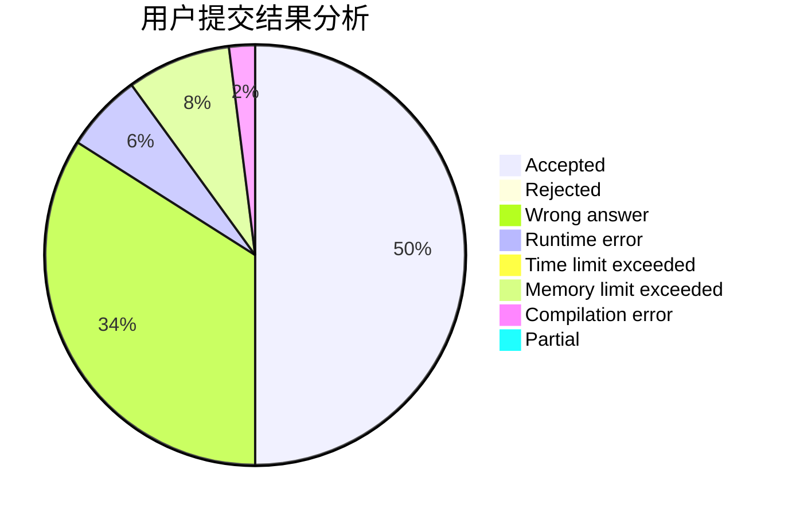
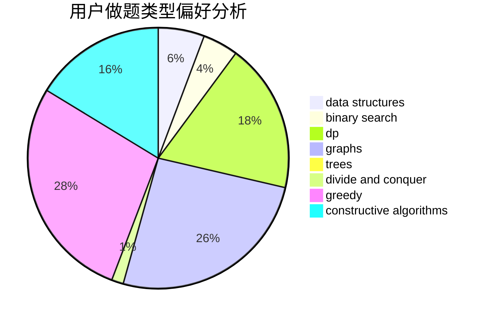
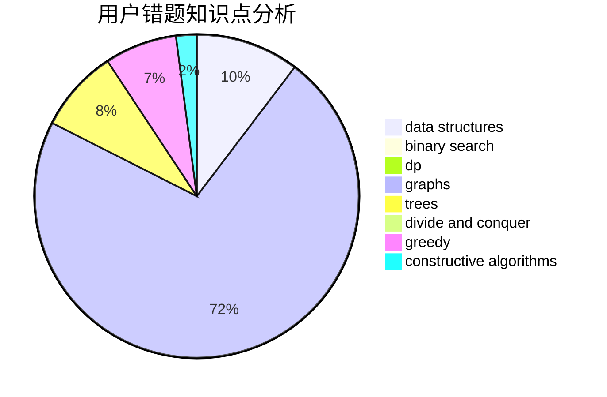

# Rheinmetall

<!-- tabs:start -->

#### **用户提交结果分析**

#### **用户做题类型偏好分析**

#### **用户错题知识点分析**

<!-- tabs:end -->
# 推荐题目
[1368D](https://codeforces.com/contest/1368/problem/D)		bitmasks,
                        greedy,
                        math		  
[673B](https://codeforces.com/contest/673/problem/B)		greedy,
                        implementation		  
[708D](https://codeforces.com/contest/708/problem/D)		flows		  
[1267K](https://codeforces.com/contest/1267/problem/K)		combinatorics,
                        math		  
[622F](https://codeforces.com/contest/622/problem/F)		math		  
[103D](https://codeforces.com/contest/103/problem/D)		brute force,
                        data structures,
                        sortings		  
[729B](https://codeforces.com/contest/729/problem/B)		dp,
                        implementation		  
[476A](https://codeforces.com/contest/476/problem/A)		implementation,
                        math		  
[954H](https://codeforces.com/contest/954/problem/H)		combinatorics,
                        dp		  
[1362A](https://codeforces.com/contest/1362/problem/A)		implementation		  
