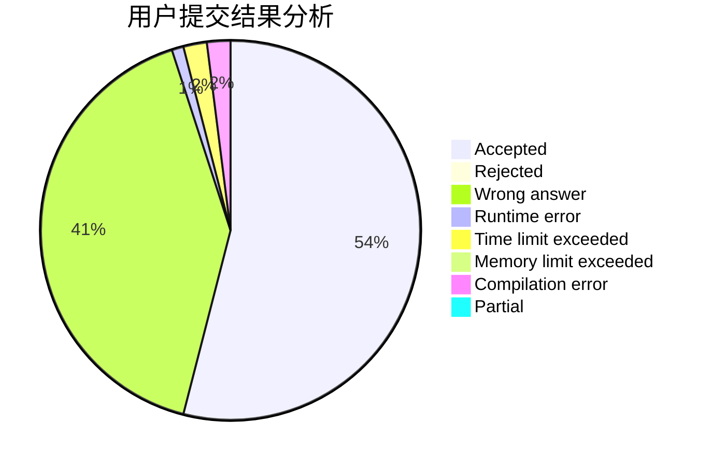
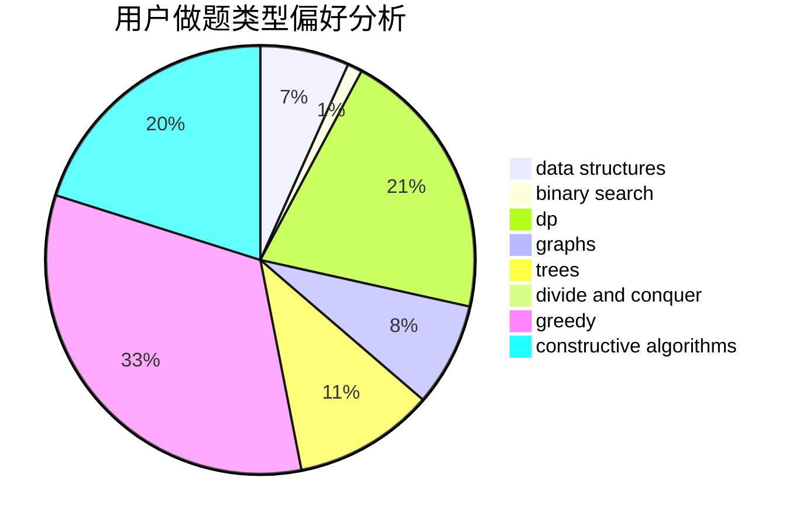
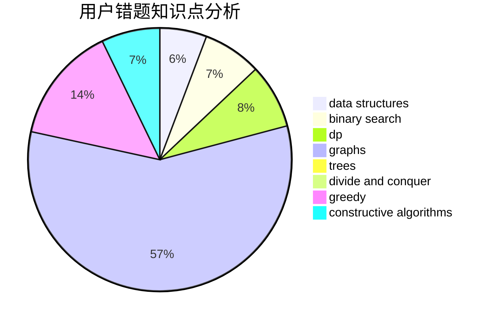

# AFOier

<!-- tabs:start -->

#### **用户提交结果分析**

#### **用户做题类型偏好分析**

#### **用户错题知识点分析**

<!-- tabs:end -->
# 推荐题目
[1497B](https://codeforces.com/contest/1497/problem/B)		constructive algorithms,
                        greedy,
                        math		  
[1498C](https://codeforces.com/contest/1498/problem/C)		brute force,
                        data structures,
                        dp		  
[1442C](https://codeforces.com/contest/1442/problem/C)		dfs and similar,
                        graphs,
                        greedy,
                        shortest paths		  
[1129B](https://codeforces.com/contest/1129/problem/B)		constructive algorithms		  
[1071D](https://codeforces.com/contest/1071/problem/D)		dsu,graphs,sortings,trees		  
[1279F](https://codeforces.com/contest/1279/problem/F)		binary search,
                        dp		  
[1432D](https://codeforces.com/contest/1432/problem/D)		dsu,graphs,sortings,trees		  
[1346C](https://codeforces.com/contest/1346/problem/C)		*special problem,
                        greedy,
                        sortings		  
[1496F](https://codeforces.com/contest/1496/problem/F)		dsu,graphs,sortings,trees		  
[1023D](https://codeforces.com/contest/1023/problem/D)		constructive algorithms,
                        data structures		  
