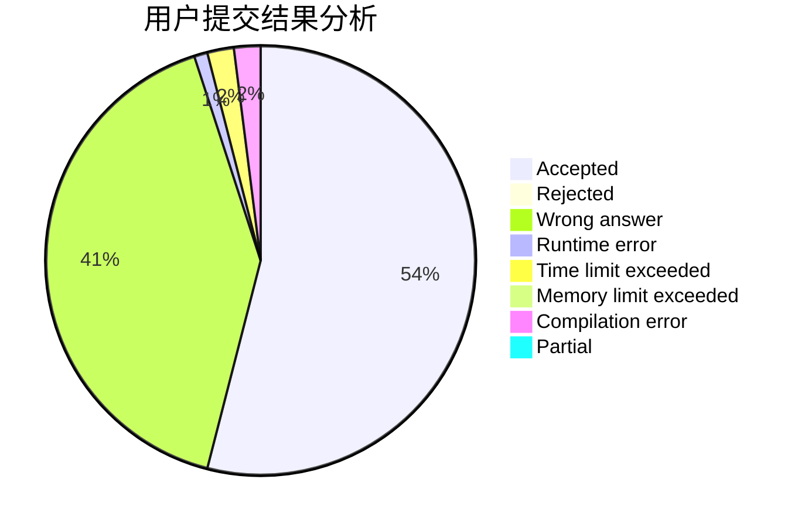
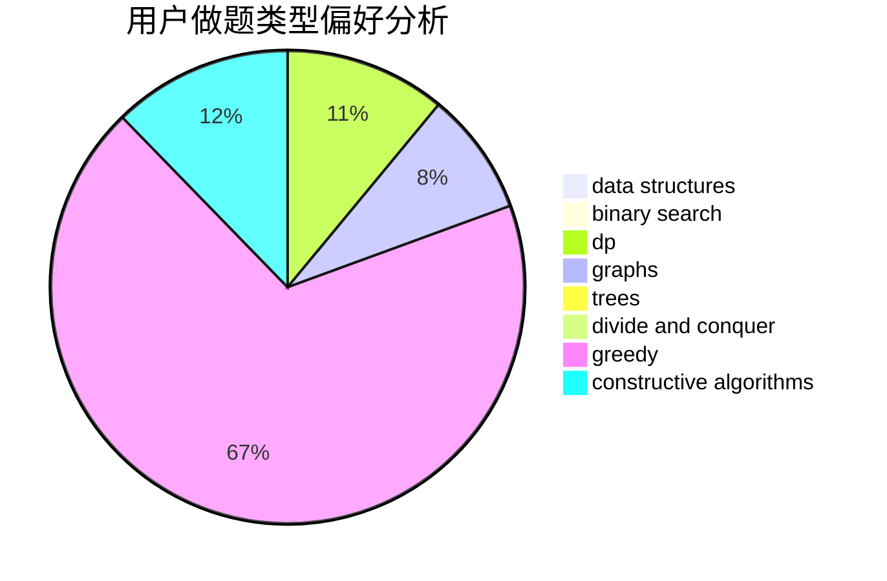
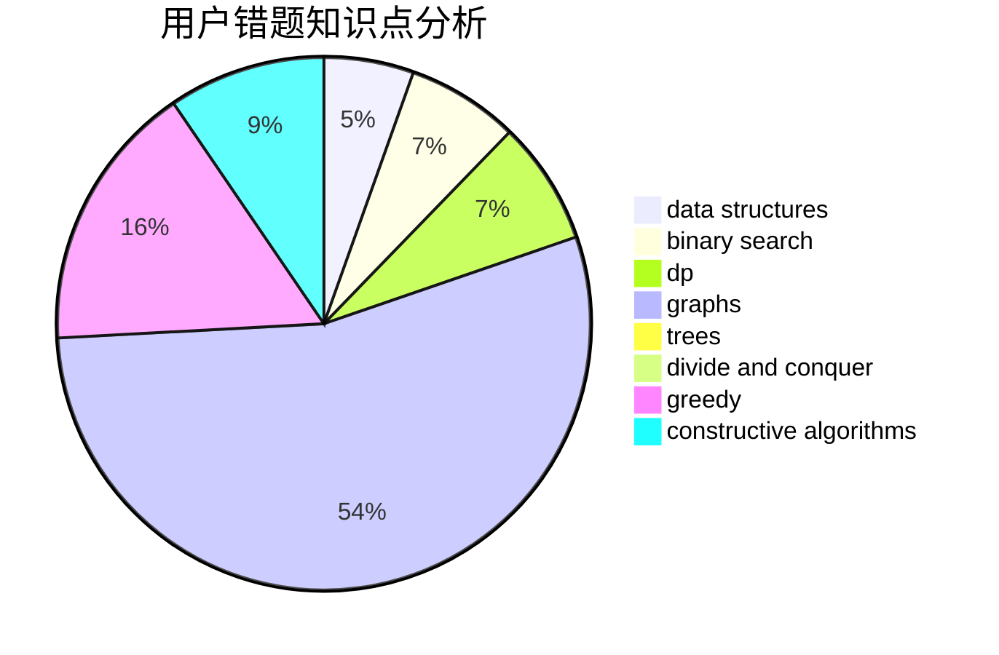

# AFOier

<!-- tabs:start -->

#### **用户提交结果分析**

#### **用户做题类型偏好分析**

#### **用户错题知识点分析**

<!-- tabs:end -->
# 推荐题目
[1489D](https://codeforces.com/contest/1489/problem/D)		dsu,graphs,sortings,trees		  
[148A](https://codeforces.com/contest/148/problem/A)		constructive algorithms,
                        implementation,
                        math		  
[1432D](https://codeforces.com/contest/1432/problem/D)		dsu,graphs,sortings,trees		  
[1119F](https://codeforces.com/contest/1119/problem/F)		data structures,
                        dp,
                        trees		  
[1071A](https://codeforces.com/contest/1071/problem/A)		dsu,graphs,sortings,trees		  
[1270F](https://codeforces.com/contest/1270/problem/F)		math,
                        strings		  
[1423N](https://codeforces.com/contest/1423/problem/N)		nan		  
[1339C](https://codeforces.com/contest/1339/problem/C)		dsu,graphs,sortings,trees		  
[1488H](https://codeforces.com/contest/1488/problem/H)		*special problem,
                        combinatorics,
                        data structures		  
[1023A](https://codeforces.com/contest/1023/problem/A)		brute force,
                        implementation,
                        strings		  
