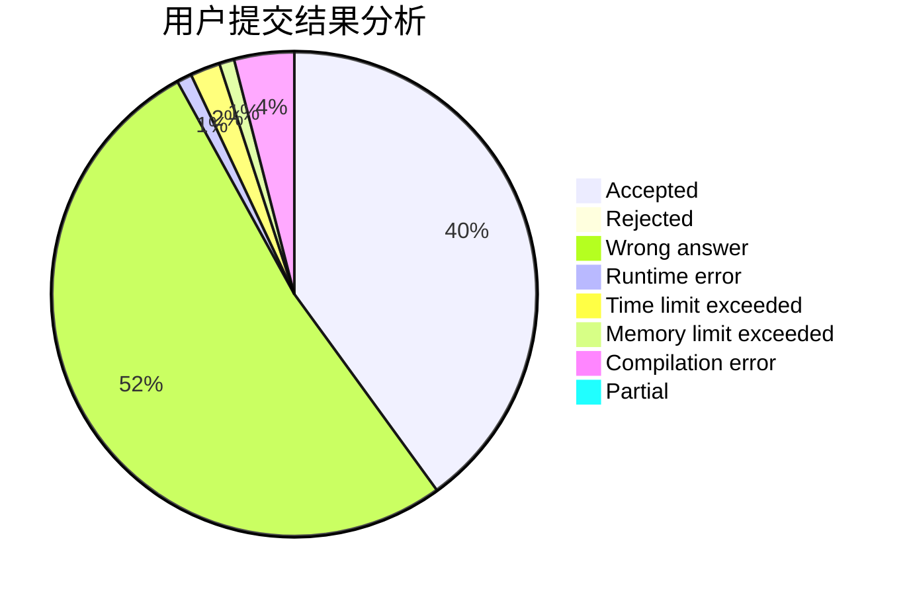
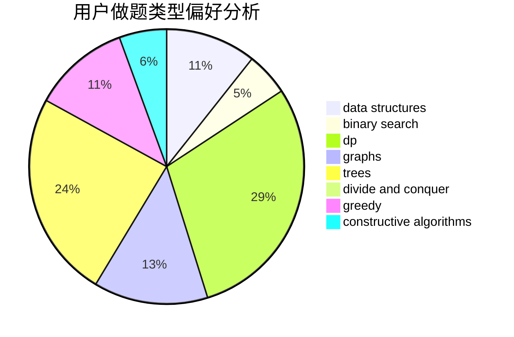
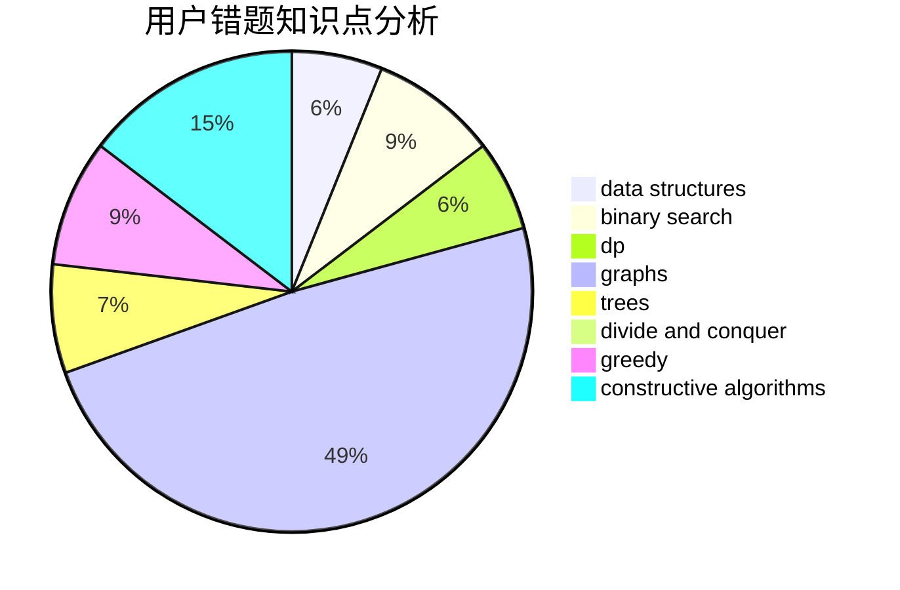

# Rhodoks

<!-- tabs:start -->

#### **用户提交结果分析**

#### **用户做题类型偏好分析**

#### **用户错题知识点分析**

<!-- tabs:end -->
# 推荐题目
[1321A](https://codeforces.com/contest/1321/problem/A)		greedy		  
[611A](https://codeforces.com/contest/611/problem/A)		implementation		  
[918D](https://codeforces.com/contest/918/problem/D)		dsu,graphs,sortings,trees		  
[681B](https://codeforces.com/contest/681/problem/B)		brute force		  
[12862](https://codeforces.com/contest/1286/problem/2)		dsu,graphs,sortings,trees		  
[1034D](https://codeforces.com/contest/1034/problem/D)		binary search,
                        data structures,
                        two pointers		  
[763E](https://codeforces.com/contest/763/problem/E)		data structures,
                        divide and conquer,
                        dsu		  
[1090A](https://codeforces.com/contest/1090/problem/A)		greedy		  
[293C](https://codeforces.com/contest/293/problem/C)		brute force,
                        math,
                        number theory		  
[976B](https://codeforces.com/contest/976/problem/B)		implementation,
                        math		  
