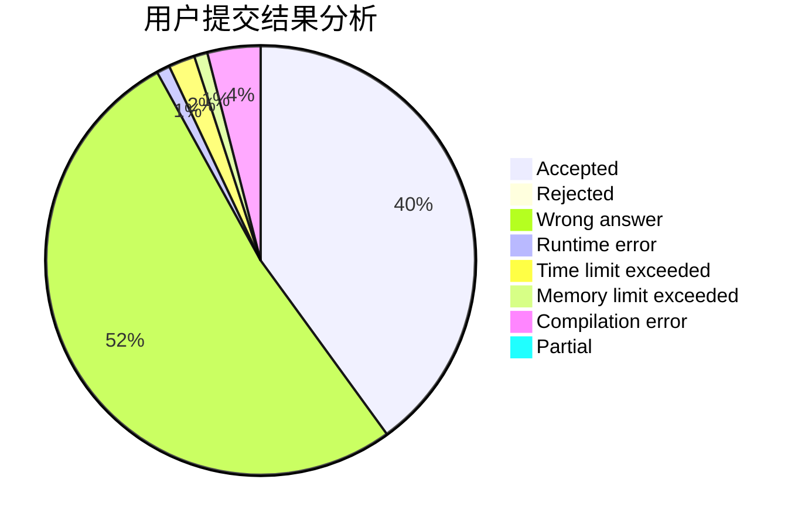
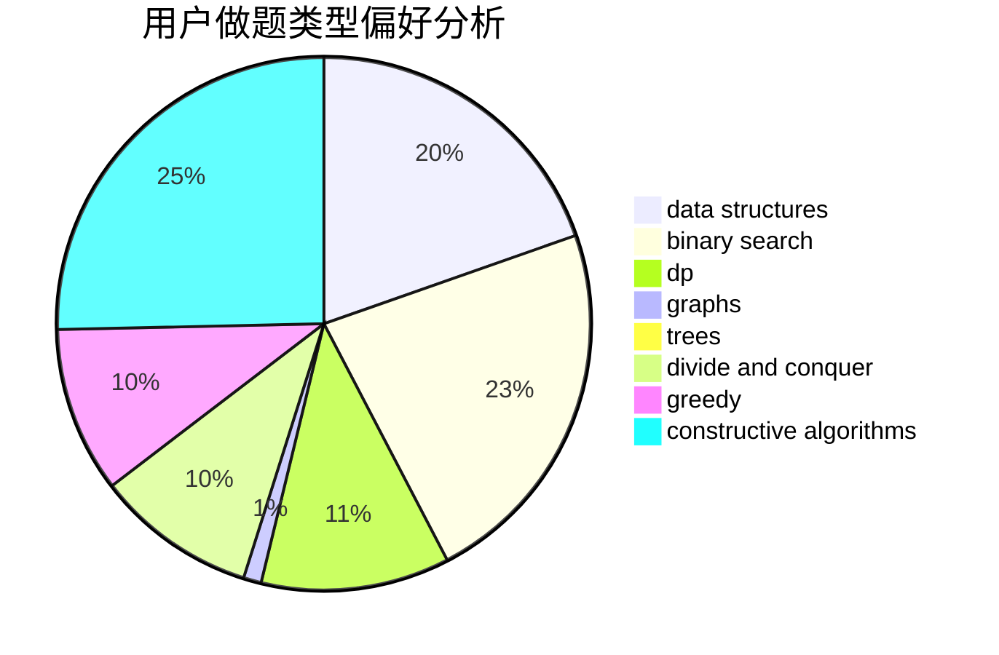
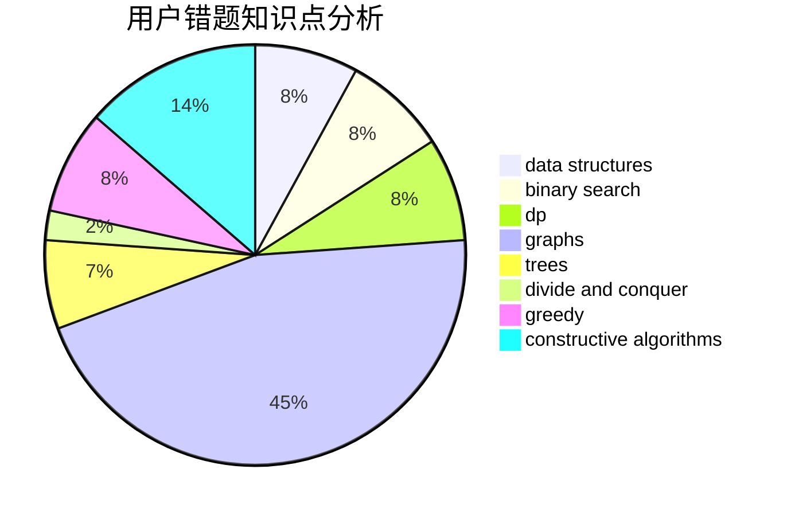

# Rhodoks

<!-- tabs:start -->

#### **用户提交结果分析**

#### **用户做题类型偏好分析**

#### **用户错题知识点分析**

<!-- tabs:end -->
# 推荐题目
[1311E](https://codeforces.com/contest/1311/problem/E)		brute force,
                        constructive algorithms,
                        trees		  
[591C](https://codeforces.com/contest/591/problem/C)		dsu,graphs,sortings,trees		  
[902B](https://codeforces.com/contest/902/problem/B)		dfs and similar,
                        dsu,
                        greedy		  
[660D](https://codeforces.com/contest/660/problem/D)		geometry		  
[127A](https://codeforces.com/contest/127/problem/A)		geometry		  
[1034A](https://codeforces.com/contest/1034/problem/A)		number theory		  
[743D](https://codeforces.com/contest/743/problem/D)		dfs and similar,
                        dp,
                        graphs,
                        trees		  
[1089L](https://codeforces.com/contest/1089/problem/L)		nan		  
[278C](https://codeforces.com/contest/278/problem/C)		dsu,graphs,sortings,trees		  
[954C](https://codeforces.com/contest/954/problem/C)		implementation		  
