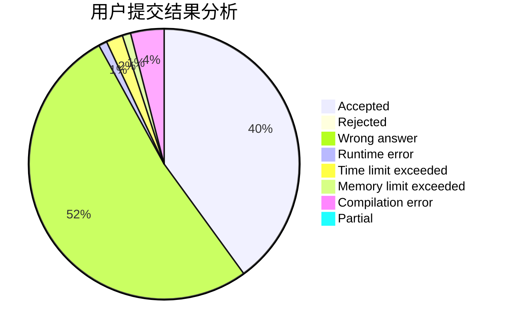
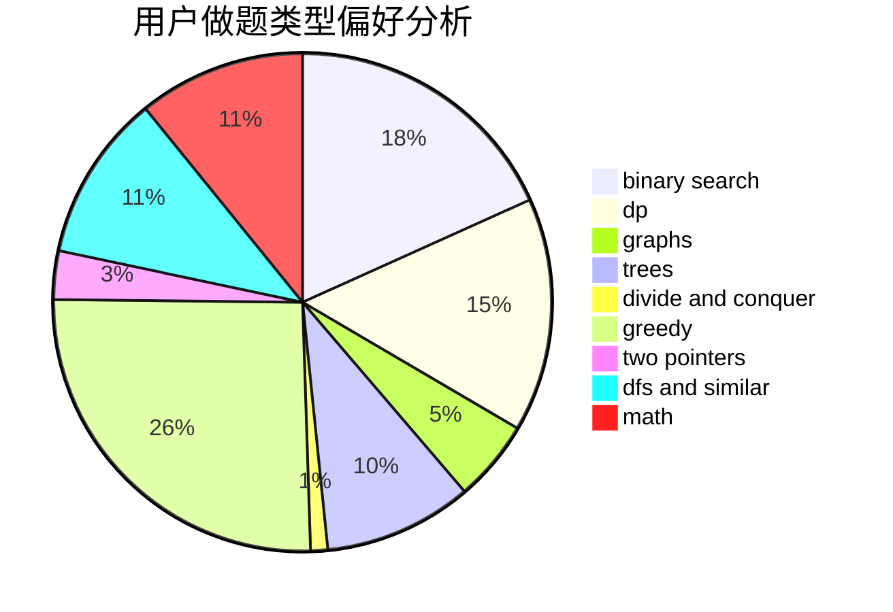

# Rhodoks

<!-- tabs:start -->

#### **用户提交结果分析**

#### **用户做题类型偏好分析**

<!-- tabs:end -->
# 推荐题目
[1321A](https://codeforces.com/contest/1321/problem/A)
[611A](https://codeforces.com/contest/611/problem/A)
[918D](https://codeforces.com/contest/918/problem/D)
[681B](https://codeforces.com/contest/681/problem/B)
[12862](https://codeforces.com/contest/1286/problem/2)
[1034D](https://codeforces.com/contest/1034/problem/D)
[763E](https://codeforces.com/contest/763/problem/E)
[1090A](https://codeforces.com/contest/1090/problem/A)
[293C](https://codeforces.com/contest/293/problem/C)
[976B](https://codeforces.com/contest/976/problem/B)
