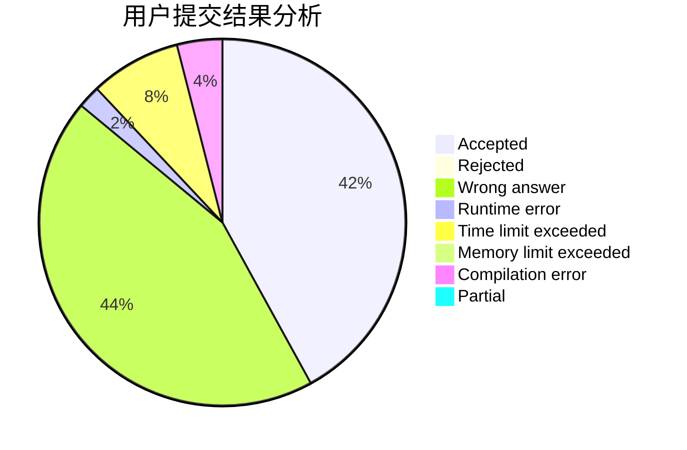
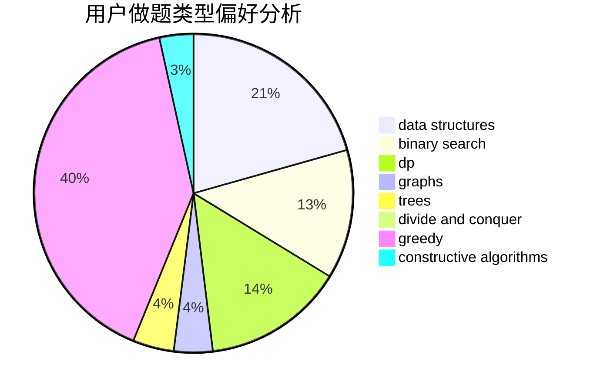
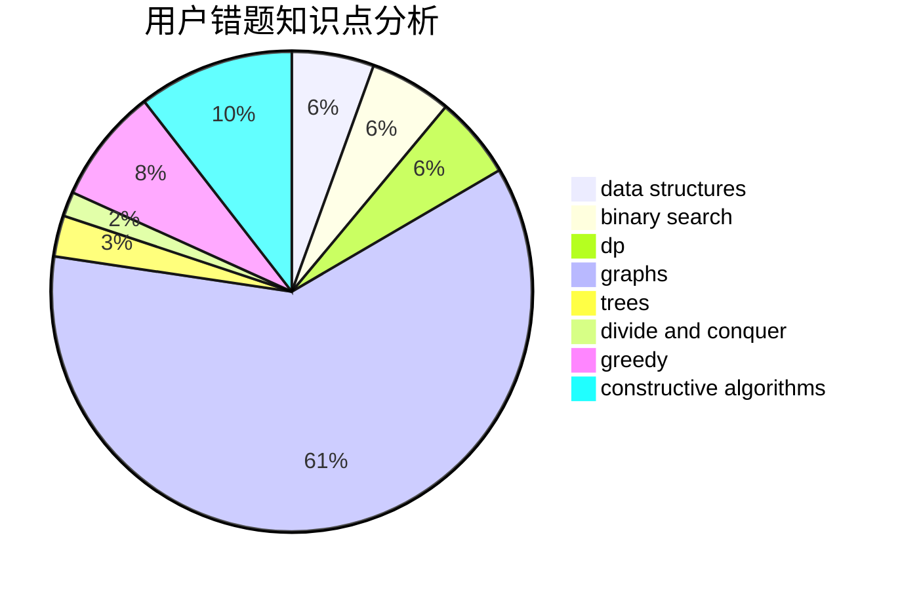

# Richelieu

<!-- tabs:start -->

#### **用户提交结果分析**

#### **用户做题类型偏好分析**

#### **用户错题知识点分析**

<!-- tabs:end -->
# 推荐题目
[173B](https://codeforces.com/contest/173/problem/B)		dfs and similar,
                        shortest paths		  
[1475C](https://codeforces.com/contest/1475/problem/C)		combinatorics,
                        graphs,
                        math		  
[686D](https://codeforces.com/contest/686/problem/D)		dsu,graphs,sortings,trees		  
[931F](https://codeforces.com/contest/931/problem/F)		dsu,graphs,sortings,trees		  
[553C](https://codeforces.com/contest/553/problem/C)		dfs and similar,
                        dsu,
                        graphs		  
[393C](https://codeforces.com/contest/393/problem/C)		dsu,graphs,sortings,trees		  
[215B](https://codeforces.com/contest/215/problem/B)		greedy,
                        math		  
[34D](https://codeforces.com/contest/34/problem/D)		dfs and similar,
                        graphs		  
[1362A](https://codeforces.com/contest/1362/problem/A)		implementation		  
[878C](https://codeforces.com/contest/878/problem/C)		data structures,
                        graphs		  
