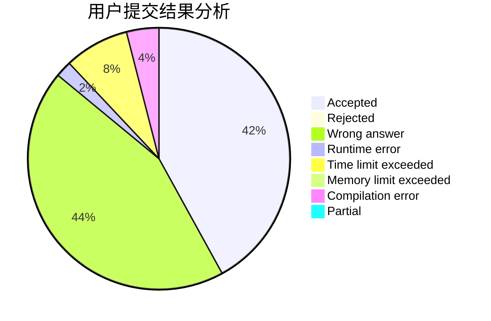
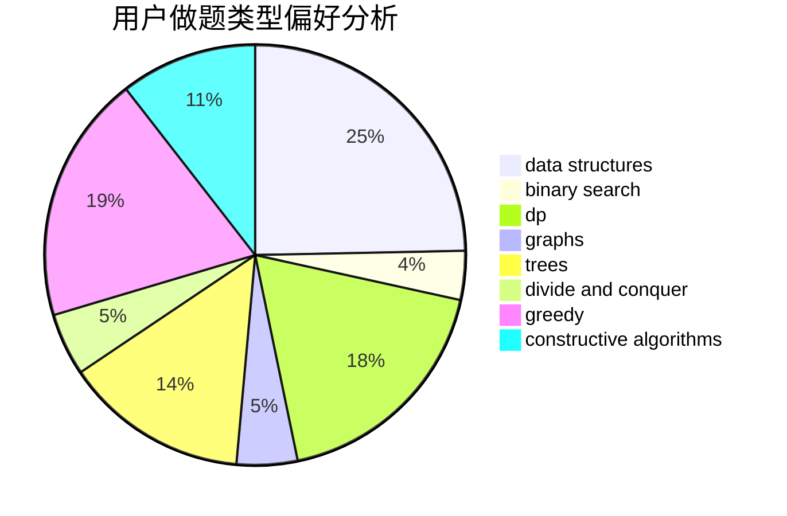
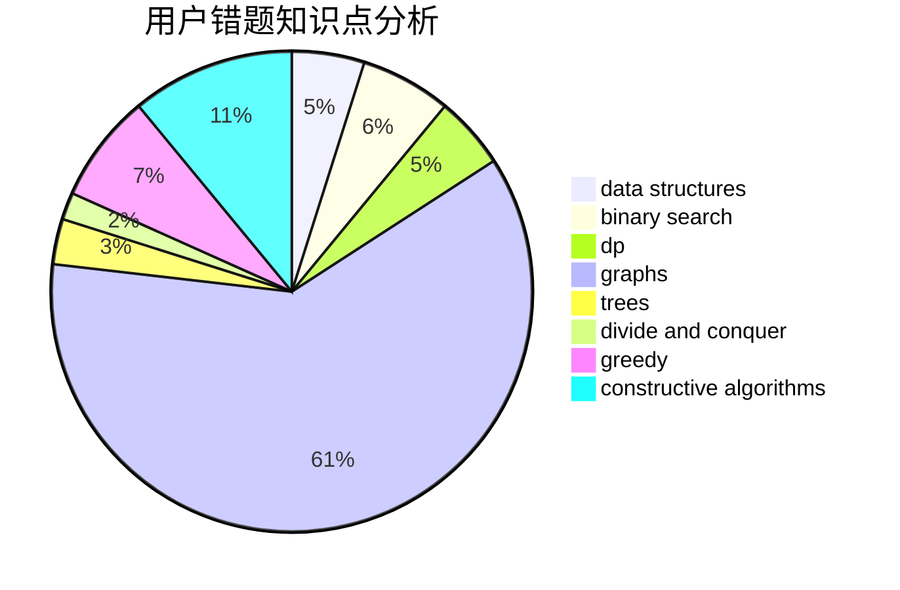

# Richelieu

<!-- tabs:start -->

#### **用户提交结果分析**

#### **用户做题类型偏好分析**

#### **用户错题知识点分析**

<!-- tabs:end -->
# 推荐题目
[19E](https://codeforces.com/contest/19/problem/E)		dfs and similar,
                        divide and conquer,
                        dsu		  
[1483F](https://codeforces.com/contest/1483/problem/F)		dsu,graphs,sortings,trees		  
[708D](https://codeforces.com/contest/708/problem/D)		flows		  
[952E](https://codeforces.com/contest/952/problem/E)		nan		  
[578E](https://codeforces.com/contest/578/problem/E)		constructive algorithms,
                        greedy		  
[421B](https://codeforces.com/contest/421/problem/B)		dsu,graphs,sortings,trees		  
[234A](https://codeforces.com/contest/234/problem/A)		implementation		  
[377B](https://codeforces.com/contest/377/problem/B)		binary search,
                        data structures,
                        greedy,
                        sortings		  
[1369F](https://codeforces.com/contest/1369/problem/F)		dfs and similar,
                        dp,
                        games		  
[899B](https://codeforces.com/contest/899/problem/B)		implementation		  
