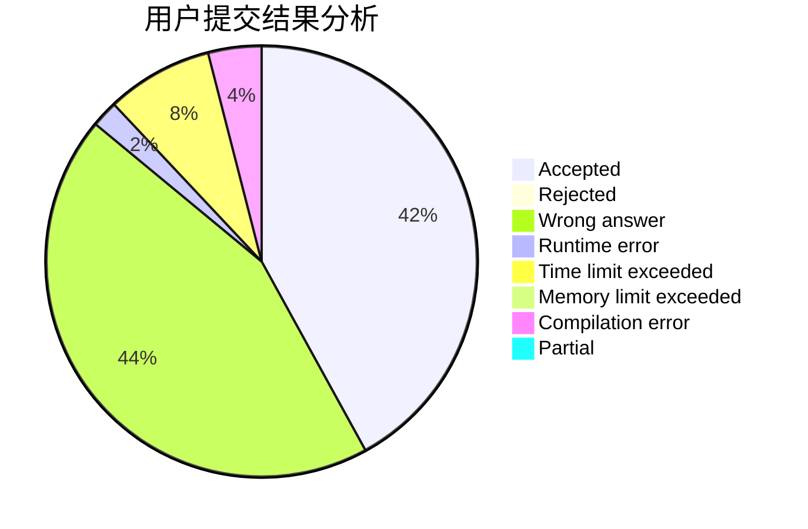
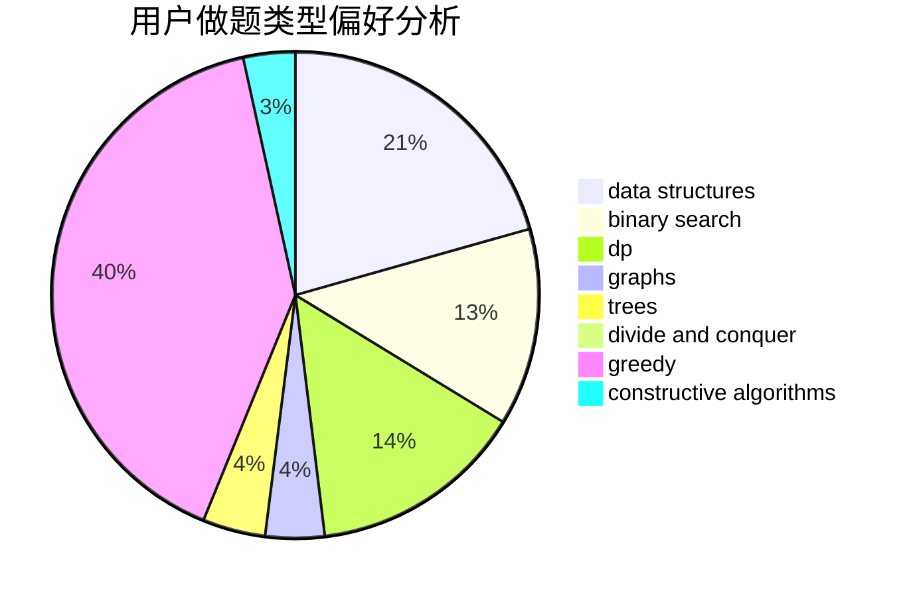
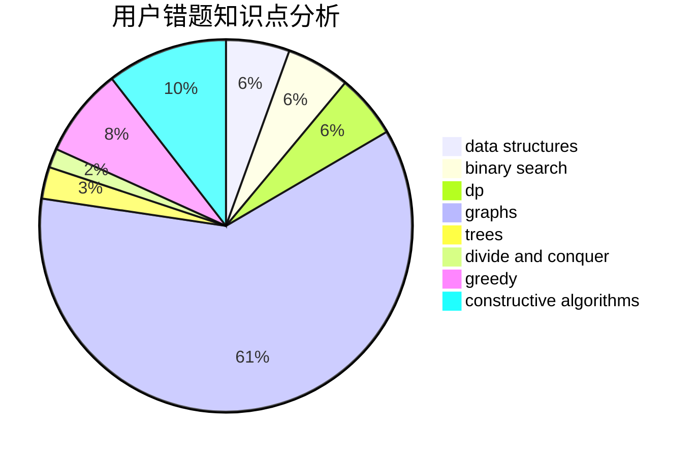

# Richelieu
<!-- tabs:start -->
#### **用户提交结果分析**

#### **用户做题类型偏好分析**

#### **用户错题知识点分析**

<!-- tabs:end -->
# 推荐题目
[Ball in Berland](http://codeforces.com/problemset/problem/1475/C)		combinatorics,
                        graphs,
                        math		  
[Move and Swap](http://codeforces.com/problemset/problem/1485/E)		dfs and similar,
                        dp,
                        greedy,
                        trees		  
[Teodor is not a liar!](https://codeforces.com/contest/931/problem/F)		data structures,
                        dp		  
[Olympic Medal](http://codeforces.com/problemset/problem/215/B)		greedy,
                        math		  
[String Transformation 2](http://codeforces.com/problemset/problem/1383/C)		bitmasks,
                        dp,
                        graphs,
                        trees		  
[Kay and Snowflake](https://codeforces.com/contest/686/problem/D)		data structures,
                        dfs and similar,
                        dp,
                        trees		  
[Stickers and Toys](http://codeforces.com/problemset/problem/1187/A)		math		  
[Watering System](http://codeforces.com/problemset/problem/967/B)		math,
                        sortings		  
[Road Map](http://codeforces.com/problemset/problem/34/D)		dfs and similar,
                        graphs		  
[Chips](http://codeforces.com/problemset/problem/333/B)		greedy		  
<!-- tabs:start -->
#### **data structures**
[Ball in Berland](https://codeforces.com/contest/931/problem/F)		data structures,
                        dp		  
[Move and Swap](https://codeforces.com/contest/686/problem/D)		data structures,
                        dfs and similar,
                        dp,
                        trees		  
[Teodor is not a liar!](http://codeforces.com/problemset/problem/1083/F)		data structures		  
[Olympic Medal](http://codeforces.com/problemset/problem/523/D)		*special problem,
                        data structures,
                        implementation		  
[String Transformation 2](http://codeforces.com/problemset/problem/1221/F)		binary search,
                        data structures,
                        sortings		  
[Kay and Snowflake](http://codeforces.com/problemset/problem/1189/C)		data structures,
                        dp,
                        implementation,
                        math		  
[Stickers and Toys](http://codeforces.com/problemset/problem/1438/B)		constructive algorithms,
                        data structures,
                        greedy,
                        sortings		  
[Watering System](http://codeforces.com/problemset/problem/474/E)		binary search,
                        data structures,
                        dp,
                        sortings,
                        trees		  
[Road Map](http://codeforces.com/problemset/problem/1479/B2)		constructive algorithms,
                        data structures,
                        dp,
                        greedy,
                        implementation		  
[Chips](http://codeforces.com/problemset/problem/878/C)		data structures,
                        graphs		  
#### **binary search**
[Ball in Berland](http://codeforces.com/problemset/problem/1221/F)		binary search,
                        data structures,
                        sortings		  
[Move and Swap](http://codeforces.com/problemset/problem/492/B)		binary search,
                        implementation,
                        math,
                        sortings		  
[Teodor is not a liar!](http://codeforces.com/problemset/problem/474/E)		binary search,
                        data structures,
                        dp,
                        sortings,
                        trees		  
[Olympic Medal](http://codeforces.com/problemset/problem/1462/F)		binary search,
                        data structures,
                        greedy		  
[String Transformation 2](http://codeforces.com/problemset/problem/1492/C)		binary search,
                        data structures,
                        dp,
                        greedy,
                        two pointers		  
[Kay and Snowflake](http://codeforces.com/problemset/problem/1463/D)		binary search,
                        constructive algorithms,
                        greedy,
                        two pointers		  
[Stickers and Toys](http://codeforces.com/problemset/problem/1490/G)		binary search,
                        data structures,
                        math		  
[Watering System](http://codeforces.com/problemset/problem/1479/D)		binary search,
                        bitmasks,
                        brute force,
                        data structures,
                        probabilities,
                        trees		  
[Road Map](http://codeforces.com/problemset/problem/1436/E)		binary search,
                        data structures,
                        two pointers		  
[Chips](http://codeforces.com/problemset/problem/1461/D)		binary search,
                        brute force,
                        data structures,
                        divide and conquer,
                        implementation,
                        sortings		  
#### **dp**
[Ball in Berland](http://codeforces.com/problemset/problem/1485/E)		dfs and similar,
                        dp,
                        greedy,
                        trees		  
[Move and Swap](https://codeforces.com/contest/931/problem/F)		data structures,
                        dp		  
[Teodor is not a liar!](http://codeforces.com/problemset/problem/1383/C)		bitmasks,
                        dp,
                        graphs,
                        trees		  
[Olympic Medal](https://codeforces.com/contest/686/problem/D)		data structures,
                        dfs and similar,
                        dp,
                        trees		  
[String Transformation 2](https://codeforces.com/contest/861/problem/C)		dp,
                        greedy,
                        implementation		  
[Kay and Snowflake](http://codeforces.com/problemset/problem/592/D)		dfs and similar,
                        dp,
                        graphs,
                        trees		  
[Stickers and Toys](http://codeforces.com/problemset/problem/327/A)		brute force,
                        dp,
                        implementation		  
[Watering System](http://codeforces.com/problemset/problem/1189/C)		data structures,
                        dp,
                        implementation,
                        math		  
[Road Map](http://codeforces.com/problemset/problem/474/E)		binary search,
                        data structures,
                        dp,
                        sortings,
                        trees		  
[Chips](http://codeforces.com/problemset/problem/1479/B2)		constructive algorithms,
                        data structures,
                        dp,
                        greedy,
                        implementation		  
#### **graph**
[Ball in Berland](http://codeforces.com/problemset/problem/1475/C)		combinatorics,
                        graphs,
                        math		  
[Move and Swap](http://codeforces.com/problemset/problem/1383/C)		bitmasks,
                        dp,
                        graphs,
                        trees		  
[Teodor is not a liar!](http://codeforces.com/problemset/problem/34/D)		dfs and similar,
                        graphs		  
[Olympic Medal](http://codeforces.com/problemset/problem/1003/E)		constructive algorithms,
                        graphs		  
[String Transformation 2](http://codeforces.com/problemset/problem/592/D)		dfs and similar,
                        dp,
                        graphs,
                        trees		  
[Kay and Snowflake](http://codeforces.com/problemset/problem/553/C)		dfs and similar,
                        dsu,
                        graphs		  
[Stickers and Toys](https://codeforces.com/contest/1243/problem/D)		dfs and similar,
                        dsu,
                        graphs,
                        sortings		  
[Watering System](http://codeforces.com/problemset/problem/1009/D)		brute force,
                        constructive algorithms,
                        graphs,
                        greedy,
                        math		  
[Road Map](http://codeforces.com/problemset/problem/1167/C)		dfs and similar,
                        dsu,
                        graphs		  
[Chips](https://codeforces.com/contest/1064/problem/D)		graphs,
                        shortest paths		  
#### **trees**
[Ball in Berland](http://codeforces.com/problemset/problem/1485/E)		dfs and similar,
                        dp,
                        greedy,
                        trees		  
[Move and Swap](http://codeforces.com/problemset/problem/1383/C)		bitmasks,
                        dp,
                        graphs,
                        trees		  
[Teodor is not a liar!](https://codeforces.com/contest/686/problem/D)		data structures,
                        dfs and similar,
                        dp,
                        trees		  
[Olympic Medal](http://codeforces.com/problemset/problem/592/D)		dfs and similar,
                        dp,
                        graphs,
                        trees		  
[String Transformation 2](http://codeforces.com/problemset/problem/474/E)		binary search,
                        data structures,
                        dp,
                        sortings,
                        trees		  
[Kay and Snowflake](http://codeforces.com/problemset/problem/868/E)		dp,
                        graphs,
                        trees		  
[Stickers and Toys](http://codeforces.com/problemset/problem/1479/D)		binary search,
                        bitmasks,
                        brute force,
                        data structures,
                        probabilities,
                        trees		  
[Watering System](http://codeforces.com/problemset/problem/1511/C)		brute force,
                        data structures,
                        implementation,
                        trees		  
[Road Map](http://codeforces.com/problemset/problem/1499/F)		combinatorics,
                        dfs and similar,
                        dp,
                        trees		  
[Chips](http://codeforces.com/problemset/problem/1491/E)		brute force,
                        dfs and similar,
                        divide and conquer,
                        number theory,
                        trees		  
#### **divide and conquer**
[Ball in Berland](http://codeforces.com/problemset/problem/97/B)		constructive algorithms,
                        divide and conquer		  
[Move and Swap](http://codeforces.com/problemset/problem/1461/D)		binary search,
                        brute force,
                        data structures,
                        divide and conquer,
                        implementation,
                        sortings		  
[Teodor is not a liar!](http://codeforces.com/problemset/problem/1466/G)		combinatorics,
                        divide and conquer,
                        hashing,
                        math,
                        string suffix structures,
                        strings		  
[Olympic Medal](http://codeforces.com/problemset/problem/1490/D)		dfs and similar,
                        divide and conquer,
                        implementation		  
[String Transformation 2](https://codeforces.com/contest/1483/problem/C)		data structures,
                        divide and conquer,
                        dp		  
[Kay and Snowflake](http://codeforces.com/problemset/problem/1491/E)		brute force,
                        dfs and similar,
                        divide and conquer,
                        number theory,
                        trees		  
[Stickers and Toys](http://codeforces.com/problemset/problem/1303/G)		data structures,
                        divide and conquer,
                        geometry,
                        trees		  
[Watering System](http://codeforces.com/problemset/problem/1494/D)		constructive algorithms,
                        data structures,
                        dfs and similar,
                        divide and conquer,
                        dsu,
                        greedy,
                        sortings,
                        trees		  
[Road Map](http://codeforces.com/problemset/problem/1482/E)		data structures,
                        divide and conquer,
                        dp		  
[Chips](http://codeforces.com/problemset/problem/566/C)		dfs and similar,
                        divide and conquer,
                        trees		  
#### **greedy**
[Ball in Berland](http://codeforces.com/problemset/problem/1485/E)		dfs and similar,
                        dp,
                        greedy,
                        trees		  
[Move and Swap](http://codeforces.com/problemset/problem/215/B)		greedy,
                        math		  
[Teodor is not a liar!](http://codeforces.com/problemset/problem/333/B)		greedy		  
[Olympic Medal](http://codeforces.com/problemset/problem/387/C)		greedy,
                        implementation		  
[String Transformation 2](https://codeforces.com/contest/861/problem/C)		dp,
                        greedy,
                        implementation		  
[Kay and Snowflake](http://codeforces.com/problemset/problem/436/A)		greedy		  
[Stickers and Toys](http://codeforces.com/problemset/problem/337/B)		greedy,
                        math,
                        number theory		  
[Watering System](http://codeforces.com/problemset/problem/540/B)		greedy,
                        implementation		  
[Road Map](http://codeforces.com/problemset/problem/1009/D)		brute force,
                        constructive algorithms,
                        graphs,
                        greedy,
                        math		  
[Chips](http://codeforces.com/problemset/problem/1438/B)		constructive algorithms,
                        data structures,
                        greedy,
                        sortings		  
#### **constructive algorithms**
[Ball in Berland](http://codeforces.com/problemset/problem/1003/E)		constructive algorithms,
                        graphs		  
[Move and Swap](http://codeforces.com/problemset/problem/1119/G)		constructive algorithms,
                        implementation		  
[Teodor is not a liar!](http://codeforces.com/problemset/problem/1136/C)		constructive algorithms,
                        sortings		  
[Olympic Medal](http://codeforces.com/problemset/problem/1009/D)		brute force,
                        constructive algorithms,
                        graphs,
                        greedy,
                        math		  
[String Transformation 2](http://codeforces.com/problemset/problem/1438/B)		constructive algorithms,
                        data structures,
                        greedy,
                        sortings		  
[Kay and Snowflake](https://codeforces.com/contest/1457/problem/E)		constructive algorithms,
                        greedy,
                        math		  
[Stickers and Toys](http://codeforces.com/problemset/problem/97/B)		constructive algorithms,
                        divide and conquer		  
[Watering System](http://codeforces.com/problemset/problem/398/C)		constructive algorithms		  
[Road Map](http://codeforces.com/problemset/problem/1479/B2)		constructive algorithms,
                        data structures,
                        dp,
                        greedy,
                        implementation		  
[Chips](http://codeforces.com/problemset/problem/1453/D)		brute force,
                        constructive algorithms,
                        greedy,
                        math,
                        probabilities		  
#### **sortings**
[Ball in Berland](http://codeforces.com/problemset/problem/967/B)		math,
                        sortings		  
[Move and Swap](http://codeforces.com/problemset/problem/1221/F)		binary search,
                        data structures,
                        sortings		  
[Teodor is not a liar!](http://codeforces.com/problemset/problem/492/B)		binary search,
                        implementation,
                        math,
                        sortings		  
[Olympic Medal](http://codeforces.com/problemset/problem/1136/C)		constructive algorithms,
                        sortings		  
[String Transformation 2](https://codeforces.com/contest/1243/problem/D)		dfs and similar,
                        dsu,
                        graphs,
                        sortings		  
[Kay and Snowflake](http://codeforces.com/problemset/problem/811/B)		implementation,
                        sortings		  
[Stickers and Toys](http://codeforces.com/problemset/problem/1438/B)		constructive algorithms,
                        data structures,
                        greedy,
                        sortings		  
[Watering System](http://codeforces.com/problemset/problem/474/E)		binary search,
                        data structures,
                        dp,
                        sortings,
                        trees		  
[Road Map](https://codeforces.com/contest/1496/problem/C)		geometry,
                        greedy,
                        math,
                        sortings		  
[Chips](http://codeforces.com/problemset/problem/1495/A)		geometry,
                        greedy,
                        math,
                        sortings		  
<!-- tabs:end -->
