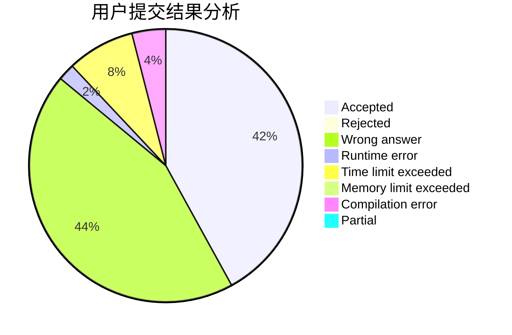
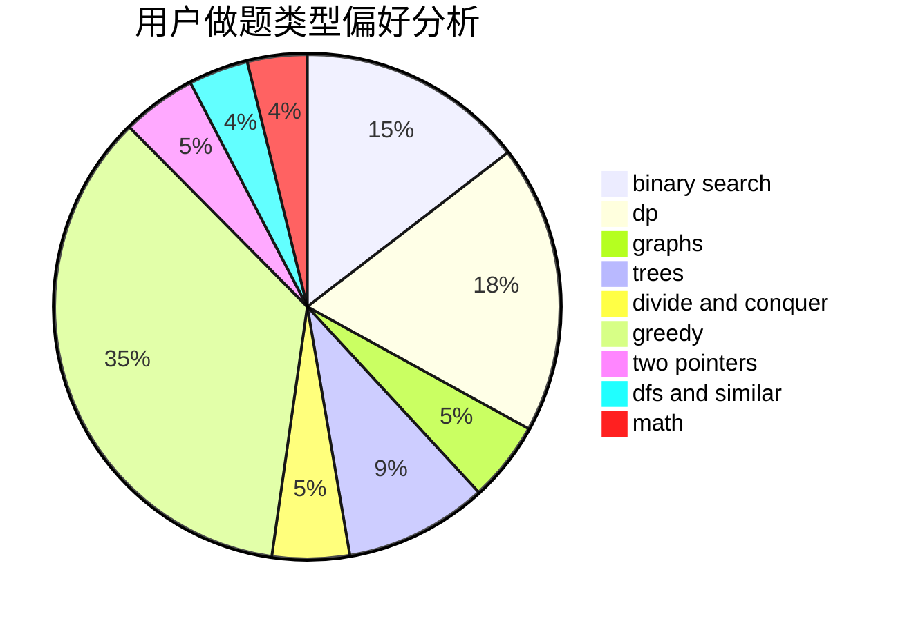

# Richelieu

<!-- tabs:start -->

#### **用户提交结果分析**

#### **用户做题类型偏好分析**

<!-- tabs:end -->
# 推荐题目
[19E](https://codeforces.com/contest/19/problem/E)
[1483F](https://codeforces.com/contest/1483/problem/F)
[708D](https://codeforces.com/contest/708/problem/D)
[952E](https://codeforces.com/contest/952/problem/E)
[578E](https://codeforces.com/contest/578/problem/E)
[421B](https://codeforces.com/contest/421/problem/B)
[234A](https://codeforces.com/contest/234/problem/A)
[377B](https://codeforces.com/contest/377/problem/B)
[1369F](https://codeforces.com/contest/1369/problem/F)
[899B](https://codeforces.com/contest/899/problem/B)
