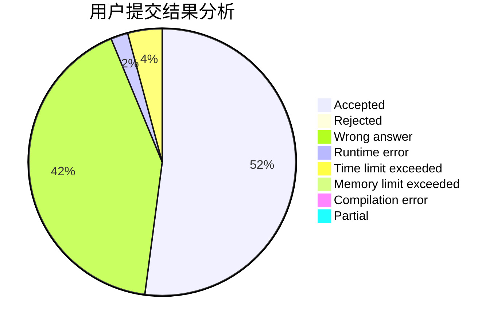
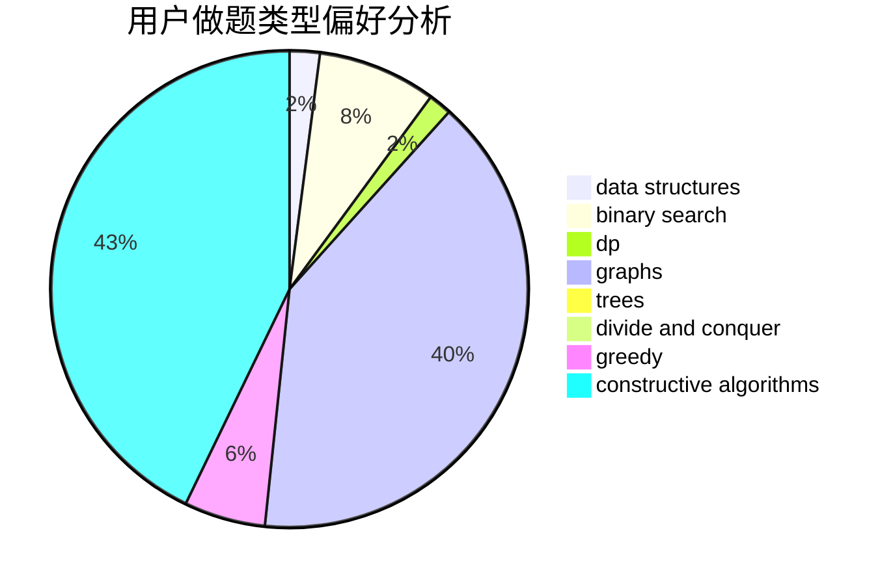
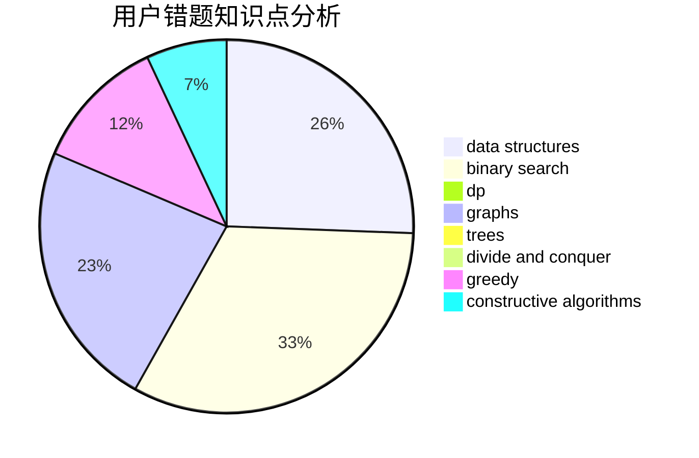

# Rings

<!-- tabs:start -->

#### **用户提交结果分析**

#### **用户做题类型偏好分析**

#### **用户错题知识点分析**

<!-- tabs:end -->
# 推荐题目
[1510I](https://codeforces.com/contest/1510/problem/I)		greedy,
                        interactive,
                        math,
                        probabilities		  
[722D](https://codeforces.com/contest/722/problem/D)		binary search,
                        data structures,
                        dfs and similar,
                        greedy,
                        strings,
                        trees		  
[732E](https://codeforces.com/contest/732/problem/E)		greedy,
                        sortings		  
[908A](https://codeforces.com/contest/908/problem/A)		brute force,
                        implementation		  
[915C](https://codeforces.com/contest/915/problem/C)		dp,
                        greedy		  
[106B](https://codeforces.com/contest/106/problem/B)		brute force,
                        implementation		  
[243C](https://codeforces.com/contest/243/problem/C)		dfs and similar,
                        implementation		  
[198E](https://codeforces.com/contest/198/problem/E)		binary search,
                        data structures,
                        sortings		  
[1027G](https://codeforces.com/contest/1027/problem/G)		bitmasks,
                        math,
                        number theory		  
[144D](https://codeforces.com/contest/144/problem/D)		data structures,
                        dfs and similar,
                        graphs,
                        shortest paths		  
