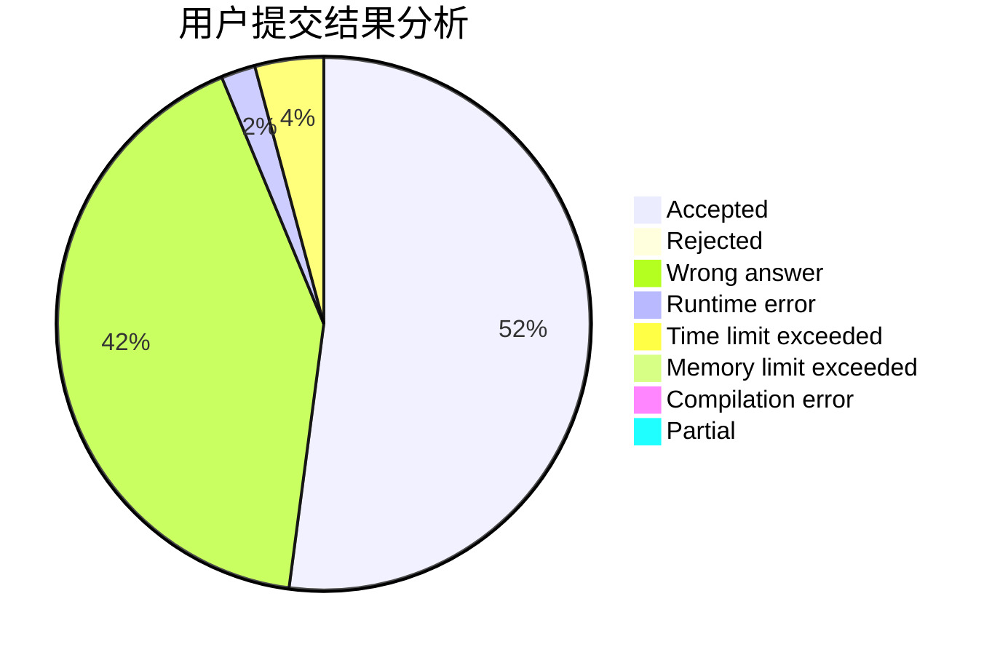
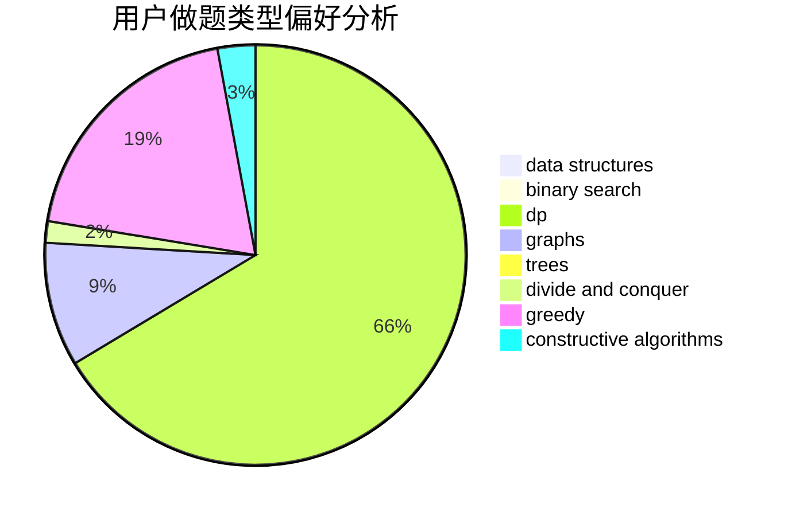
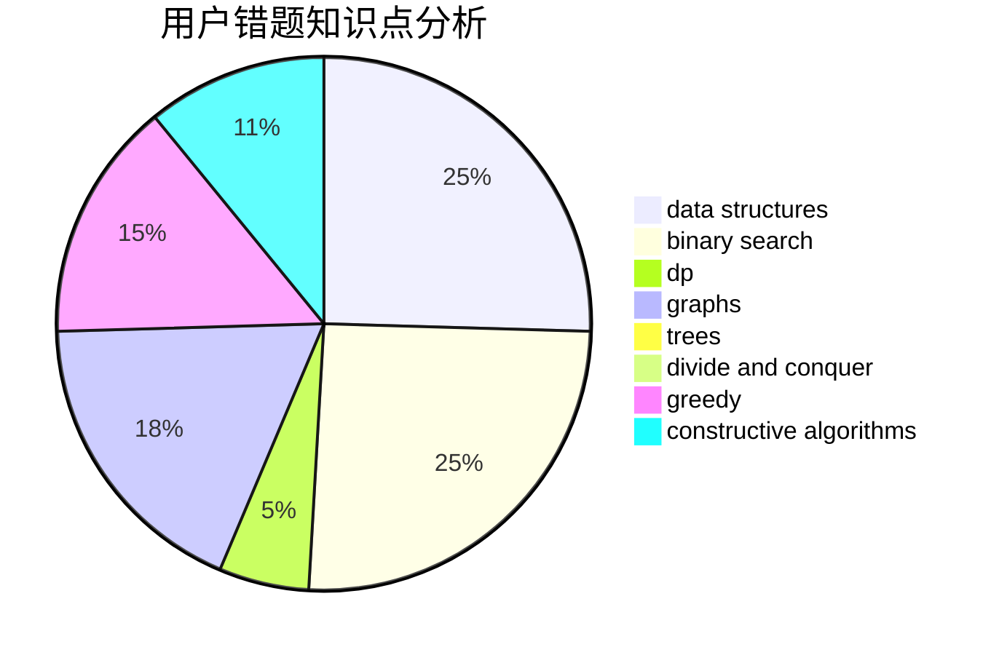

# Rings

<!-- tabs:start -->

#### **用户提交结果分析**

#### **用户做题类型偏好分析**

#### **用户错题知识点分析**

<!-- tabs:end -->
# 推荐题目
[1500C](https://codeforces.com/contest/1500/problem/C)		bitmasks,
                        brute force,
                        constructive algorithms,
                        greedy,
                        two pointers		  
[703C](https://codeforces.com/contest/703/problem/C)		geometry,
                        implementation		  
[713E](https://codeforces.com/contest/713/problem/E)		binary search,
                        dp		  
[888C](https://codeforces.com/contest/888/problem/C)		binary search,
                        implementation,
                        two pointers		  
[899C](https://codeforces.com/contest/899/problem/C)		constructive algorithms,
                        graphs,
                        math		  
[1068D](https://codeforces.com/contest/1068/problem/D)		dsu,graphs,sortings,trees		  
[225C](https://codeforces.com/contest/225/problem/C)		dp,
                        matrices		  
[171D](https://codeforces.com/contest/171/problem/D)		*special problem,
                        brute force		  
[1027D](https://codeforces.com/contest/1027/problem/D)		dfs and similar,
                        graphs		  
[1438C](https://codeforces.com/contest/1438/problem/C)		2-sat,
                        chinese remainder theorem,
                        constructive algorithms,
                        fft,
                        flows		  
