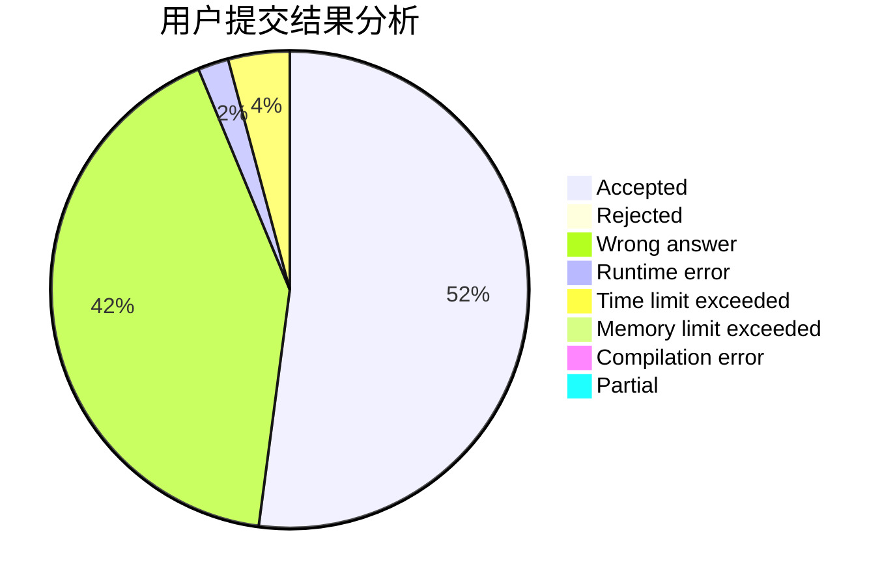
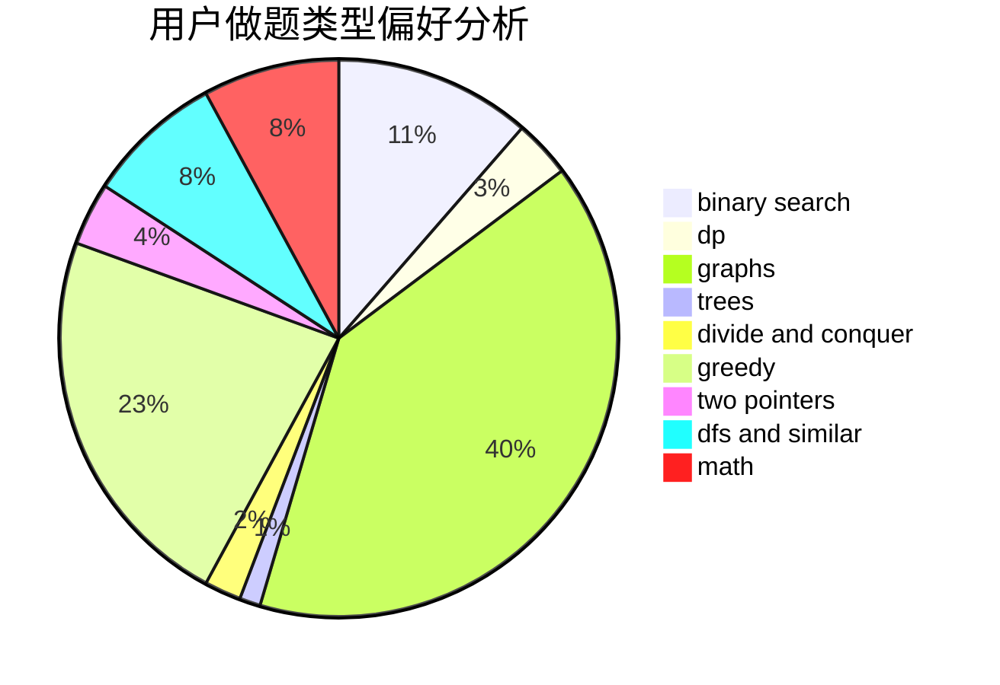

# Rings

<!-- tabs:start -->

#### **用户提交结果分析**

#### **用户做题类型偏好分析**

<!-- tabs:end -->
# 推荐题目
[1510I](https://codeforces.com/contest/1510/problem/I)
[722D](https://codeforces.com/contest/722/problem/D)
[732E](https://codeforces.com/contest/732/problem/E)
[908A](https://codeforces.com/contest/908/problem/A)
[915C](https://codeforces.com/contest/915/problem/C)
[106B](https://codeforces.com/contest/106/problem/B)
[243C](https://codeforces.com/contest/243/problem/C)
[198E](https://codeforces.com/contest/198/problem/E)
[1027G](https://codeforces.com/contest/1027/problem/G)
[144D](https://codeforces.com/contest/144/problem/D)
