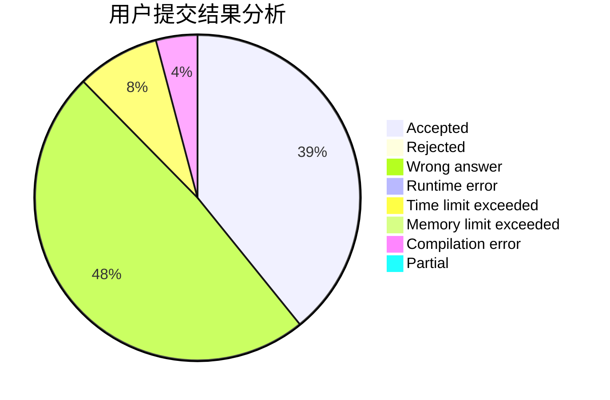
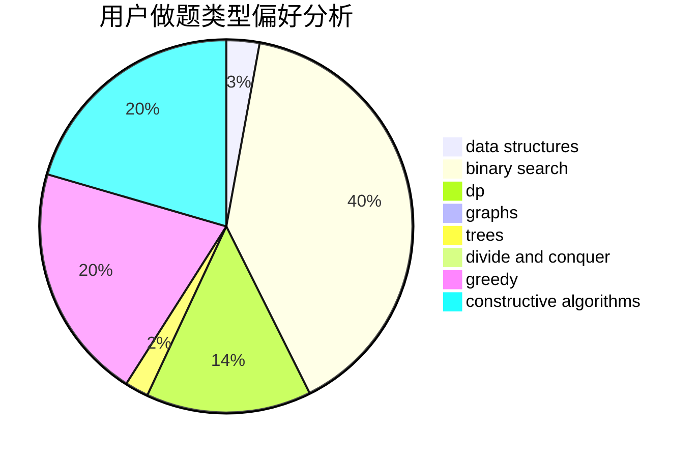
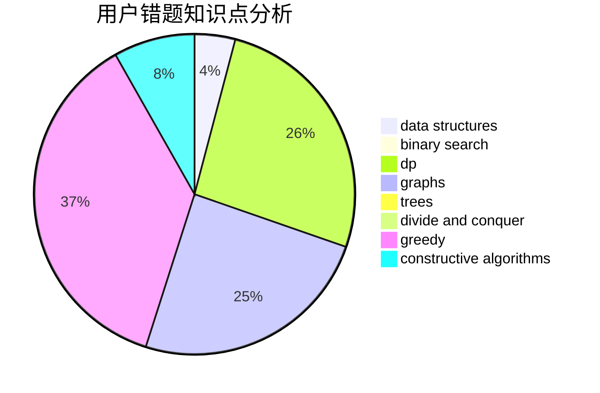

# Rinne

<!-- tabs:start -->

#### **用户提交结果分析**

#### **用户做题类型偏好分析**

#### **用户错题知识点分析**

<!-- tabs:end -->
# 推荐题目
[505D](https://codeforces.com/contest/505/problem/D)		dfs and similar		  
[645E](https://codeforces.com/contest/645/problem/E)		dp,
                        greedy,
                        strings		  
[1045G](https://codeforces.com/contest/1045/problem/G)		data structures		  
[545B](https://codeforces.com/contest/545/problem/B)		greedy		  
[1B](https://codeforces.com/contest/1/problem/B)		implementation,
                        math		  
[1138C](https://codeforces.com/contest/1138/problem/C)		dsu,graphs,sortings,trees		  
[1120F](https://codeforces.com/contest/1120/problem/F)		data structures,
                        dp,
                        greedy		  
[1111E](https://codeforces.com/contest/1111/problem/E)		data structures,
                        dfs and similar,
                        dp,
                        graphs,
                        trees		  
[1340A](https://codeforces.com/contest/1340/problem/A)		brute force,
                        data structures,
                        greedy,
                        implementation		  
[97C](https://codeforces.com/contest/97/problem/C)		binary search,
                        graphs,
                        math,
                        shortest paths		  
