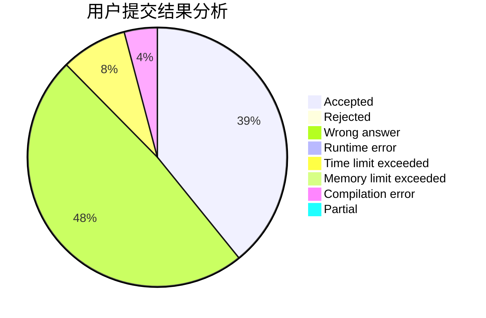
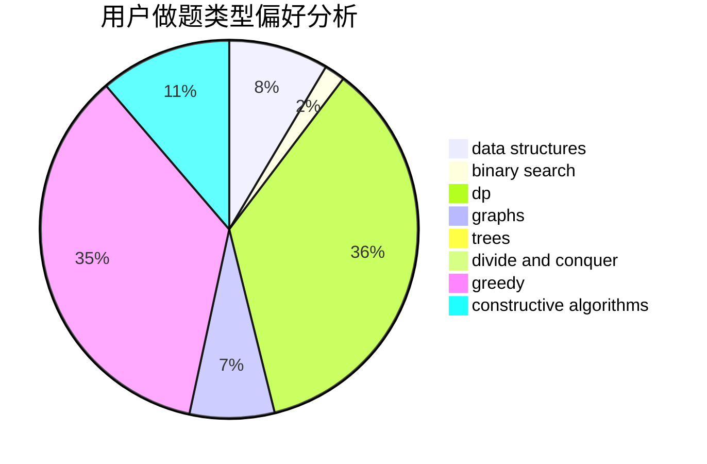
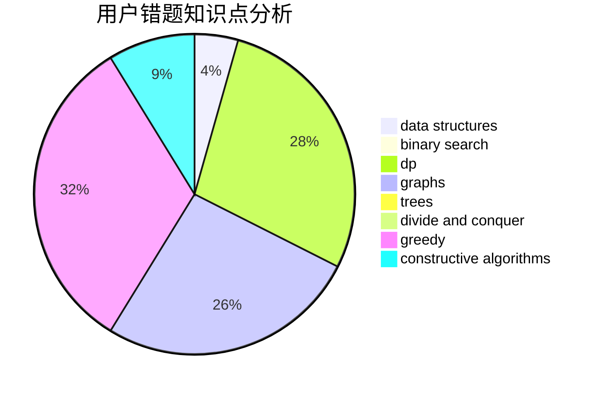

# Rinne

<!-- tabs:start -->

#### **用户提交结果分析**

#### **用户做题类型偏好分析**

#### **用户错题知识点分析**

<!-- tabs:end -->
# 推荐题目
[526A](https://codeforces.com/contest/526/problem/A)		brute force,
                        implementation		  
[672A](https://codeforces.com/contest/672/problem/A)		implementation		  
[1045J](https://codeforces.com/contest/1045/problem/J)		data structures,
                        strings,
                        trees		  
[56B](https://codeforces.com/contest/56/problem/B)		implementation		  
[224A](https://codeforces.com/contest/224/problem/A)		brute force,
                        geometry,
                        math		  
[1140A](https://codeforces.com/contest/1140/problem/A)		implementation		  
[11302](https://codeforces.com/contest/1130/problem/2)		dsu,graphs,sortings,trees		  
[1113C](https://codeforces.com/contest/1113/problem/C)		dsu,graphs,sortings,trees		  
[1346F](https://codeforces.com/contest/1346/problem/F)		*special problem,
                        data structures,
                        greedy,
                        math		  
[994C](https://codeforces.com/contest/994/problem/C)		dsu,graphs,sortings,trees		  
