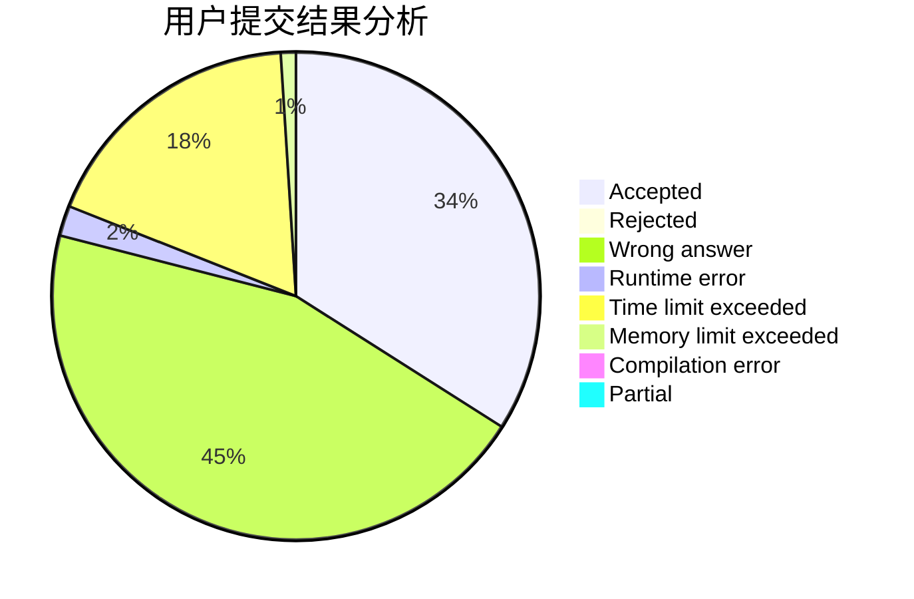
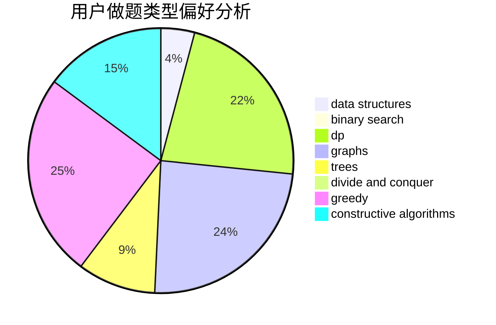
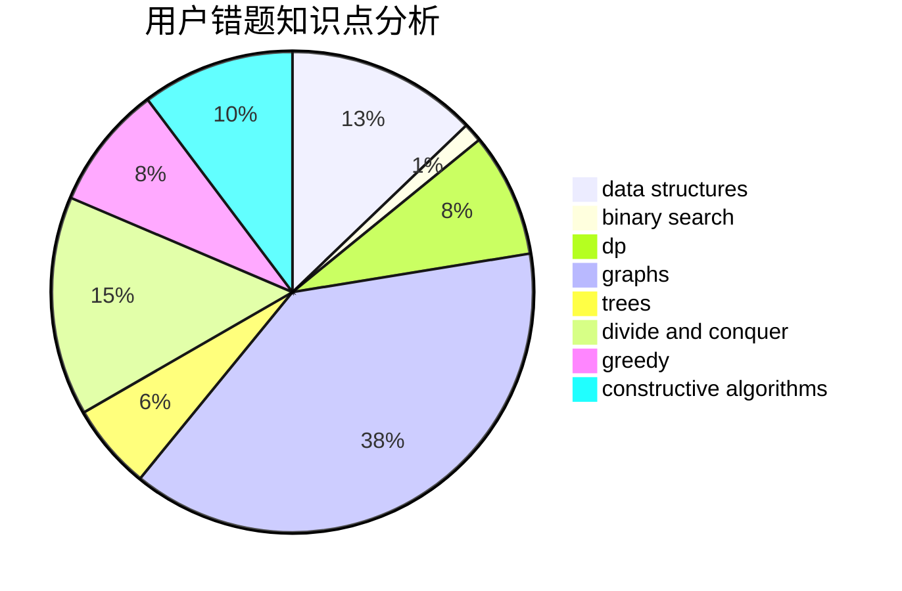

# Rita_Ross

<!-- tabs:start -->

#### **用户提交结果分析**

#### **用户做题类型偏好分析**

#### **用户错题知识点分析**

<!-- tabs:end -->
# 推荐题目
[808A](https://codeforces.com/contest/808/problem/A)		implementation		  
[543E](https://codeforces.com/contest/543/problem/E)		constructive algorithms,
                        data structures		  
[77B](https://codeforces.com/contest/77/problem/B)		math,
                        probabilities		  
[299C](https://codeforces.com/contest/299/problem/C)		dsu,graphs,sortings,trees		  
[1085B](https://codeforces.com/contest/1085/problem/B)		math		  
[371C](https://codeforces.com/contest/371/problem/C)		binary search,
                        brute force		  
[516C](https://codeforces.com/contest/516/problem/C)		dsu,graphs,sortings,trees		  
[1347E](https://codeforces.com/contest/1347/problem/E)		dsu,graphs,sortings,trees		  
[190E](https://codeforces.com/contest/190/problem/E)		data structures,
                        dsu,
                        graphs,
                        hashing,
                        sortings		  
[987F](https://codeforces.com/contest/987/problem/F)		dsu,graphs,sortings,trees		  
