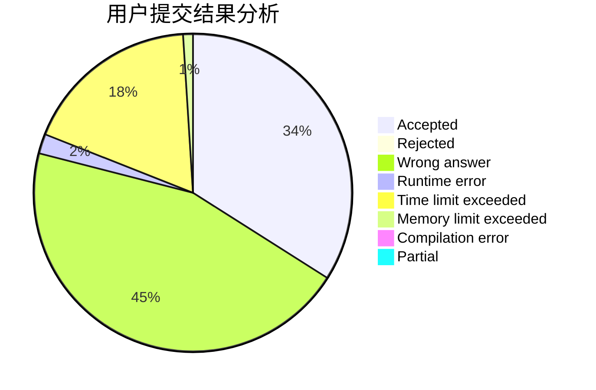
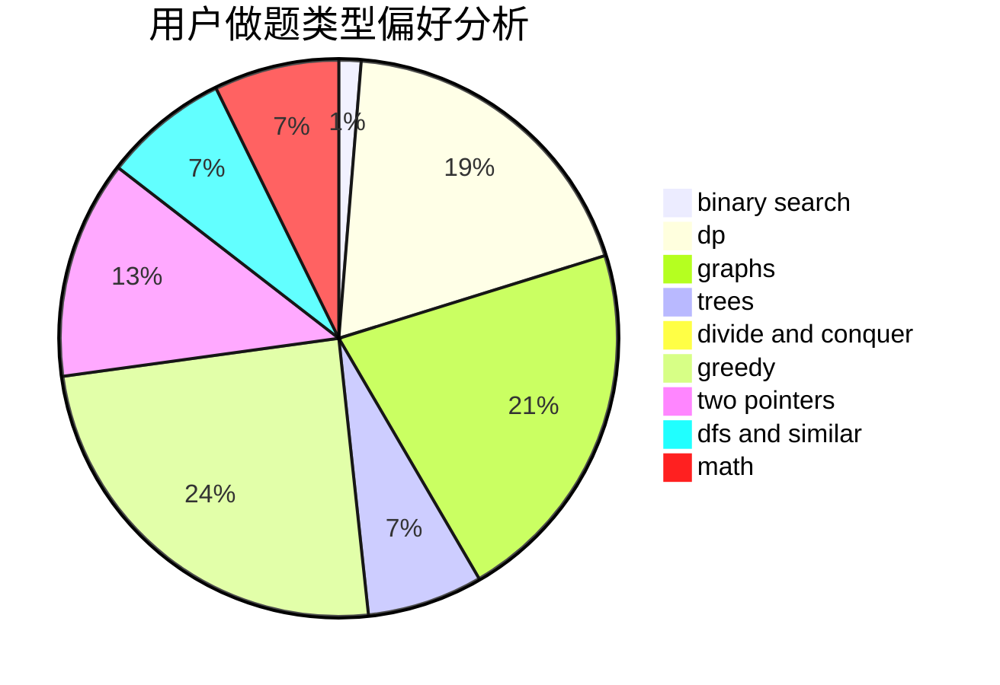

# Rita_Ross

<!-- tabs:start -->

#### **用户提交结果分析**

#### **用户做题类型偏好分析**

<!-- tabs:end -->
# 推荐题目
[808A](https://codeforces.com/contest/808/problem/A)
[543E](https://codeforces.com/contest/543/problem/E)
[77B](https://codeforces.com/contest/77/problem/B)
[299C](https://codeforces.com/contest/299/problem/C)
[1085B](https://codeforces.com/contest/1085/problem/B)
[371C](https://codeforces.com/contest/371/problem/C)
[516C](https://codeforces.com/contest/516/problem/C)
[1347E](https://codeforces.com/contest/1347/problem/E)
[190E](https://codeforces.com/contest/190/problem/E)
[987F](https://codeforces.com/contest/987/problem/F)
