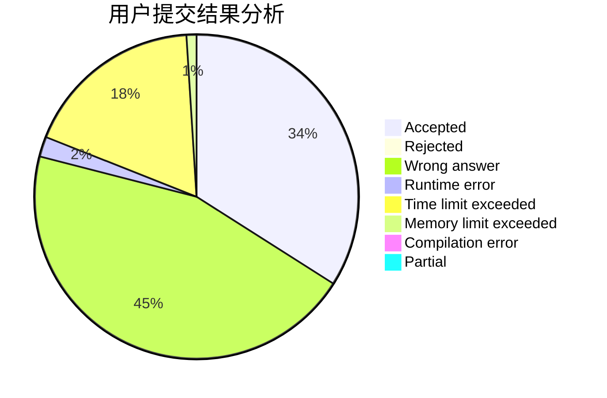
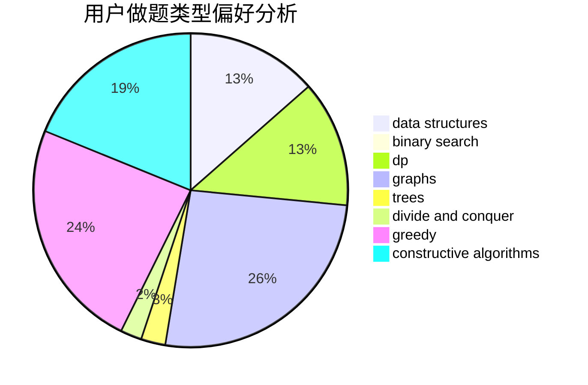
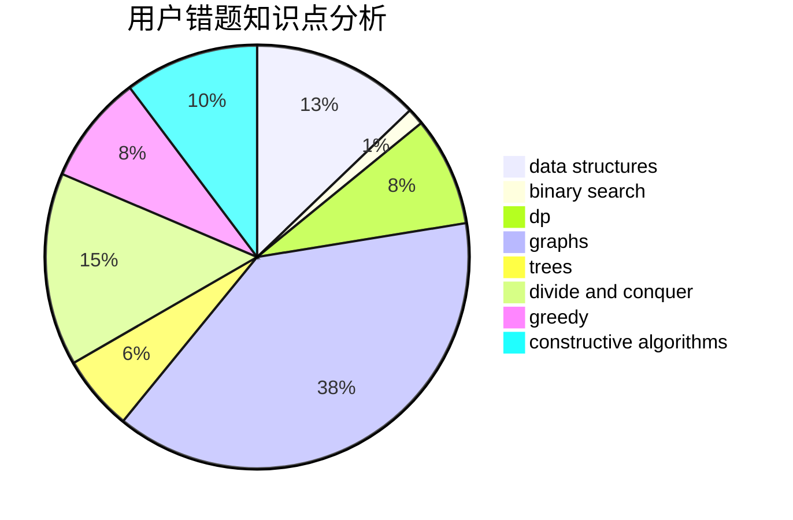

# Rita_Ross
<!-- tabs:start -->
#### **用户提交结果分析**

#### **用户做题类型偏好分析**

#### **用户错题知识点分析**

<!-- tabs:end -->
# 推荐题目
[Big Maximum Sum](http://codeforces.com/problemset/problem/75/D)		data structures,
                        dp,
                        greedy,
                        implementation,
                        math,
                        trees		  
[Drazil and His Happy Friends](http://codeforces.com/problemset/problem/516/E)		math,
                        number theory		  
[Wizard's Tour](https://codeforces.com/contest/860/problem/D)		constructive algorithms,
                        dfs and similar,
                        graphs		  
[Tennis Game](https://codeforces.com/contest/497/problem/B)		binary search		  
[Counting-out Rhyme](http://codeforces.com/problemset/problem/792/B)		implementation		  
[Expecting Trouble](http://codeforces.com/problemset/problem/345/A)		*special problem,
                        probabilities		  
[Pig and Palindromes](http://codeforces.com/problemset/problem/570/E)		combinatorics,
                        dp		  
[A Trivial Problem](http://codeforces.com/problemset/problem/633/B)		brute force,
                        constructive algorithms,
                        math,
                        number theory		  
[Sausage Maximization](http://codeforces.com/problemset/problem/282/E)		bitmasks,
                        data structures,
                        trees		  
[The Fair Nut and String](http://codeforces.com/problemset/problem/1084/C)		combinatorics,
                        dp,
                        implementation		  
<!-- tabs:start -->
#### **data structures**
[Big Maximum Sum](http://codeforces.com/problemset/problem/75/D)		data structures,
                        dp,
                        greedy,
                        implementation,
                        math,
                        trees		  
[Drazil and His Happy Friends](http://codeforces.com/problemset/problem/282/E)		bitmasks,
                        data structures,
                        trees		  
[Wizard's Tour](http://codeforces.com/problemset/problem/280/B)		data structures,
                        implementation,
                        two pointers		  
[Tennis Game](http://codeforces.com/problemset/problem/1137/F)		data structures,
                        trees		  
[Counting-out Rhyme](http://codeforces.com/problemset/problem/1017/G)		data structures		  
[Expecting Trouble](http://codeforces.com/problemset/problem/1340/F)		brute force,
                        data structures,
                        hashing		  
[Pig and Palindromes](http://codeforces.com/problemset/problem/235/C)		data structures,
                        string suffix structures,
                        strings		  
[A Trivial Problem](http://codeforces.com/problemset/problem/1492/C)		binary search,
                        data structures,
                        dp,
                        greedy,
                        two pointers		  
[Sausage Maximization](http://codeforces.com/problemset/problem/1490/G)		binary search,
                        data structures,
                        math		  
[The Fair Nut and String](http://codeforces.com/problemset/problem/1479/D)		binary search,
                        bitmasks,
                        brute force,
                        data structures,
                        probabilities,
                        trees		  
#### **binary search**
[Big Maximum Sum](https://codeforces.com/contest/497/problem/B)		binary search		  
[Drazil and His Happy Friends](https://codeforces.com/contest/966/problem/A)		binary search		  
[Wizard's Tour](http://codeforces.com/problemset/problem/1165/F1)		binary search,
                        greedy		  
[Tennis Game](http://codeforces.com/problemset/problem/1073/C)		binary search,
                        two pointers		  
[Counting-out Rhyme](http://codeforces.com/problemset/problem/380/A)		binary search,
                        brute force		  
[Expecting Trouble](http://codeforces.com/problemset/problem/1492/C)		binary search,
                        data structures,
                        dp,
                        greedy,
                        two pointers		  
[Pig and Palindromes](http://codeforces.com/problemset/problem/1463/D)		binary search,
                        constructive algorithms,
                        greedy,
                        two pointers		  
[A Trivial Problem](http://codeforces.com/problemset/problem/1490/G)		binary search,
                        data structures,
                        math		  
[Sausage Maximization](http://codeforces.com/problemset/problem/1479/D)		binary search,
                        bitmasks,
                        brute force,
                        data structures,
                        probabilities,
                        trees		  
[The Fair Nut and String](http://codeforces.com/problemset/problem/1436/E)		binary search,
                        data structures,
                        two pointers		  
#### **dp**
[Big Maximum Sum](http://codeforces.com/problemset/problem/75/D)		data structures,
                        dp,
                        greedy,
                        implementation,
                        math,
                        trees		  
[Drazil and His Happy Friends](http://codeforces.com/problemset/problem/570/E)		combinatorics,
                        dp		  
[Wizard's Tour](http://codeforces.com/problemset/problem/1084/C)		combinatorics,
                        dp,
                        implementation		  
[Tennis Game](https://codeforces.com/contest/265/problem/D)		dp,
                        number theory		  
[Counting-out Rhyme](http://codeforces.com/problemset/problem/702/A)		dp,
                        greedy,
                        implementation		  
[Expecting Trouble](http://codeforces.com/problemset/problem/165/E)		bitmasks,
                        brute force,
                        dfs and similar,
                        dp		  
[Pig and Palindromes](http://codeforces.com/problemset/problem/463/D)		dfs and similar,
                        dp,
                        graphs,
                        implementation		  
[A Trivial Problem](http://codeforces.com/problemset/problem/467/C)		dp,
                        implementation		  
[Sausage Maximization](http://codeforces.com/problemset/problem/1439/D)		combinatorics,
                        dp,
                        fft		  
[The Fair Nut and String](http://codeforces.com/problemset/problem/1198/D)		dp		  
#### **graph**
[Big Maximum Sum](https://codeforces.com/contest/860/problem/D)		constructive algorithms,
                        dfs and similar,
                        graphs		  
[Drazil and His Happy Friends](http://codeforces.com/problemset/problem/463/D)		dfs and similar,
                        dp,
                        graphs,
                        implementation		  
[Wizard's Tour](http://codeforces.com/problemset/problem/1463/E)		constructive algorithms,
                        dfs and similar,
                        dsu,
                        graphs,
                        implementation,
                        sortings,
                        trees		  
[Tennis Game](http://codeforces.com/problemset/problem/1487/C)		brute force,
                        constructive algorithms,
                        dfs and similar,
                        graphs,
                        greedy,
                        implementation,
                        math		  
[Counting-out Rhyme](http://codeforces.com/problemset/problem/1437/C)		dp,
                        flows,
                        graph matchings,
                        greedy,
                        math,
                        sortings		  
[Expecting Trouble](http://codeforces.com/problemset/problem/1470/D)		constructive algorithms,
                        dfs and similar,
                        graph matchings,
                        graphs,
                        greedy		  
[Pig and Palindromes](http://codeforces.com/problemset/problem/1476/C)		dp,
                        graphs,
                        greedy		  
[A Trivial Problem](http://codeforces.com/problemset/problem/1304/D)		constructive algorithms,
                        graphs,
                        greedy,
                        two pointers		  
[Sausage Maximization](http://codeforces.com/problemset/problem/1475/C)		combinatorics,
                        graphs,
                        math		  
[The Fair Nut and String](http://codeforces.com/problemset/problem/553/E)		dp,
                        fft,
                        graphs,
                        math,
                        probabilities		  
#### **trees**
[Big Maximum Sum](http://codeforces.com/problemset/problem/75/D)		data structures,
                        dp,
                        greedy,
                        implementation,
                        math,
                        trees		  
[Drazil and His Happy Friends](http://codeforces.com/problemset/problem/282/E)		bitmasks,
                        data structures,
                        trees		  
[Wizard's Tour](http://codeforces.com/problemset/problem/1137/F)		data structures,
                        trees		  
[Tennis Game](http://codeforces.com/problemset/problem/792/D)		bitmasks,
                        trees		  
[Counting-out Rhyme](http://codeforces.com/problemset/problem/280/C)		implementation,
                        math,
                        probabilities,
                        trees		  
[Expecting Trouble](http://codeforces.com/problemset/problem/1463/E)		constructive algorithms,
                        dfs and similar,
                        dsu,
                        graphs,
                        implementation,
                        sortings,
                        trees		  
[Pig and Palindromes](http://codeforces.com/problemset/problem/1479/D)		binary search,
                        bitmasks,
                        brute force,
                        data structures,
                        probabilities,
                        trees		  
[A Trivial Problem](http://codeforces.com/problemset/problem/1511/C)		brute force,
                        data structures,
                        implementation,
                        trees		  
[Sausage Maximization](http://codeforces.com/problemset/problem/1499/F)		combinatorics,
                        dfs and similar,
                        dp,
                        trees		  
[The Fair Nut and String](http://codeforces.com/problemset/problem/1491/E)		brute force,
                        dfs and similar,
                        divide and conquer,
                        number theory,
                        trees		  
#### **divide and conquer**
[Big Maximum Sum](http://codeforces.com/problemset/problem/1461/D)		binary search,
                        brute force,
                        data structures,
                        divide and conquer,
                        implementation,
                        sortings		  
[Drazil and His Happy Friends](http://codeforces.com/problemset/problem/1466/G)		combinatorics,
                        divide and conquer,
                        hashing,
                        math,
                        string suffix structures,
                        strings		  
[Wizard's Tour](http://codeforces.com/problemset/problem/1490/D)		dfs and similar,
                        divide and conquer,
                        implementation		  
[Tennis Game](https://codeforces.com/contest/1483/problem/C)		data structures,
                        divide and conquer,
                        dp		  
[Counting-out Rhyme](http://codeforces.com/problemset/problem/1491/E)		brute force,
                        dfs and similar,
                        divide and conquer,
                        number theory,
                        trees		  
[Expecting Trouble](http://codeforces.com/problemset/problem/1303/G)		data structures,
                        divide and conquer,
                        geometry,
                        trees		  
[Pig and Palindromes](http://codeforces.com/problemset/problem/1494/D)		constructive algorithms,
                        data structures,
                        dfs and similar,
                        divide and conquer,
                        dsu,
                        greedy,
                        sortings,
                        trees		  
[A Trivial Problem](http://codeforces.com/problemset/problem/1482/E)		data structures,
                        divide and conquer,
                        dp		  
[Sausage Maximization](http://codeforces.com/problemset/problem/566/C)		dfs and similar,
                        divide and conquer,
                        trees		  
[The Fair Nut and String](http://codeforces.com/problemset/problem/1428/F)		binary search,
                        data structures,
                        divide and conquer,
                        dp,
                        two pointers		  
#### **greedy**
[Big Maximum Sum](http://codeforces.com/problemset/problem/75/D)		data structures,
                        dp,
                        greedy,
                        implementation,
                        math,
                        trees		  
[Drazil and His Happy Friends](http://codeforces.com/problemset/problem/1108/E1)		brute force,
                        greedy,
                        implementation		  
[Wizard's Tour](http://codeforces.com/problemset/problem/1312/A)		geometry,
                        greedy,
                        math,
                        number theory		  
[Tennis Game](http://codeforces.com/problemset/problem/1165/F1)		binary search,
                        greedy		  
[Counting-out Rhyme](http://codeforces.com/problemset/problem/702/A)		dp,
                        greedy,
                        implementation		  
[Expecting Trouble](http://codeforces.com/problemset/problem/381/B)		greedy,
                        implementation,
                        sortings		  
[Pig and Palindromes](http://codeforces.com/problemset/problem/1197/B)		greedy,
                        implementation		  
[A Trivial Problem](http://codeforces.com/problemset/problem/1452/F)		constructive algorithms,
                        greedy		  
[Sausage Maximization](http://codeforces.com/problemset/problem/1492/C)		binary search,
                        data structures,
                        dp,
                        greedy,
                        two pointers		  
[The Fair Nut and String](https://codeforces.com/contest/1496/problem/C)		geometry,
                        greedy,
                        math,
                        sortings		  
#### **constructive algorithms**
[Big Maximum Sum](https://codeforces.com/contest/860/problem/D)		constructive algorithms,
                        dfs and similar,
                        graphs		  
[Drazil and His Happy Friends](http://codeforces.com/problemset/problem/633/B)		brute force,
                        constructive algorithms,
                        math,
                        number theory		  
[Wizard's Tour](http://codeforces.com/problemset/problem/1452/F)		constructive algorithms,
                        greedy		  
[Tennis Game](http://codeforces.com/problemset/problem/1227/G)		constructive algorithms		  
[Counting-out Rhyme](http://codeforces.com/problemset/problem/1463/E)		constructive algorithms,
                        dfs and similar,
                        dsu,
                        graphs,
                        implementation,
                        sortings,
                        trees		  
[Expecting Trouble](http://codeforces.com/problemset/problem/1493/A)		constructive algorithms,
                        greedy		  
[Pig and Palindromes](http://codeforces.com/problemset/problem/1463/D)		binary search,
                        constructive algorithms,
                        greedy,
                        two pointers		  
[A Trivial Problem](https://codeforces.com/contest/1456/problem/B)		bitmasks,
                        brute force,
                        constructive algorithms		  
[Sausage Maximization](http://codeforces.com/problemset/problem/1492/D)		bitmasks,
                        constructive algorithms,
                        greedy,
                        math		  
[The Fair Nut and String](https://codeforces.com/contest/1504/problem/D)		constructive algorithms,
                        games,
                        interactive		  
#### **sortings**
[Big Maximum Sum](http://codeforces.com/problemset/problem/381/B)		greedy,
                        implementation,
                        sortings		  
[Drazil and His Happy Friends](http://codeforces.com/problemset/problem/1463/E)		constructive algorithms,
                        dfs and similar,
                        dsu,
                        graphs,
                        implementation,
                        sortings,
                        trees		  
[Wizard's Tour](https://codeforces.com/contest/1496/problem/C)		geometry,
                        greedy,
                        math,
                        sortings		  
[Tennis Game](http://codeforces.com/problemset/problem/1495/A)		geometry,
                        greedy,
                        math,
                        sortings		  
[Counting-out Rhyme](http://codeforces.com/problemset/problem/1497/A)		brute force,
                        data structures,
                        greedy,
                        sortings		  
[Expecting Trouble](http://codeforces.com/problemset/problem/1427/A)		math,
                        sortings		  
[Pig and Palindromes](http://codeforces.com/problemset/problem/1461/D)		binary search,
                        brute force,
                        data structures,
                        divide and conquer,
                        implementation,
                        sortings		  
[A Trivial Problem](http://codeforces.com/problemset/problem/1437/C)		dp,
                        flows,
                        graph matchings,
                        greedy,
                        math,
                        sortings		  
[Sausage Maximization](http://codeforces.com/problemset/problem/1473/A)		greedy,
                        implementation,
                        math,
                        sortings		  
[The Fair Nut and String](http://codeforces.com/problemset/problem/1486/B)		binary search,
                        geometry,
                        shortest paths,
                        sortings		  
<!-- tabs:end -->
