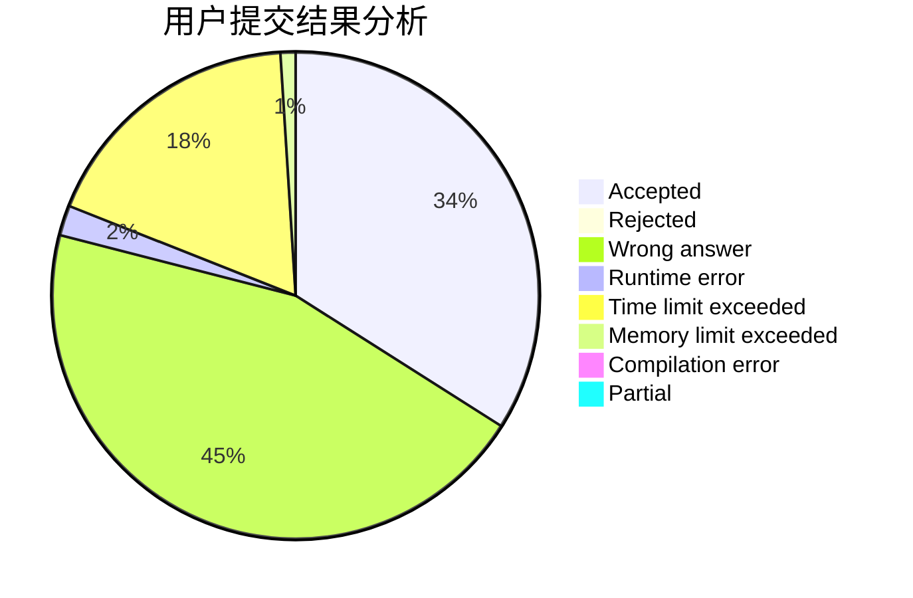
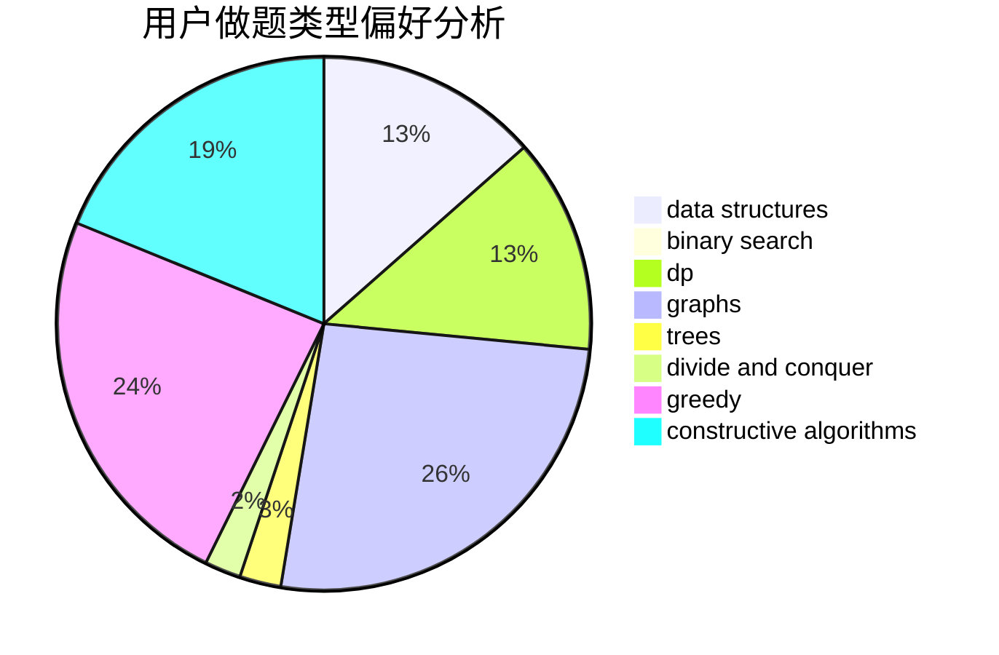
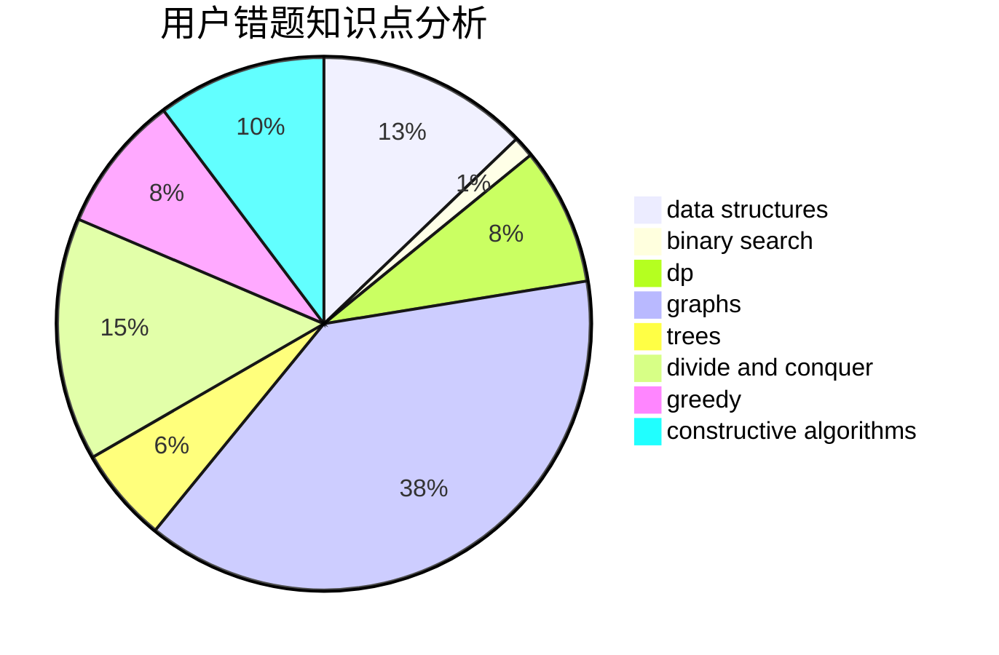

# Rita_Ross

<!-- tabs:start -->

#### **用户提交结果分析**

#### **用户做题类型偏好分析**

#### **用户错题知识点分析**

<!-- tabs:end -->
# 推荐题目
[792B](https://codeforces.com/contest/792/problem/B)		implementation		  
[516E](https://codeforces.com/contest/516/problem/E)		math,
                        number theory		  
[75D](https://codeforces.com/contest/75/problem/D)		data structures,
                        dp,
                        greedy,
                        implementation,
                        math,
                        trees		  
[282E](https://codeforces.com/contest/282/problem/E)		bitmasks,
                        data structures,
                        trees		  
[1084C](https://codeforces.com/contest/1084/problem/C)		combinatorics,
                        dp,
                        implementation		  
[345A](https://codeforces.com/contest/345/problem/A)		*special problem,
                        probabilities		  
[497B](https://codeforces.com/contest/497/problem/B)		dsu,graphs,sortings,trees		  
[1340F](https://codeforces.com/contest/1340/problem/F)		brute force,
                        data structures,
                        hashing		  
[165E](https://codeforces.com/contest/165/problem/E)		bitmasks,
                        brute force,
                        dfs and similar,
                        dp		  
[966A](https://codeforces.com/contest/966/problem/A)		dsu,graphs,sortings,trees		  
