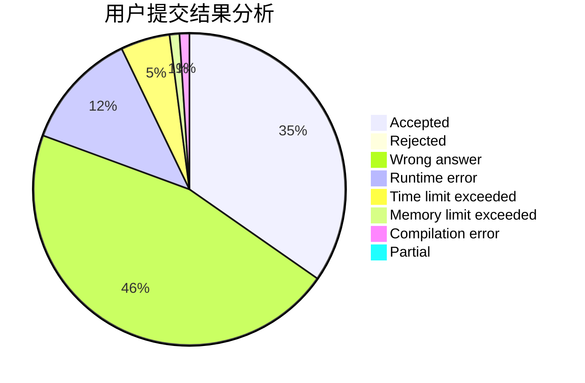
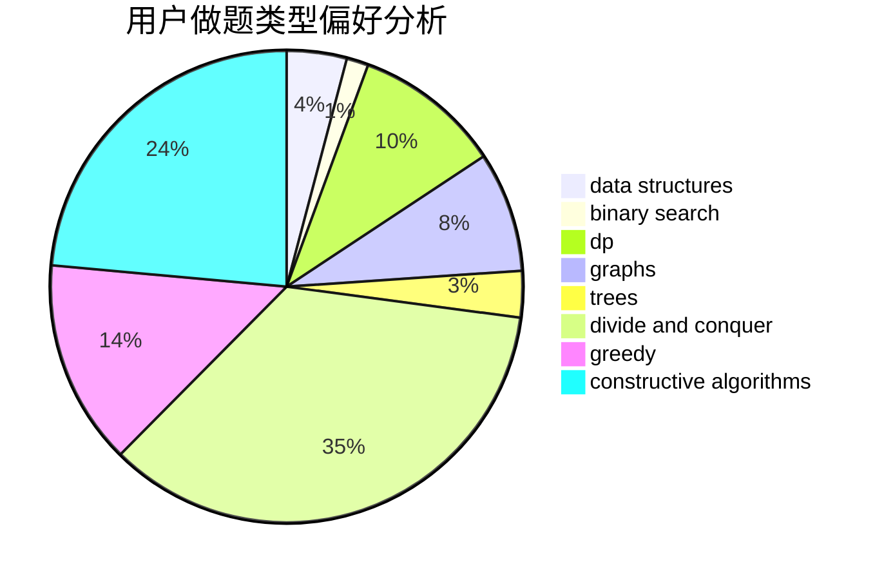
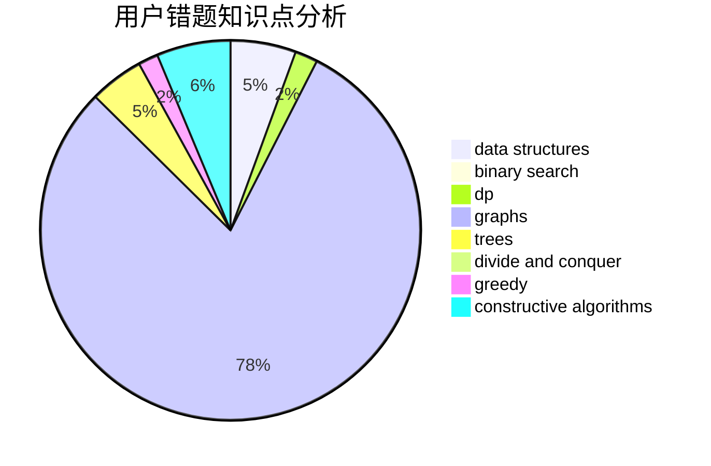

# RiverHamster

<!-- tabs:start -->

#### **用户提交结果分析**

#### **用户做题类型偏好分析**

#### **用户错题知识点分析**

<!-- tabs:end -->
# 推荐题目
[260C](https://codeforces.com/contest/260/problem/C)		constructive algorithms,
                        greedy,
                        implementation		  
[780E](https://codeforces.com/contest/780/problem/E)		constructive algorithms,
                        dfs and similar,
                        graphs		  
[1175C](https://codeforces.com/contest/1175/problem/C)		binary search,
                        brute force,
                        greedy		  
[370A](https://codeforces.com/contest/370/problem/A)		graphs,
                        math,
                        shortest paths		  
[1071A](https://codeforces.com/contest/1071/problem/A)		dsu,graphs,sortings,trees		  
[61B](https://codeforces.com/contest/61/problem/B)		strings		  
[727F](https://codeforces.com/contest/727/problem/F)		binary search,
                        dp,
                        greedy		  
[1239E](https://codeforces.com/contest/1239/problem/E)		dp,
                        implementation		  
[938E](https://codeforces.com/contest/938/problem/E)		combinatorics,
                        math		  
[956B](https://codeforces.com/contest/956/problem/B)		dsu,graphs,sortings,trees		  
