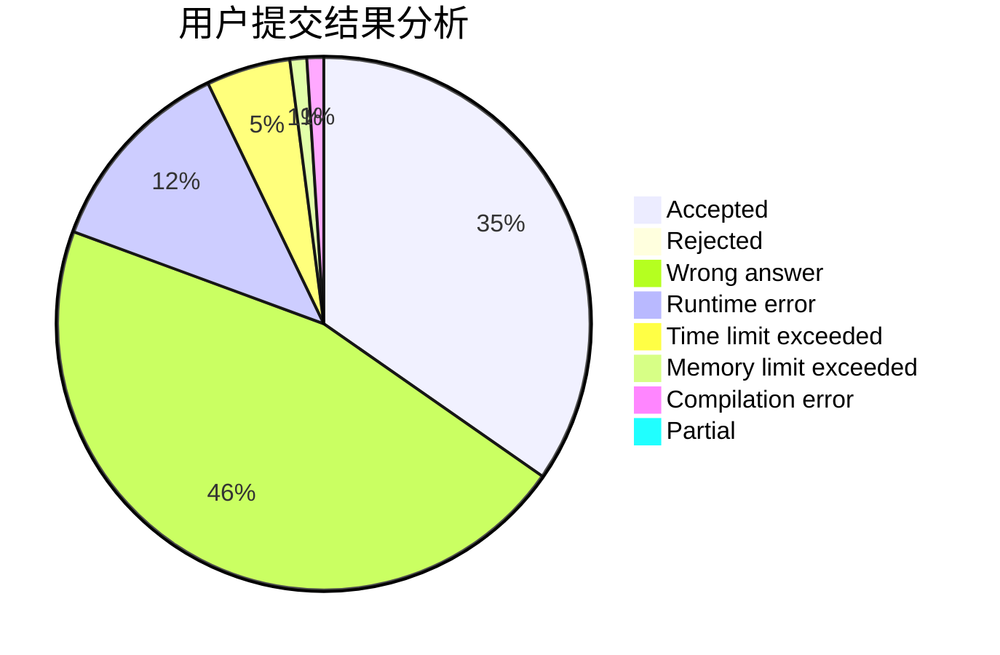
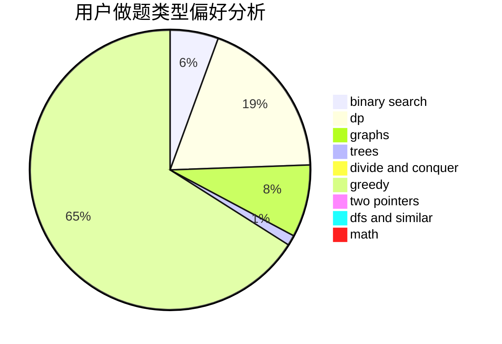

# RiverHamster

<!-- tabs:start -->

#### **用户提交结果分析**

#### **用户做题类型偏好分析**

<!-- tabs:end -->
# 推荐题目
[279A](https://codeforces.com/contest/279/problem/A)
[799D](https://codeforces.com/contest/799/problem/D)
[1178C](https://codeforces.com/contest/1178/problem/C)
[3C](https://codeforces.com/contest/3/problem/C)
[1071D](https://codeforces.com/contest/1071/problem/D)
[641E](https://codeforces.com/contest/641/problem/E)
[745C](https://codeforces.com/contest/745/problem/C)
[1244G](https://codeforces.com/contest/1244/problem/G)
[960A](https://codeforces.com/contest/960/problem/A)
[977F](https://codeforces.com/contest/977/problem/F)
